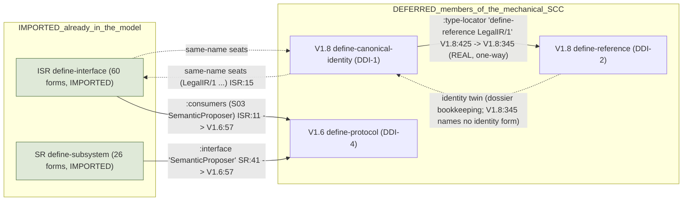

# DDI-DEPENDENCY-AND-ORDER

**Read-only reconnaissance artifact — NOT a repository file.** Target: commit `4ee2b58a8df0941845ab786bd0ff859844b94dde`, tree `ad71185a26b3beb39da6d50c09f567cff0475def`, branch `claude/lawmax-omega-arch-review-vgi9zl`. Companion of `PRE-DDI-INDEPENDENT-CENSUS.md` and `DDI-1-4-EXECUTION-MATRIX.sexp`.

## 0. Verdict on the declared DDI-1 → DDI-2 → DDI-3 → DDI-4 order

The declared batch order is **NOT a topological order** of the semantic dependency graph: the DAG agent records 33 conflict(s) (each with exact edges and a bounded adjudication proposal, §7) and 3 cycle report(s) (§5). Nothing was re-batched; every conflict is an adjudication item for the creator.

## 1. Declared batches (from the ledger; independently reconstructed counts)

| batch | title (build_deferred.py) | classes | forms | member classes |
|---|---|---|---|---|
| DDI-1 | seats / canonical identities / RA closure / pipeline+authority topology | 12 | 40 | V1.5 construction-order, V1.5 required-refs, V1.6 construction-order, V1.7 capability-seat, V1.7 construction-order, V1.7 pipeline, V1.7 ra-closure-roots, V1.7 write-authority, V1.8 canonical-identity, V1.8 capability-seat, V1.8 ra-closure-roots, V1.8 ra-delta-seats |
| DDI-2 | type / record / enum / reference schema detail | 18 | 156 | V1.5 cardinality-matrix, closed-enum, frozen-enum-reference, record, ref-classification; V1.6 adapter-contract, closed-enum, mapping, record, ref-classification-v6, reference; V1.7 closed-enum, record, reference; V1.8 cardinality-table, closed-enum, record, reference |
| DDI-3 | cognition graph / decision / projection layer | 10 | 12 | V1.5 algorithm, decision-function, projection, quorum-predicate; V1.7 decision-function, source-type-coverage; V1.8 cognition-graph, cognition-node-types, dimension-policy, reliance-aggregation |
| DDI-4 | normative invariants / rules / prose | 16 | 124 | INTERFACE invariant; SUBSYSTEM file-disposition, invariant, wp-purpose; V1.5 constitution-reference, gate, invariant, rule; V1.6 invariant, protocol, rule; V1.7 invariant, wp-reconciliation; V1.8 fixtures, invariant, wp-reconciliation |

## Mechanical symbol-reference evidence (independent, `dag.py`; upper bound — string word-matches included, verified semantically by the DAG agent)

### Batch-level reference matrix (count of form-level references from row batch to column batch)

| from \ to | IMPORTED | DDI-1 | DDI-2 | DDI-3 | DDI-4 |
|---|---|---|---|---|---|
| **IMPORTED** | 141 | 8 | 41 | 1 | 48 |
| **DDI-1** | 80 | 20 | 137 | 3 | 9 |
| **DDI-2** | 15 | 9 | 64 | 3 | 9 |
| **DDI-3** | 5 | 1 | 33 | 2 | 0 |
| **DDI-4** | 31 | 11 | 69 | 4 | 31 |

Reading: DDI-1 (12 classes) makes 137 references INTO DDI-2 and 9 into DDI-4; DDI-2 makes 9 references back into DDI-1; DDI-3 references DDI-2 33 times; DDI-4 references DDI-2 69 times and DDI-1 11 times. A batch order DDI-1 → DDI-2 → DDI-3 → DDI-4 is therefore NOT a topological order of the reference graph: the classes scheduled first depend on the classes scheduled second.

### Order violations at class level (68 pairs where an earlier batch references a later one)

| from class (rank) | to class (rank) | refs | example |
|---|---|---|---|
| `INTERFACE-AND-SCHEMA-REGISTRY.sexp define-interface` (0) | `V1.8-SCHEMAS.sexp define-canonical-identity` (1) | 1 | INTERFACE-AND-SCHEMA-REGISTRY.sexp:136 ResolutionRecord/1 -> V1.8-SCHEMAS.sexp:430 ResolverResult/1 |
| `SUBSYSTEM-REGISTRY.sexp define-subsystem` (0) | `V1.5-SCHEMAS.sexp define-required-refs` (1) | 1 | SUBSYSTEM-REGISTRY.sexp:35 S01 -> V1.5-SCHEMAS.sexp:209 CensusSpaceClassification/1 |
| `SUBSYSTEM-REGISTRY.sexp define-subsystem` (0) | `V1.8-SCHEMAS.sexp define-canonical-identity` (1) | 6 | SUBSYSTEM-REGISTRY.sexp:119 S25 -> V1.8-SCHEMAS.sexp:430 ResolverResult/1 |
| `INTERFACE-AND-SCHEMA-REGISTRY.sexp define-interface` (0) | `V1.7-SCHEMAS.sexp define-record` (2) | 3 | INTERFACE-AND-SCHEMA-REGISTRY.sexp:110 RootAuthorityStatus/1 -> V1.7-SCHEMAS.sexp:242 RootAuthorityQualification/1 |
| `INTERFACE-AND-SCHEMA-REGISTRY.sexp define-interface` (0) | `V1.6-SCHEMAS.sexp define-reference` (2) | 1 | INTERFACE-AND-SCHEMA-REGISTRY.sexp:117 ClarifiedInterpretation/1 -> V1.6-SCHEMAS.sexp:92 CandidateInterpretation/1 |
| `INTERFACE-AND-SCHEMA-REGISTRY.sexp define-interface` (0) | `V1.8-SCHEMAS.sexp define-reference` (2) | 1 | INTERFACE-AND-SCHEMA-REGISTRY.sexp:136 ResolutionRecord/1 -> V1.8-SCHEMAS.sexp:350 ResolverResult/1 |
| `SUBSYSTEM-REGISTRY.sexp define-subsystem` (0) | `V1.5-SCHEMAS.sexp define-record` (2) | 1 | SUBSYSTEM-REGISTRY.sexp:35 S01 -> V1.5-SCHEMAS.sexp:198 CensusSpaceClassification/1 |
| `SUBSYSTEM-REGISTRY.sexp define-subsystem` (0) | `V1.6-SCHEMAS.sexp define-record` (2) | 12 | SUBSYSTEM-REGISTRY.sexp:100 S20 -> V1.6-SCHEMAS.sexp:108 CapabilityManifest/1 |
| `SUBSYSTEM-REGISTRY.sexp define-subsystem` (0) | `V1.7-SCHEMAS.sexp define-reference` (2) | 2 | SUBSYSTEM-REGISTRY.sexp:38 S02 -> V1.7-SCHEMAS.sexp:34 PerceptionEnvelope/1 |
| `SUBSYSTEM-REGISTRY.sexp define-subsystem` (0) | `V1.6-SCHEMAS.sexp define-closed-enum` (2) | 2 | SUBSYSTEM-REGISTRY.sexp:104 S21 -> V1.6-SCHEMAS.sexp:20 SafetyMode |
| `SUBSYSTEM-REGISTRY.sexp define-subsystem` (0) | `V1.6-SCHEMAS.sexp define-reference` (2) | 7 | SUBSYSTEM-REGISTRY.sexp:41 S03 -> V1.6-SCHEMAS.sexp:92 CandidateInterpretation/1 |
| `SUBSYSTEM-REGISTRY.sexp define-subsystem` (0) | `V1.8-SCHEMAS.sexp define-reference` (2) | 6 | SUBSYSTEM-REGISTRY.sexp:119 S25 -> V1.8-SCHEMAS.sexp:350 ResolverResult/1 |
| `SUBSYSTEM-REGISTRY.sexp define-subsystem` (0) | `V1.5-SCHEMAS.sexp define-frozen-enum-reference` (2) | 1 | SUBSYSTEM-REGISTRY.sexp:85 S16 -> V1.5-SCHEMAS.sexp:182 census_coverage_state |
| `SUBSYSTEM-REGISTRY.sexp define-subsystem` (0) | `V1.7-SCHEMAS.sexp define-record` (2) | 5 | SUBSYSTEM-REGISTRY.sexp:119 S25 -> V1.7-SCHEMAS.sexp:150 ResolverQuery/1 |
| `SUBSYSTEM-REGISTRY.sexp define-subsystem` (0) | `V1.5-SCHEMAS.sexp define-decision-function` (3) | 1 | SUBSYSTEM-REGISTRY.sexp:35 S01 -> V1.5-SCHEMAS.sexp:229 census-coverage-decision |
| `INTERFACE-AND-SCHEMA-REGISTRY.sexp define-interface` (0) | `V1.6-SCHEMAS.sexp define-protocol` (4) | 1 | INTERFACE-AND-SCHEMA-REGISTRY.sexp:11 PerceptionEnvelope/1 -> V1.6-SCHEMAS.sexp:57 SemanticProposer |
| `INTERFACE-AND-SCHEMA-REGISTRY.sexp define-interface` (0) | `SUBSYSTEM-REGISTRY.sexp define-wp-purpose` (4) | 10 | INTERFACE-AND-SCHEMA-REGISTRY.sexp:117 ClarifiedInterpretation/1 -> SUBSYSTEM-REGISTRY.sexp:23 WP-08 |
| `SUBSYSTEM-REGISTRY.sexp define-subsystem` (0) | `SUBSYSTEM-REGISTRY.sexp define-wp-purpose` (4) | 29 | SUBSYSTEM-REGISTRY.sexp:100 S20 -> SUBSYSTEM-REGISTRY.sexp:22 WP-07 |
| `SUBSYSTEM-REGISTRY.sexp define-subsystem` (0) | `V1.6-SCHEMAS.sexp define-protocol` (4) | 1 | SUBSYSTEM-REGISTRY.sexp:41 S03 -> V1.6-SCHEMAS.sexp:57 SemanticProposer |
| `V1.8-SCHEMAS.sexp define-write-authority` (0) | `SUBSYSTEM-REGISTRY.sexp define-wp-purpose` (4) | 7 | V1.8-SCHEMAS.sexp:286 "journal" -> SUBSYSTEM-REGISTRY.sexp:18 WP-03 |
| `V1.5-SCHEMAS.sexp define-construction-order` (1) | `V1.5-SCHEMAS.sexp define-record` (2) | 7 | V1.5-SCHEMAS.sexp:597 legal-ir-interpretive -> V1.5-SCHEMAS.sexp:461 CanonRule/1 |
| `V1.6-SCHEMAS.sexp define-construction-order` (1) | `V1.6-SCHEMAS.sexp define-record` (2) | 9 | V1.6-SCHEMAS.sexp:217 cognition-stage-dag -> V1.6-SCHEMAS.sexp:183 MorphLattice/1 |
| `V1.6-SCHEMAS.sexp define-construction-order` (1) | `V1.7-SCHEMAS.sexp define-reference` (2) | 6 | V1.6-SCHEMAS.sexp:217 cognition-stage-dag -> V1.7-SCHEMAS.sexp:34 PerceptionEnvelope/1 |
| `V1.6-SCHEMAS.sexp define-construction-order` (1) | `V1.8-SCHEMAS.sexp define-reference` (2) | 1 | V1.6-SCHEMAS.sexp:217 cognition-stage-dag -> V1.8-SCHEMAS.sexp:348 CognitionResult/1 |
| `V1.6-SCHEMAS.sexp define-construction-order` (1) | `V1.5-SCHEMAS.sexp define-record` (2) | 1 | V1.6-SCHEMAS.sexp:217 cognition-stage-dag -> V1.5-SCHEMAS.sexp:476 InterpretiveProfile/1 |
| `V1.7-SCHEMAS.sexp define-construction-order` (1) | `V1.6-SCHEMAS.sexp define-record` (2) | 6 | V1.7-SCHEMAS.sexp:80 cognition-stage-dag-v7 -> V1.6-SCHEMAS.sexp:183 MorphLattice/1 |
| `V1.7-SCHEMAS.sexp define-construction-order` (1) | `V1.7-SCHEMAS.sexp define-reference` (2) | 6 | V1.7-SCHEMAS.sexp:80 cognition-stage-dag-v7 -> V1.7-SCHEMAS.sexp:34 PerceptionEnvelope/1 |
| `V1.7-SCHEMAS.sexp define-construction-order` (1) | `V1.7-SCHEMAS.sexp define-record` (2) | 9 | V1.7-SCHEMAS.sexp:80 cognition-stage-dag-v7 -> V1.7-SCHEMAS.sexp:45 NormalizedDocument/1 |
| `V1.7-SCHEMAS.sexp define-construction-order` (1) | `V1.8-SCHEMAS.sexp define-reference` (2) | 1 | V1.7-SCHEMAS.sexp:80 cognition-stage-dag-v7 -> V1.8-SCHEMAS.sexp:348 CognitionResult/1 |
| `V1.7-SCHEMAS.sexp define-construction-order` (1) | `V1.5-SCHEMAS.sexp define-record` (2) | 1 | V1.7-SCHEMAS.sexp:80 cognition-stage-dag-v7 -> V1.5-SCHEMAS.sexp:476 InterpretiveProfile/1 |
| `V1.7-SCHEMAS.sexp define-construction-order` (1) | `V1.8-SCHEMAS.sexp define-record` (2) | 1 | V1.7-SCHEMAS.sexp:80 cognition-stage-dag-v7 -> V1.8-SCHEMAS.sexp:40 ClarifiedInterpretation/1 |
| `V1.7-SCHEMAS.sexp define-ra-closure-roots` (1) | `V1.6-SCHEMAS.sexp define-record` (2) | 7 | V1.7-SCHEMAS.sexp:290 None -> V1.6-SCHEMAS.sexp:100 MemoryEvent/1 |
| `V1.7-SCHEMAS.sexp define-ra-closure-roots` (1) | `V1.6-SCHEMAS.sexp define-reference` (2) | 2 | V1.7-SCHEMAS.sexp:290 None -> V1.6-SCHEMAS.sexp:143 TrustBundle/1 |
| `V1.7-SCHEMAS.sexp define-ra-closure-roots` (1) | `V1.8-SCHEMAS.sexp define-reference` (2) | 7 | V1.7-SCHEMAS.sexp:290 None -> V1.8-SCHEMAS.sexp:345 LegalIR/1 |
| `V1.7-SCHEMAS.sexp define-ra-closure-roots` (1) | `V1.7-SCHEMAS.sexp define-record` (2) | 7 | V1.7-SCHEMAS.sexp:290 None -> V1.7-SCHEMAS.sexp:126 RightsMatrix/1 |
| `V1.7-SCHEMAS.sexp define-ra-closure-roots` (1) | `V1.7-SCHEMAS.sexp define-reference` (2) | 1 | V1.7-SCHEMAS.sexp:290 None -> V1.7-SCHEMAS.sexp:39 CognitionResult/1 |
| `V1.7-SCHEMAS.sexp define-pipeline` (1) | `V1.5-SCHEMAS.sexp define-record` (2) | 1 | V1.7-SCHEMAS.sexp:308 symbolic-only-path -> V1.5-SCHEMAS.sexp:33 SemanticAdmissionEvidence/1 |
| `V1.7-SCHEMAS.sexp define-pipeline` (1) | `V1.5-SCHEMAS.sexp define-cardinality-matrix` (2) | 1 | V1.7-SCHEMAS.sexp:308 symbolic-only-path -> V1.5-SCHEMAS.sexp:45 SemanticAdmissionEvidence/1 |
| `V1.7-SCHEMAS.sexp define-pipeline` (1) | `V1.5-SCHEMAS.sexp define-frozen-enum-reference` (2) | 1 | V1.7-SCHEMAS.sexp:308 symbolic-only-path -> V1.5-SCHEMAS.sexp:182 census_coverage_state |
| `V1.7-SCHEMAS.sexp define-pipeline` (1) | `V1.7-SCHEMAS.sexp define-reference` (2) | 3 | V1.7-SCHEMAS.sexp:308 symbolic-only-path -> V1.7-SCHEMAS.sexp:258 census_coverage_state |
| `V1.7-SCHEMAS.sexp define-pipeline` (1) | `V1.6-SCHEMAS.sexp define-record` (2) | 2 | V1.7-SCHEMAS.sexp:308 symbolic-only-path -> V1.6-SCHEMAS.sexp:204 CognitionResult/1 |
| `V1.7-SCHEMAS.sexp define-pipeline` (1) | `V1.8-SCHEMAS.sexp define-reference` (2) | 2 | V1.7-SCHEMAS.sexp:308 symbolic-only-path -> V1.8-SCHEMAS.sexp:345 LegalIR/1 |
| `V1.7-SCHEMAS.sexp define-pipeline` (1) | `V1.6-SCHEMAS.sexp define-reference` (2) | 1 | V1.7-SCHEMAS.sexp:308 symbolic-only-path -> V1.6-SCHEMAS.sexp:96 LegalIR/1 |
| `V1.7-SCHEMAS.sexp define-pipeline` (1) | `V1.7-SCHEMAS.sexp define-record` (2) | 1 | V1.7-SCHEMAS.sexp:308 symbolic-only-path -> V1.7-SCHEMAS.sexp:173 CanonicalRetrievalView/1 |
| `V1.7-SCHEMAS.sexp define-capability-seat` (1) | `V1.7-SCHEMAS.sexp define-record` (2) | 1 | V1.7-SCHEMAS.sexp:352 :RIGHTS_LICENSE -> V1.7-SCHEMAS.sexp:126 RightsMatrix/1 |
| `V1.7-SCHEMAS.sexp define-capability-seat` (1) | `V1.8-SCHEMAS.sexp define-reference` (2) | 1 | V1.7-SCHEMAS.sexp:352 :RIGHTS_LICENSE -> V1.8-SCHEMAS.sexp:352 RightsMatrix/1 |
| `V1.8-SCHEMAS.sexp define-capability-seat` (1) | `V1.7-SCHEMAS.sexp define-record` (2) | 1 | V1.8-SCHEMAS.sexp:248 :RIGHTS_LICENSE -> V1.7-SCHEMAS.sexp:126 RightsMatrix/1 |
| `V1.8-SCHEMAS.sexp define-capability-seat` (1) | `V1.8-SCHEMAS.sexp define-reference` (2) | 1 | V1.8-SCHEMAS.sexp:248 :RIGHTS_LICENSE -> V1.8-SCHEMAS.sexp:352 RightsMatrix/1 |
| `V1.8-SCHEMAS.sexp define-ra-closure-roots` (1) | `V1.8-SCHEMAS.sexp define-record` (2) | 4 | V1.8-SCHEMAS.sexp:259 None -> V1.8-SCHEMAS.sexp:165 RestrictedForensicRecord/1 |
| `V1.8-SCHEMAS.sexp define-ra-closure-roots` (1) | `V1.6-SCHEMAS.sexp define-record` (2) | 6 | V1.8-SCHEMAS.sexp:259 None -> V1.6-SCHEMAS.sexp:100 MemoryEvent/1 |
| `V1.8-SCHEMAS.sexp define-ra-closure-roots` (1) | `V1.6-SCHEMAS.sexp define-reference` (2) | 2 | V1.8-SCHEMAS.sexp:259 None -> V1.6-SCHEMAS.sexp:143 TrustBundle/1 |
| `V1.8-SCHEMAS.sexp define-ra-closure-roots` (1) | `V1.8-SCHEMAS.sexp define-reference` (2) | 7 | V1.8-SCHEMAS.sexp:259 None -> V1.8-SCHEMAS.sexp:345 LegalIR/1 |
| `V1.8-SCHEMAS.sexp define-ra-closure-roots` (1) | `V1.7-SCHEMAS.sexp define-record` (2) | 5 | V1.8-SCHEMAS.sexp:259 None -> V1.7-SCHEMAS.sexp:126 RightsMatrix/1 |
| `V1.8-SCHEMAS.sexp define-ra-closure-roots` (1) | `V1.7-SCHEMAS.sexp define-reference` (2) | 1 | V1.8-SCHEMAS.sexp:259 None -> V1.7-SCHEMAS.sexp:39 CognitionResult/1 |
| `V1.8-SCHEMAS.sexp define-canonical-identity` (1) | `V1.6-SCHEMAS.sexp define-reference` (2) | 3 | V1.8-SCHEMAS.sexp:425 LegalIR/1 -> V1.6-SCHEMAS.sexp:96 LegalIR/1 |
| `V1.8-SCHEMAS.sexp define-canonical-identity` (1) | `V1.8-SCHEMAS.sexp define-reference` (2) | 8 | V1.8-SCHEMAS.sexp:425 LegalIR/1 -> V1.8-SCHEMAS.sexp:345 LegalIR/1 |
| `V1.8-SCHEMAS.sexp define-canonical-identity` (1) | `V1.6-SCHEMAS.sexp define-record` (2) | 2 | V1.8-SCHEMAS.sexp:428 CognitionResult/1 -> V1.6-SCHEMAS.sexp:204 CognitionResult/1 |
| `V1.8-SCHEMAS.sexp define-canonical-identity` (1) | `V1.7-SCHEMAS.sexp define-reference` (2) | 1 | V1.8-SCHEMAS.sexp:428 CognitionResult/1 -> V1.7-SCHEMAS.sexp:39 CognitionResult/1 |
| `V1.8-SCHEMAS.sexp define-canonical-identity` (1) | `V1.7-SCHEMAS.sexp define-record` (2) | 3 | V1.8-SCHEMAS.sexp:430 ResolverResult/1 -> V1.7-SCHEMAS.sexp:155 ResolverResult/1 |
| `V1.8-SCHEMAS.sexp define-ra-delta-seats` (1) | `V1.8-SCHEMAS.sexp define-record` (2) | 7 | V1.8-SCHEMAS.sexp:444 None -> V1.8-SCHEMAS.sexp:110 CanonicalCitationURI/1 |
| `V1.5-SCHEMAS.sexp define-construction-order` (1) | `V1.5-SCHEMAS.sexp define-projection` (3) | 3 | V1.5-SCHEMAS.sexp:597 legal-ir-interpretive -> V1.5-SCHEMAS.sexp:484 InterpretiveProfileCanons |
| `V1.6-SCHEMAS.sexp define-construction-order` (1) | `SUBSYSTEM-REGISTRY.sexp define-file-disposition` (4) | 1 | V1.6-SCHEMAS.sexp:217 cognition-stage-dag -> SUBSYSTEM-REGISTRY.sexp:130 legal-casegrammar.lisp |
| `V1.7-SCHEMAS.sexp define-construction-order` (1) | `SUBSYSTEM-REGISTRY.sexp define-file-disposition` (4) | 1 | V1.7-SCHEMAS.sexp:80 cognition-stage-dag-v7 -> SUBSYSTEM-REGISTRY.sexp:130 legal-casegrammar.lisp |
| `V1.7-SCHEMAS.sexp define-write-authority` (1) | `SUBSYSTEM-REGISTRY.sexp define-wp-purpose` (4) | 7 | V1.7-SCHEMAS.sexp:327 "journal" -> SUBSYSTEM-REGISTRY.sexp:18 WP-03 |
| `V1.5-SCHEMAS.sexp define-ref-classification` (2) | `V1.5-SCHEMAS.sexp define-projection` (3) | 3 | V1.5-SCHEMAS.sexp:569 None -> V1.5-SCHEMAS.sexp:484 InterpretiveProfileCanons |
| `V1.6-SCHEMAS.sexp define-adapter-contract` (2) | `V1.6-SCHEMAS.sexp define-protocol` (4) | 2 | V1.6-SCHEMAS.sexp:67 ONNXProposerAdapter -> V1.6-SCHEMAS.sexp:57 SemanticProposer |
| `V1.6-SCHEMAS.sexp define-reference` (2) | `SUBSYSTEM-REGISTRY.sexp define-wp-purpose` (4) | 6 | V1.6-SCHEMAS.sexp:127 ActionIntent/1 -> SUBSYSTEM-REGISTRY.sexp:27 WP-12 |
| `V1.6-SCHEMAS.sexp define-mapping` (2) | `SUBSYSTEM-REGISTRY.sexp define-file-disposition` (4) | 1 | V1.6-SCHEMAS.sexp:231 cognition->existing-lisp-seat -> SUBSYSTEM-REGISTRY.sexp:130 legal-casegrammar.lisp |

Rank 0 = IMPORTED (already in the model; a reference from an IMPORTED class into a deferred class is not an ordering problem for the import itself, but it IS a closed-reference (L3) obligation once the target is imported: e.g. `define-subsystem` names `define-wp-purpose` WP ids and V1.8 `define-canonical-identity` targets).

### Class-level strongly connected components (cycles)

- SCC of 5 classes: `V1.6-SCHEMAS.sexp define-protocol`, `V1.8-SCHEMAS.sexp define-canonical-identity`, `V1.8-SCHEMAS.sexp define-reference`, `SUBSYSTEM-REGISTRY.sexp define-subsystem`, `INTERFACE-AND-SCHEMA-REGISTRY.sexp define-interface`

Edges inside the SCC (from `scc-edges.txt`):

```
INTERFACE-AND-SCHEMA-REGISTRY.sexp define-interface -> SUBSYSTEM-REGISTRY.sexp define-subsystem : 112
INTERFACE-AND-SCHEMA-REGISTRY.sexp define-interface -> V1.6-SCHEMAS.sexp define-protocol : 1
INTERFACE-AND-SCHEMA-REGISTRY.sexp define-interface -> V1.8-SCHEMAS.sexp define-canonical-identity : 1
INTERFACE-AND-SCHEMA-REGISTRY.sexp define-interface -> V1.8-SCHEMAS.sexp define-reference : 1
SUBSYSTEM-REGISTRY.sexp define-subsystem -> INTERFACE-AND-SCHEMA-REGISTRY.sexp define-interface : 29
SUBSYSTEM-REGISTRY.sexp define-subsystem -> V1.6-SCHEMAS.sexp define-protocol : 1
SUBSYSTEM-REGISTRY.sexp define-subsystem -> V1.8-SCHEMAS.sexp define-canonical-identity : 6
SUBSYSTEM-REGISTRY.sexp define-subsystem -> V1.8-SCHEMAS.sexp define-reference : 6
V1.6-SCHEMAS.sexp define-protocol -> INTERFACE-AND-SCHEMA-REGISTRY.sexp define-interface : 2
V1.8-SCHEMAS.sexp define-canonical-identity -> INTERFACE-AND-SCHEMA-REGISTRY.sexp define-interface : 8
V1.8-SCHEMAS.sexp define-canonical-identity -> V1.8-SCHEMAS.sexp define-reference : 8
V1.8-SCHEMAS.sexp define-reference -> INTERFACE-AND-SCHEMA-REGISTRY.sexp define-interface : 5
V1.8-SCHEMAS.sexp define-reference -> V1.8-SCHEMAS.sexp define-canonical-identity : 5
```

The only DEFERRED members of the SCC are `V1.6 define-protocol`, `V1.8 define-canonical-identity` and `V1.8 define-reference`; the cycle closes through the two IMPORTED classes (`define-interface`, `define-subsystem`). Among deferred classes alone the mechanical edges are canonical-identity → reference (8, `:type-locator "define-reference X"`) and reference → canonical-identity (5, the same names). Whether this is a true mutual dependency or a lineage artefact (two seats naming the same identity) is adjudicated in the DAG section with evidence.

## 3. Independent class-level dependency graph computed by the orchestrator from the six dossiers (`dossier-graph.json`)

Built by `dossier_graph.py` from the **1,009 verified `references` entries** the six dossier agents recorded (each carries a target and a `FILE:LINE head name` locator). Every locator is resolved against MY census line index — not against any agent's class list — so this graph is independent of the DAG agent whose output appears in §4. 564 reference instances resolved to **123 class-level edges**; 439 references could not be resolved to a source-registry line (they point at repository files, requirement/test/WP ids, or prose — counted below, never silently dropped).

### 3.1 Batch-level matrix (reference instances, row batch → column batch)

| from \ to | IMPORTED | DDI-1 | DDI-2 | DDI-3 | DDI-4 |
|---|---|---|---|---|---|
| **IMPORTED** | 161 | 0 | 1 | 0 | 72 |
| **DDI-1** | 0 | 1 | 14 | 2 | 4 |
| **DDI-2** | 33 | 25 | 79 | 1 | 26 |
| **DDI-3** | 0 | 0 | 20 | 1 | 1 |
| **DDI-4** | 4 | 5 | 96 | 4 | 13 |

Reading (independent of the mechanical graph in §2 and of the DAG agent): **DDI-2 → DDI-4 = 26** and **DDI-1 → DDI-2 = 14**, **DDI-1 → DDI-3 = 2**, **DDI-1 → DDI-4 = 4**, **DDI-2 → DDI-3 = 1**, **DDI-3 → DDI-4 = 1** are all forward-pointing dependencies, i.e. a batch depending on a batch scheduled AFTER it. The declared order DDI-1 → DDI-2 → DDI-3 → DDI-4 is therefore not a topological order under the dossiers' own evidence either.

### 3.2 The 27 order violations (earlier batch depends on later; IMPORTED sources excluded)

| from class | batch | to class | batch | refs | kinds | example |
|---|---|---|---|---|---|---|
| `V1.6-SCHEMAS.sexp define-construction-order` | DDI-1 | `V1.6-SCHEMAS.sexp define-record` | DDI-2 | 10 | field-type, consumer | V1.6-SCHEMAS.sexp:217 cognition-stage-dag -> V1.6-SCHEMAS.sexp:85 |
| `V1.6-SCHEMAS.sexp define-closed-enum` | DDI-2 | `V1.6-SCHEMAS.sexp define-invariant` | DDI-4 | 4 | other | V1.6-SCHEMAS.sexp:168 CognitionCapability -> V1.6-SCHEMAS.sexp:270 |
| `V1.6-SCHEMAS.sexp define-record` | DDI-2 | `V1.6-SCHEMAS.sexp define-invariant` | DDI-4 | 4 | other | V1.6-SCHEMAS.sexp:108 CapabilityManifest/1 -> V1.6-SCHEMAS.sexp:155-157 |
| `V1.6-SCHEMAS.sexp define-closed-enum` | DDI-2 | `V1.7-SCHEMAS.sexp define-invariant` | DDI-4 | 2 | enum-value, other | V1.6-SCHEMAS.sexp:20 SafetyMode -> V1.7-SCHEMAS.sexp:22,303; V1.8-SCHEMAS.sexp:19 |
| `V1.6-SCHEMAS.sexp define-adapter-contract` | DDI-2 | `V1.6-SCHEMAS.sexp define-protocol` | DDI-4 | 2 | ref-target | V1.6-SCHEMAS.sexp:67 ONNXProposerAdapter -> V1.6-SCHEMAS.sexp:57; type ARCHITECTURE-MODEL/interfaces-and-types.sexp:57 |
| `V1.6-SCHEMAS.sexp define-adapter-contract` | DDI-2 | `SUBSYSTEM-REGISTRY.sexp define-wp-purpose` | DDI-4 | 2 | wp | V1.6-SCHEMAS.sexp:67 ONNXProposerAdapter -> IMPLEMENTATION-BOOK/WORK-PACKETS/WP-07.md:25 'neural = Python + ONNX Runtime'; SUBSYSTEM-REGISTRY.sexp:22  |
| `V1.6-SCHEMAS.sexp define-reference` | DDI-2 | `V1.6-SCHEMAS.sexp define-invariant` | DDI-4 | 2 | consumer | V1.6-SCHEMAS.sexp:131 Approval/1 -> V1.6-SCHEMAS.sexp:337 |
| `V1.6-SCHEMAS.sexp define-construction-order` | DDI-1 | `SUBSYSTEM-REGISTRY.sexp define-file-disposition` | DDI-4 | 2 | seat-file, other | V1.6-SCHEMAS.sexp:217 cognition-stage-dag -> tracked; SUBSYSTEM-REGISTRY.sexp:130-134 define-file-disposition SPLIT; no [general] partition marker in  |
| `V1.6-SCHEMAS.sexp define-mapping` | DDI-2 | `SUBSYSTEM-REGISTRY.sexp define-file-disposition` | DDI-4 | 2 | seat-file, other | V1.6-SCHEMAS.sexp:231 cognition->existing-lisp-seat -> tracked; SUBSYSTEM-REGISTRY.sexp:130-134 define-file-disposition SPLIT; no [general] partition  |
| `V1.5-SCHEMAS.sexp define-cardinality-matrix` | DDI-2 | `V1.5-SCHEMAS.sexp define-gate` | DDI-4 | 1 | other | V1.5-SCHEMAS.sexp:45 SemanticAdmissionEvidence/1 -> V1.5-SCHEMAS.sexp:123 |
| `V1.5-SCHEMAS.sexp define-required-refs` | DDI-1 | `V1.5-SCHEMAS.sexp define-closed-enum` | DDI-2 | 1 | enum-value | V1.5-SCHEMAS.sexp:209 CensusSpaceClassification/1 -> V1.5-SCHEMAS.sexp:170-171 |
| `V1.5-SCHEMAS.sexp define-required-refs` | DDI-1 | `V1.5-SCHEMAS.sexp define-record` | DDI-2 | 1 | other | V1.5-SCHEMAS.sexp:209 CensusSpaceClassification/1 -> V1.5-SCHEMAS.sexp:201-203 |
| `V1.5-SCHEMAS.sexp define-algorithm` | DDI-3 | `V1.5-SCHEMAS.sexp define-rule` | DDI-4 | 1 | other | V1.5-SCHEMAS.sexp:387 control-domain-partition -> V1.5-SCHEMAS.sexp:333 (header comment L386) |
| `V1.5-SCHEMAS.sexp define-ref-classification` | DDI-2 | `V1.5-SCHEMAS.sexp define-projection` | DDI-3 | 1 | other | V1.5-SCHEMAS.sexp:569 <anonymous: (CanonRule/1.authority_basis :hash-bearing (AuthorityBasis)) ...> -> V1.5-SCHEMAS.sexp:561,484,540 |
| `V1.5-SCHEMAS.sexp define-construction-order` | DDI-1 | `V1.5-SCHEMAS.sexp define-record` | DDI-2 | 1 | other | V1.5-SCHEMAS.sexp:597 legal-ir-interpretive -> V1.5-SCHEMAS.sexp:461,468,476,496,502,515,530 |
| `V1.5-SCHEMAS.sexp define-construction-order` | DDI-1 | `V1.5-SCHEMAS.sexp define-projection` | DDI-3 | 1 | other | V1.5-SCHEMAS.sexp:597 legal-ir-interpretive -> V1.5-SCHEMAS.sexp:561,484,540 |
| `V1.6-SCHEMAS.sexp define-record` | DDI-2 | `V1.6-SCHEMAS.sexp define-protocol` | DDI-4 | 1 | consumer | V1.6-SCHEMAS.sexp:85 PerceptionEnvelope/1 -> V1.6-SCHEMAS.sexp:59 |
| `V1.6-SCHEMAS.sexp define-record` | DDI-2 | `SUBSYSTEM-REGISTRY.sexp define-file-disposition` | DDI-4 | 1 | other | V1.6-SCHEMAS.sexp:317 PrivateMatterProfile/1 -> SUBSYSTEM-REGISTRY.sexp:133; V1.6-SCHEMAS.sexp:249 |
| `V1.6-SCHEMAS.sexp define-reference` | DDI-2 | `V1.6-SCHEMAS.sexp define-protocol` | DDI-4 | 1 | consumer | V1.6-SCHEMAS.sexp:92 CandidateInterpretation/1 -> V1.6-SCHEMAS.sexp:60 |
| `V1.6-SCHEMAS.sexp define-construction-order` | DDI-1 | `V1.5-SCHEMAS.sexp define-record` | DDI-2 | 1 | seat-file | V1.6-SCHEMAS.sexp:217 cognition-stage-dag -> V1.5-SCHEMAS.sexp:476 define-record; type ARCHITECTURE-MODEL/interfaces-and-types.sexp:28 S04 — a TYPE us |
| `V1.6-SCHEMAS.sexp define-construction-order` | DDI-1 | `V1.6-SCHEMAS.sexp define-invariant` | DDI-4 | 1 | consumer | V1.6-SCHEMAS.sexp:217 cognition-stage-dag -> V1.6-SCHEMAS.sexp:265-269 |
| `V1.6-SCHEMAS.sexp define-construction-order` | DDI-1 | `V1.8-SCHEMAS.sexp define-cognition-graph` | DDI-3 | 1 | other | V1.6-SCHEMAS.sexp:217 cognition-stage-dag -> V1.8-SCHEMAS.sexp:53-65, :363-383 (DDI-3) |
| `V1.6-SCHEMAS.sexp define-construction-order` | DDI-1 | `V1.7-SCHEMAS.sexp define-wp-reconciliation` | DDI-4 | 1 | wp | V1.6-SCHEMAS.sexp:217 cognition-stage-dag -> V1.7-SCHEMAS.sexp:380; V1.8-SCHEMAS.sexp:304 wp-reconciliation COGNITION_DAG -> WP-08 |
| `V1.6-SCHEMAS.sexp define-mapping` | DDI-2 | `V1.6-SCHEMAS.sexp define-invariant` | DDI-4 | 1 | consumer | V1.6-SCHEMAS.sexp:231 cognition->existing-lisp-seat -> V1.6-SCHEMAS.sexp:270-272; V1.6-CONTRADICTION-OMISSION-AUDIT.sh:243-251 |
| `V1.6-SCHEMAS.sexp define-mapping` | DDI-2 | `V1.7-SCHEMAS.sexp define-invariant` | DDI-4 | 1 | consumer | V1.6-SCHEMAS.sexp:231 cognition->existing-lisp-seat -> V1.7-SCHEMAS.sexp:343-345 'Cognition capabilities are closed by the v1.6 cognition->existing-li |
| `V1.6-SCHEMAS.sexp define-mapping` | DDI-2 | `V1.8-SCHEMAS.sexp define-invariant` | DDI-4 | 1 | other | V1.6-SCHEMAS.sexp:231 cognition->existing-lisp-seat -> V1.8-SCHEMAS.sexp:250-254 (capability must name :CODE file+package+symbol or :DOCUMENT file+sec |
| `V1.6-SCHEMAS.sexp define-ref-classification-v6` | DDI-2 | `V1.6-SCHEMAS.sexp define-invariant` | DDI-4 | 1 | consumer | V1.6-SCHEMAS.sexp:344 (public-build :hash-bearing (LegalIR/1 MemoryEvent/1 TrustBundle/1 LanguageCognitionLayer/1 CognitionResult/1)) -> V1.6-SCHEMAS. |

### 3.3 Strongly connected component

One SCC of 22 classes: `V1.5-SCHEMAS.sexp define-ref-classification`, `V1.5-SCHEMAS.sexp define-cardinality-matrix`, `V1.5-SCHEMAS.sexp define-projection`, `V1.5-SCHEMAS.sexp define-construction-order`, `V1.5-SCHEMAS.sexp define-decision-function`, `V1.5-SCHEMAS.sexp define-gate`, `V1.5-SCHEMAS.sexp define-rule`, `V1.5-SCHEMAS.sexp define-algorithm`, `V1.6-SCHEMAS.sexp define-ref-classification-v6`, `V1.6-SCHEMAS.sexp define-construction-order`, `V1.6-SCHEMAS.sexp define-mapping`, `V1.6-SCHEMAS.sexp define-record`, `V1.6-SCHEMAS.sexp define-protocol`, `V1.6-SCHEMAS.sexp define-adapter-contract`, `V1.6-SCHEMAS.sexp define-closed-enum`, `V1.6-SCHEMAS.sexp define-invariant`, `V1.6-SCHEMAS.sexp define-reference`, `V1.5-SCHEMAS.sexp define-closed-enum`, `V1.5-SCHEMAS.sexp define-record`, `V1.5-SCHEMAS.sexp define-quorum-predicate`, `V1.5-SCHEMAS.sexp define-invariant`, `INTERFACE-AND-SCHEMA-REGISTRY.sexp define-interface`.

It spans V1.5, V1.6 and the IMPORTED `define-interface`, and closes through invariant↔record/enum references (an invariant names the records it constrains; a record's prose names the invariant that governs it). Whether these are TRUE import-order dependencies or merely documentation cross-references is exactly the question the DAG section adjudicates — a docstring citation is not an import prerequisite, while a field type is.

### 3.4 References that resolve outside the six registries (never dropped silently)

| kind | count | meaning |
|---|---|---|
| other | 99 | prose / mission ids / provenance strings |
| field-type | 49 | a type named in a field whose definition is outside the six registries |
| unresolved-line | 46 | a locator whose line could not be snapped to a form start |
| test | 43 | a Q* / V6Q* / RA-Q* / T8-* id (no registry definition — N7) |
| requirement | 42 | an R-* / RA-* id with no source-registry definition (see §3 N1/N8) |
| seat-file | 31 | a repository file (source/*.lisp, deployment/*.md) — a seat question, not a class edge |
| wp | 30 | a WP-nn token (see N2) |
| enum-value | 30 | an enum value whose enum is elsewhere |
| ref-target | 28 | a reference target defined in a document rather than a registry |
| owner-subsystem | 6 | an S-id resolved in the model, not in a registry form |
| canonical-file | 3 | a :canonical-file document |
| consumer | 1 | a consumer that is not a registry form |
| enum-value / ref-target | 1 | — |
| field-type / ref-target | 1 | — |

These 439 unresolved references are themselves a finding: **43 test ids and 42+14 requirement ids referenced by source forms have no definition in any of the six migration sources**, which is the L3/L6 closure gap recorded as N1/N7/N8 and repeated by the matrix rows as a DDI-1 entry criterion.


## 3bis. Two reference-universe gaps the order must respect (orchestrator finding, independent of the agents)

**N1 — requirement/test ids.** V1.8 `define-capability-seat` (7 forms, DDI-1) and `define-ra-delta-seats` (7 rows, DDI-1) reference requirement ids `RA-E RA-I RA-J RA-K RA-L RA-R RA-T RA8-CONT RA8-CORR RA8-EPOCH RA8-JURNS RA8-K RA8-MARK RA8-SIDE` and test ids `RA-Q-CITE RA-Q-DATASET RA-Q-JURIS RA-Q-LICENSE RA-Q-RESOLVE RA-Q-RETRIEVE RA-Q-TRANSLATE T8-CONT T8-CORR T8-EPOCH T8-JURNS T8-K T8-MARK T8-SIDE`. The model's `requirement` (24) and `test` (21) facts are derived from `define-subsystem` and contain none of these except `RA-Q-RESOLVE` (and `RA-Q-TENANT`). Under L3 (closed typed references) a DDI-1 import of these two classes is impossible until the requirement/test universe has a seat that can hold RA-layer ids. Today that universe has no seat of its own (its ids are a by-product of an IMPORTED class).

**N2 — work-packet ids.** The model's `wp` facts (14) are derived from `define-subsystem :future-wp`; the source `define-wp-purpose` (16 forms, DDI-4) declares `WP-00`, `WP-05`, `WP-10` which the model lacks, while the model holds `DEFERRED`, which is a disposition token and not a work packet. Importing `define-wp-purpose` gives `wp` a second origin unless the derivation is retired at the same time (one seat).

## 4. Semantic dependency graph, topological order, atomic groups, cycles (DAG agent)

## DAG — the SEMANTIC dependency graph of the 56 deferred classes (+ the 4 imported classes as present nodes)

RO = read-only clone at HEAD `4ee2b58a8df0941845ab786bd0ff859844b94dde` (tree `ad71185a`). READ-ONLY: nothing outside
`WORK/agents/dag/` was created, modified or deleted; no git mutation; no gate, corpus or battery was executed.
Machine-readable twin: `WORK/agents/dag/order.json`.

### 0. Method — what counts as an edge, and why the mechanical graph is not the answer

`WORK/dag.json` is a symbol-reference graph built by string word-matching; `WORK/dag-fragment.md` states it is an upper bound.
An edge survives into THIS graph only when TWO independent evidences agree:

1. a dossier `references` entry of an admitted kind — field type, enum value, ref-target, owner, consumer, wp / test /
   requirement id, canonical-file, seat file — whose `target_loc` resolves to a form inside one of the six registries; AND
2. the **source form's own text in RO** contains the target form's id token (form extent = its start line up to the line
   before the next top-level form; `WORK/agents/dag/verify_text.py`).

Four filters were applied on top, each with source evidence, because the dossiers record *relations*, not *directions*:

- **self-name vacuity**: if the token found in the source text is the form's OWN name (or a substring of it), the text
  evidence proves nothing. 186 reference hits were reclassified this way (28 distinct `same-name-seat` class edges). Example: `define-record PerceptionEnvelope/1`
  (V1.6-SCHEMAS.sexp:85-91) contains the token `PerceptionEnvelope/1` only because that is its own id — its body is nine
  `(:field :type ...)` pairs and names no V1.7 form. Such pairs are kept as `same-name-seat` edges (competing seats), never
  as ordering constraints.
- **direction heterogeneity of `consumer`**: in ISR/SR the dossier's consumer refs are the form's own `:consumers` field
  (INTERFACE-AND-SCHEMA-REGISTRY.sexp:11 `:consumers (S03 SemanticProposer)`) — outbound; in V1.5–V1.8 they are
  "consumed by" (V1.6-SCHEMAS.sexp:85 recorded as consumed by `cognition-stage-dag`) — inbound. Only the ones that survive
  filter (2) are ordering edges.
- **enum leaves**: a `define-closed-enum` body is a list of keyword members and nothing else (V1.6-SCHEMAS.sexp:20-24,
  V1.8-SCHEMAS.sexp:31, V1.5-SCHEMAS.sexp:169-171), so an out-edge from an enum class is always a use-site back-reference.
- **already-adjudicated edges** from `WORK/agents/matrix-DDI-1/matrix.json` and `matrix-DDI-3/matrix.json` `dependencies`
  are merged in as `matrix-adjudicated`; entries the matrices themselves label LINEAGE / "not a prerequisite" /
  "reverse edge" are carried as non-blocking or inverted accordingly.

Result: **60 nodes** (56 DEFERRED_DATA_IMPORT + 4 IMPORTED), **464 kinded edges**, of which
**161** are *blocking* (an import-order prerequisite) and the rest are annotations
(`same-name-seat`, `identity-twin`, `competing-seat`, `lineage`, `.../annotation`). Every edge in `order.json` carries one
`file:line -> file:line` example and its ref kind.

### 1. Cycles

#### CYC-1-cognition-graph-vs-node-types

Members: `V1.8-SCHEMAS__define-cognition-graph`, `V1.8-SCHEMAS__define-cognition-node-types`

**Verdict.** TRUE MUTUAL CONSTRAINT (co-definition). Not resolvable by ordering; resolvable only by ATOMIC co-import (AG-02).

- V1.8-SCHEMAS.sexp:53-65 declares 20 :nodes; V1.8-SCHEMAS.sexp:363-383 types exactly those nodes
- WORK/agents/matrix-DDI-3/matrix.json (both rows list the other as a dependency; 'node set equality is required')
- V1.8-SCHEMAS.sexp:386-392 :V8I-COG-typed-edges makes the typing a law over the graph

#### CYC-2-V15-gate-vs-rule

Members: `V1.5-SCHEMAS__define-gate`, `V1.5-SCHEMAS__define-rule`

**Verdict.** CLASS-GRANULARITY ARTEFACT. Form-level order is acyclic: rule@V1.5:87 -> gate@V1.5:123 -> rule@V1.5:140. Import unit is the fact, not the class.

- V1.5-SCHEMAS.sexp:123 (SA-2-canonical-admission) names derivation-independence-trust-root at V1.5-SCHEMAS.sexp:87
- V1.5-SCHEMAS.sexp:140 (candidate-id-discipline) names SA-2-canonical-admission at V1.5-SCHEMAS.sexp:123
- form-level SCC computation over the same reference set: no cycle containing these two forms (WORK/agents/dag/formcycles.json)

#### CYC-0-mechanical-SCC-of-five-classes

Members: `V1.6-SCHEMAS__define-protocol`, `V1.8-SCHEMAS__define-canonical-identity`, `V1.8-SCHEMAS__define-reference`, `SUBSYSTEM-REGISTRY__define-subsystem`, `INTERFACE-AND-SCHEMA-REGISTRY__define-interface`

**Verdict.** NOT A CYCLE IN THE DEFERRED SET. (a) Two of the five members are already IMPORTED, so their facts exist before any batch runs; the cycle closes only through them. (b) Between the two deferred members the reference is one-directional: define-canonical-identity -> define-reference via :type-locator. The reverse edge is a SAME-NAME artefact: define-reference LegalIR/1 (V1.8:345) contains no token naming the identity form; the dossier's 'identity twin' entry is bookkeeping, not a source reference. (c) V1.6 define-protocol has NO out-edge to either: it is dragged in only by define-interface :consumers (SemanticProposer).

- V1.8-SCHEMAS.sexp:425 (:type-locator "define-reference LegalIR/1") -> V1.8-SCHEMAS.sexp:345
- V1.8-SCHEMAS.sexp:345 full form text: :canonical-file/:identity/:version/:locator only - no identity-form token
- ARCHITECTURE-MODEL/deferred-imports.sexp (INTERFACE-AND-SCHEMA-REGISTRY__define-interface :status IMPORTED; SUBSYSTEM-REGISTRY__define-subsystem :status IMPORTED)
- INTERFACE-AND-SCHEMA-REGISTRY.sexp:11 (:consumers (S03 SemanticProposer)) -> V1.6-SCHEMAS.sexp:57
- WORK/dag-fragment.md (mechanical SCC) vs WORK/agents/dag/final.json (semantic SCC set)



**The mechanical SCC `[V1.6 define-protocol, V1.8 define-canonical-identity, V1.8 define-reference, define-subsystem,
define-interface]` is NOT a cycle of the deferred import.** Three independent reasons, each checkable:

1. Two of the five members are already IMPORTED (`ARCHITECTURE-MODEL/deferred-imports.sexp`, rows
   `INTERFACE-AND-SCHEMA-REGISTRY__define-interface` and `SUBSYSTEM-REGISTRY__define-subsystem`, `:status IMPORTED`).
   Their facts exist before any batch runs, so every path through them is an L3 obligation that comes due, not an ordering loop.
2. Between the two deferred members the reference is one-directional and textual:
   `V1.8-SCHEMAS.sexp:425 :type-locator "define-reference LegalIR/1"` → `V1.8-SCHEMAS.sexp:345`. The reverse edge does not
   exist in the source: the full text of `define-reference LegalIR/1` is `:canonical-file` + `:identity` + `:version` +
   `:locator` and contains no token naming the identity form.
3. `V1.6 define-protocol` has no out-edge to either; it is pulled in only because `define-interface :consumers` and
   `define-subsystem :interface` name `SemanticProposer` (ISR:11, SR:41 → V1.6-SCHEMAS.sexp:57).

So the deferred part is a **lineage / same-name artefact plus one real one-way edge**. What remains after that is
`AG-01` (an atomic pair) — not a cycle to break, a transaction to keep whole.

### 2. Topological order over the 56 deferred classes

Order of the condensation of the blocking sub-graph restricted to deferred→deferred edges (edges into the 4 IMPORTED
classes are satisfied at time 0). Tie-break: unblock-the-most-first, then class id — deterministic, no hidden preference
for a batch. `[n]` = declared batch. Braces = one strongly connected component (import together).

| # | class(es) | declared batch | forms |
|---|---|---|---|
| 0 | `V1.5-SCHEMAS__define-closed-enum` | DDI-2 | 16 |
| 1 | `V1.5-SCHEMAS__define-record` | DDI-2 | 18 |
| 2 | `SUBSYSTEM-REGISTRY__define-wp-purpose` | DDI-4 | 16 |
| 3 | `V1.7-SCHEMAS__define-reference` | DDI-2 | 8 |
| 4 | `V1.8-SCHEMAS__define-reference` | DDI-2 | 9 |
| 5 | `V1.5-SCHEMAS__define-frozen-enum-reference` | DDI-2 | 1 |
| 6 | `V1.6-SCHEMAS__define-closed-enum` | DDI-2 | 8 |
| 7 | `V1.6-SCHEMAS__define-record` | DDI-2 | 22 |
| 8 | `V1.6-SCHEMAS__define-reference` | DDI-2 | 6 |
| 9 | `V1.5-SCHEMAS__define-gate` + `V1.5-SCHEMAS__define-rule` | DDI-4 | 8 |
| 10 | `V1.8-SCHEMAS__define-closed-enum` | DDI-2 | 9 |
| 11 | `V1.8-SCHEMAS__define-record` | DDI-2 | 19 |
| 12 | `SUBSYSTEM-REGISTRY__define-file-disposition` | DDI-4 | 1 |
| 13 | `V1.5-SCHEMAS__define-algorithm` | DDI-3 | 1 |
| 14 | `V1.5-SCHEMAS__define-projection` | DDI-3 | 3 |
| 15 | `V1.5-SCHEMAS__define-construction-order` | DDI-1 | 1 |
| 16 | `V1.5-SCHEMAS__define-decision-function` | DDI-3 | 1 |
| 17 | `V1.5-SCHEMAS__define-ref-classification` | DDI-2 | 1 |
| 18 | `V1.6-SCHEMAS__define-construction-order` | DDI-1 | 1 |
| 19 | `V1.6-SCHEMAS__define-mapping` | DDI-2 | 1 |
| 20 | `V1.6-SCHEMAS__define-protocol` | DDI-4 | 1 |
| 21 | `V1.7-SCHEMAS__define-closed-enum` | DDI-2 | 8 |
| 22 | `V1.7-SCHEMAS__define-record` | DDI-2 | 25 |
| 23 | `V1.7-SCHEMAS__define-capability-seat` | DDI-1 | 7 |
| 24 | `V1.7-SCHEMAS__define-construction-order` | DDI-1 | 1 |
| 25 | `V1.7-SCHEMAS__define-decision-function` | DDI-3 | 1 |
| 26 | `V1.7-SCHEMAS__define-pipeline` | DDI-1 | 1 |
| 27 | `V1.7-SCHEMAS__define-source-type-coverage` | DDI-3 | 1 |
| 28 | `V1.7-SCHEMAS__define-write-authority` | DDI-1 | 10 |
| 29 | `V1.7-SCHEMAS__define-invariant` | DDI-4 | 23 |
| 30 | `V1.8-SCHEMAS__define-capability-seat` | DDI-1 | 7 |
| 31 | `V1.8-SCHEMAS__define-cognition-graph` + `V1.8-SCHEMAS__define-cognition-node-types` | DDI-3 | 2 |
| 32 | `V1.8-SCHEMAS__define-dimension-policy` | DDI-3 | 1 |
| 33 | `INTERFACE-AND-SCHEMA-REGISTRY__define-invariant` | DDI-4 | 1 |
| 34 | `SUBSYSTEM-REGISTRY__define-invariant` | DDI-4 | 2 |
| 35 | `V1.5-SCHEMAS__define-cardinality-matrix` | DDI-2 | 1 |
| 36 | `V1.5-SCHEMAS__define-constitution-reference` | DDI-4 | 1 |
| 37 | `V1.5-SCHEMAS__define-invariant` | DDI-4 | 22 |
| 38 | `V1.5-SCHEMAS__define-quorum-predicate` | DDI-3 | 1 |
| 39 | `V1.5-SCHEMAS__define-required-refs` | DDI-1 | 1 |
| 40 | `V1.6-SCHEMAS__define-adapter-contract` | DDI-2 | 2 |
| 41 | `V1.6-SCHEMAS__define-invariant` | DDI-4 | 21 |
| 42 | `V1.6-SCHEMAS__define-ref-classification-v6` | DDI-2 | 1 |
| 43 | `V1.6-SCHEMAS__define-rule` | DDI-4 | 2 |
| 44 | `V1.7-SCHEMAS__define-ra-closure-roots` | DDI-1 | 1 |
| 45 | `V1.7-SCHEMAS__define-wp-reconciliation` | DDI-4 | 1 |
| 46 | `V1.8-SCHEMAS__define-canonical-identity` | DDI-1 | 8 |
| 47 | `V1.8-SCHEMAS__define-cardinality-table` | DDI-2 | 1 |
| 48 | `V1.8-SCHEMAS__define-fixtures` | DDI-4 | 1 |
| 49 | `V1.8-SCHEMAS__define-invariant` | DDI-4 | 23 |
| 50 | `V1.8-SCHEMAS__define-ra-closure-roots` | DDI-1 | 1 |
| 51 | `V1.8-SCHEMAS__define-ra-delta-seats` | DDI-1 | 1 |
| 52 | `V1.8-SCHEMAS__define-reliance-aggregation` | DDI-3 | 1 |
| 53 | `V1.8-SCHEMAS__define-wp-reconciliation` | DDI-4 | 1 |

The order is *not* DDI-1 → DDI-2 → DDI-3 → DDI-4. Reading the column: DDI-2 enums and records occupy ranks 0–11, and
nine DDI-1 classes sit at ranks 15–51, after the DDI-2 content they reference.

**Importable with no deferred prerequisite at all (16 classes)** — these can go first, in any order, in one transaction:

- `INTERFACE-AND-SCHEMA-REGISTRY__define-invariant` [DDI-4] — 1 forms
- `SUBSYSTEM-REGISTRY__define-file-disposition` [DDI-4] — 1 forms
- `SUBSYSTEM-REGISTRY__define-wp-purpose` [DDI-4] — 16 forms
- `V1.5-SCHEMAS__define-closed-enum` [DDI-2] — 16 forms
- `V1.5-SCHEMAS__define-frozen-enum-reference` [DDI-2] — 1 forms
- `V1.6-SCHEMAS__define-closed-enum` [DDI-2] — 8 forms
- `V1.6-SCHEMAS__define-ref-classification-v6` [DDI-2] — 1 forms
- `V1.6-SCHEMAS__define-rule` [DDI-4] — 2 forms
- `V1.7-SCHEMAS__define-closed-enum` [DDI-2] — 8 forms
- `V1.7-SCHEMAS__define-reference` [DDI-2] — 8 forms
- `V1.7-SCHEMAS__define-source-type-coverage` [DDI-3] — 1 forms
- `V1.8-SCHEMAS__define-cardinality-table` [DDI-2] — 1 forms
- `V1.8-SCHEMAS__define-closed-enum` [DDI-2] — 9 forms
- `V1.8-SCHEMAS__define-fixtures` [DDI-4] — 1 forms
- `V1.8-SCHEMAS__define-ra-delta-seats` [DDI-1] — 1 forms
- `V1.8-SCHEMAS__define-reference` [DDI-2] — 9 forms

### 3. Internal order within each declared batch

The declared batch is kept as the unit; within it the order below is forced by blocking edges (it is the global
topological order restricted to the batch). Ranks are the global ranks of §2.

#### DDI-1 (12 classes)

- rank 15 `V1.5-SCHEMAS__define-construction-order` — in-batch prerequisites: —
- rank 18 `V1.6-SCHEMAS__define-construction-order` — in-batch prerequisites: —
- rank 23 `V1.7-SCHEMAS__define-capability-seat` — in-batch prerequisites: —
- rank 24 `V1.7-SCHEMAS__define-construction-order` — in-batch prerequisites: —
- rank 26 `V1.7-SCHEMAS__define-pipeline` — in-batch prerequisites: —
- rank 28 `V1.7-SCHEMAS__define-write-authority` — in-batch prerequisites: —
- rank 30 `V1.8-SCHEMAS__define-capability-seat` — in-batch prerequisites: —
- rank 39 `V1.5-SCHEMAS__define-required-refs` — in-batch prerequisites: —
- rank 44 `V1.7-SCHEMAS__define-ra-closure-roots` — in-batch prerequisites: —
- rank 46 `V1.8-SCHEMAS__define-canonical-identity` — in-batch prerequisites: —
- rank 50 `V1.8-SCHEMAS__define-ra-closure-roots` — in-batch prerequisites: —
- rank 51 `V1.8-SCHEMAS__define-ra-delta-seats` — in-batch prerequisites: —

#### DDI-2 (18 classes)

- rank  0 `V1.5-SCHEMAS__define-closed-enum` — in-batch prerequisites: —
- rank  1 `V1.5-SCHEMAS__define-record` — in-batch prerequisites: V1.5 closed-enum
- rank  3 `V1.7-SCHEMAS__define-reference` — in-batch prerequisites: —
- rank  4 `V1.8-SCHEMAS__define-reference` — in-batch prerequisites: —
- rank  5 `V1.5-SCHEMAS__define-frozen-enum-reference` — in-batch prerequisites: —
- rank  6 `V1.6-SCHEMAS__define-closed-enum` — in-batch prerequisites: —
- rank  7 `V1.6-SCHEMAS__define-record` — in-batch prerequisites: V1.6 closed-enum
- rank  8 `V1.6-SCHEMAS__define-reference` — in-batch prerequisites: —
- rank 10 `V1.8-SCHEMAS__define-closed-enum` — in-batch prerequisites: —
- rank 11 `V1.8-SCHEMAS__define-record` — in-batch prerequisites: V1.8 closed-enum
- rank 17 `V1.5-SCHEMAS__define-ref-classification` — in-batch prerequisites: V1.5 closed-enum
- rank 19 `V1.6-SCHEMAS__define-mapping` — in-batch prerequisites: —
- rank 21 `V1.7-SCHEMAS__define-closed-enum` — in-batch prerequisites: —
- rank 22 `V1.7-SCHEMAS__define-record` — in-batch prerequisites: V1.5 record, V1.7 closed-enum
- rank 35 `V1.5-SCHEMAS__define-cardinality-matrix` — in-batch prerequisites: —
- rank 40 `V1.6-SCHEMAS__define-adapter-contract` — in-batch prerequisites: —
- rank 42 `V1.6-SCHEMAS__define-ref-classification-v6` — in-batch prerequisites: —
- rank 47 `V1.8-SCHEMAS__define-cardinality-table` — in-batch prerequisites: —

#### DDI-3 (10 classes)

- rank 13 `V1.5-SCHEMAS__define-algorithm` — in-batch prerequisites: —
- rank 14 `V1.5-SCHEMAS__define-projection` — in-batch prerequisites: —
- rank 16 `V1.5-SCHEMAS__define-decision-function` — in-batch prerequisites: —
- rank 25 `V1.7-SCHEMAS__define-decision-function` — in-batch prerequisites: —
- rank 27 `V1.7-SCHEMAS__define-source-type-coverage` — in-batch prerequisites: —
- rank 31 `V1.8-SCHEMAS__define-cognition-graph` — in-batch prerequisites: V1.8 cognition-node-types
- rank 31 `V1.8-SCHEMAS__define-cognition-node-types` — in-batch prerequisites: V1.8 cognition-graph
- rank 32 `V1.8-SCHEMAS__define-dimension-policy` — in-batch prerequisites: —
- rank 38 `V1.5-SCHEMAS__define-quorum-predicate` — in-batch prerequisites: V1.5 algorithm
- rank 52 `V1.8-SCHEMAS__define-reliance-aggregation` — in-batch prerequisites: V1.8 dimension-policy

#### DDI-4 (16 classes)

- rank  2 `SUBSYSTEM-REGISTRY__define-wp-purpose` — in-batch prerequisites: —
- rank  9 `V1.5-SCHEMAS__define-gate` — in-batch prerequisites: V1.5 rule
- rank  9 `V1.5-SCHEMAS__define-rule` — in-batch prerequisites: V1.5 gate
- rank 12 `SUBSYSTEM-REGISTRY__define-file-disposition` — in-batch prerequisites: —
- rank 20 `V1.6-SCHEMAS__define-protocol` — in-batch prerequisites: —
- rank 29 `V1.7-SCHEMAS__define-invariant` — in-batch prerequisites: —
- rank 33 `INTERFACE-AND-SCHEMA-REGISTRY__define-invariant` — in-batch prerequisites: —
- rank 34 `SUBSYSTEM-REGISTRY__define-invariant` — in-batch prerequisites: SR wp-purpose
- rank 36 `V1.5-SCHEMAS__define-constitution-reference` — in-batch prerequisites: —
- rank 37 `V1.5-SCHEMAS__define-invariant` — in-batch prerequisites: V1.5 gate
- rank 41 `V1.6-SCHEMAS__define-invariant` — in-batch prerequisites: SR wp-purpose
- rank 43 `V1.6-SCHEMAS__define-rule` — in-batch prerequisites: —
- rank 45 `V1.7-SCHEMAS__define-wp-reconciliation` — in-batch prerequisites: SR wp-purpose
- rank 48 `V1.8-SCHEMAS__define-fixtures` — in-batch prerequisites: —
- rank 49 `V1.8-SCHEMAS__define-invariant` — in-batch prerequisites: V1.7 invariant
- rank 53 `V1.8-SCHEMAS__define-wp-reconciliation` — in-batch prerequisites: SR wp-purpose

### 4. Atomic groups — what must be imported in ONE transaction

#### AG-01-V18-identity-and-reference

Members: `V1.8-SCHEMAS__define-canonical-identity`, `V1.8-SCHEMAS__define-reference`  ·  declared batches: DDI-1, DDI-2

Every define-canonical-identity row's :type-locator is literally the string "define-reference <Type>" and it duplicates that block's :identity/:version; the identity fact is unresolvable (L3) without the reference fact, and V1.8:421-422 declares 'the reference IS the identity seat'.

- V1.8-SCHEMAS.sexp:425 (define-canonical-identity LegalIR/1 :type-locator "define-reference LegalIR/1")
- V1.8-SCHEMAS.sexp:345 (define-reference LegalIR/1 :canonical-file ... :locator "Counterproof")
- V1.8-SCHEMAS.sexp:421-424 (comment: the reference is the identity seat, the define-record remains the structure seat)
- WORK/agents/matrix-DDI-1/matrix.json V1.8-SCHEMAS__define-canonical-identity.dependencies

#### AG-02-cognition-graph-and-node-types

Members: `V1.8-SCHEMAS__define-cognition-graph`, `V1.8-SCHEMAS__define-cognition-node-types`  ·  declared batches: DDI-3

Node-set equality is a two-sided constraint: the graph declares 20 :nodes, the node-types form types exactly those nodes; either alone is not L1/L3 checkable and the source's own verifier compares them.

- V1.8-SCHEMAS.sexp:53-65 (define-cognition-graph cognition-graph-v8 :nodes ... 20 nodes)
- V1.8-SCHEMAS.sexp:363-383 (define-cognition-node-types cognition-graph-v8-types)
- WORK/agents/matrix-DDI-3/matrix.json V1.8-SCHEMAS__define-cognition-graph.dependencies: "node set equality is required (V1.8-VERIFY.py:949-950 'nodes!=node-types')"
- V1.8-SCHEMAS.sexp:386-392 (:V8I-COG-typed-edges: out-type(src)=in-type(tgt))

#### AG-03-construction-order-is-a-cognition-graph

Members: `V1.6-SCHEMAS__define-construction-order`, `V1.7-SCHEMAS__define-construction-order`, `V1.8-SCHEMAS__define-cognition-graph`, `V1.8-SCHEMAS__define-cognition-node-types`  ·  declared batches: DDI-1, DDI-3

Three versions of ONE concept (12 / 14 / 20 nodes). Importing the DDI-1 construction orders before the DDI-3 graph would seat the cognition DAG twice, against 'one seat per concept'.

- V1.6-SCHEMAS.sexp:217-229 (cognition-stage-dag, 12 stages, carries :seat strings)
- V1.7-SCHEMAS.sexp:80-94 (cognition-stage-dag-v7, 14 stages, carries :seat strings)
- V1.8-SCHEMAS.sexp:53-65 (cognition-graph-v8, 20 nodes, carries NO seat)
- ARCHITECTURE-MODEL/build_deferred.py:90 (define-construction-order -> DDI-1) vs :97 (define-cognition-graph -> DDI-3)
- WORK/agents/matrix-DDI-3/matrix.json V1.8-SCHEMAS__define-cognition-graph.batch_reason (DISAGREES)

#### AG-04-record-with-the-enums-its-fields-name

Members: `V1.5-SCHEMAS__define-record`, `V1.5-SCHEMAS__define-closed-enum`, `V1.6-SCHEMAS__define-record`, `V1.6-SCHEMAS__define-closed-enum`, `V1.7-SCHEMAS__define-record`, `V1.7-SCHEMAS__define-closed-enum`, `V1.8-SCHEMAS__define-record`, `V1.8-SCHEMAS__define-closed-enum`  ·  declared batches: DDI-2

A record field whose :type is a closed enum is only L3-closed when the enum-value facts exist; the record and its enums are one flattening transaction per registry (153 verified field-type references).

- V1.8-SCHEMAS.sexp:76-82 (RootAuthorityStatus/1 8 fields :type DimensionState) -> V1.8-SCHEMAS.sexp:75 (define-closed-enum DimensionState)
- V1.6-SCHEMAS.sexp:100-107 (MemoryEvent/1 :memory_type PublicMemoryType) -> V1.6-SCHEMAS.sexp:278 (define-closed-enum PublicMemoryType)
- V1.5-SCHEMAS.sexp:33-41 (SemanticAdmissionEvidence/1 :assurance_profile) -> V1.5-SCHEMAS.sexp:13 (SemanticAdmissionAssuranceProfile)
- MODEL-SCHEMA.sexp:5 (L1 permits only string|integer|plain symbol -> the nested value list must be flattened)

#### AG-05-clarified-interpretation-cardinality-table-and-fixtures

Members: `V1.8-SCHEMAS__define-cardinality-table`, `V1.8-SCHEMAS__define-fixtures`, `V1.8-SCHEMAS__define-record`, `V1.8-SCHEMAS__define-closed-enum`  ·  declared batches: DDI-2, DDI-4

The fixtures are the executable witnesses of the cardinality table over ClarifiedInterpretation/1 and MergeSemanticsV8; a table without its 7 fixtures is an unfalsifiable rule and a fixture without the table has no subject.

- V1.8-SCHEMAS.sexp:394-397 (define-cardinality-table clarified-interpretation-cardinality, :when :ABSTAIN/:EXPLICIT_SELECTION/:EXPLICIT_MERGE)
- V1.8-SCHEMAS.sexp:398-405 (define-fixtures clarified-interpretation-fixtures, 3 valid + 4 invalid)
- V1.8-SCHEMAS.sexp:40-46 (define-record ClarifiedInterpretation/1)
- V1.8-SCHEMAS.sexp:31 (define-closed-enum MergeSemanticsV8)
- V1.8-SCHEMAS.sexp:47-52 (:V8I-CLARIFY-cardinality names the fixtures)

#### AG-06-root-authority-product-state

Members: `V1.8-SCHEMAS__define-dimension-policy`, `V1.8-SCHEMAS__define-reliance-aggregation`, `V1.8-SCHEMAS__define-record`, `V1.8-SCHEMAS__define-closed-enum`  ·  declared batches: DDI-2, DDI-3

The dimension policy classifies the 8 fields of RootAuthorityStatus/1 as MANDATORY/ADVISORY and names failure classes of RelianceClass; reliance-of aggregates over exactly that policy. Split, the aggregation function is total over nothing.

- V1.8-SCHEMAS.sexp:75 (DimensionState) / :83 (RelianceClass)
- V1.8-SCHEMAS.sexp:76-82 (RootAuthorityStatus/1) / :84-87 (RelianceProjection/1)
- V1.8-SCHEMAS.sexp:88-96 (define-dimension-policy root-authority-dimensions)
- V1.8-SCHEMAS.sexp:411-419 (define-reliance-aggregation reliance-of)
- WORK/agents/matrix-DDI-3/matrix.json V1.8-SCHEMAS__define-reliance-aggregation.dependencies

#### AG-07-ra-delta-seats-with-their-seven-seat-records

Members: `V1.8-SCHEMAS__define-ra-delta-seats`, `V1.8-SCHEMAS__define-record`  ·  declared batches: DDI-1, DDI-2

Each of the 7 delta rows binds delta -> seat type -> owner -> requirement -> test; the seat type of every row is a V1.8 define-record in DDI-2 (one of them, JurisdictionNamespace/1, is CANDIDATE_DEFINITION).

- V1.8-SCHEMAS.sexp:444-451 (define-ra-delta-seats, 7 rows)
- V1.8-SCHEMAS.sexp:452-454 (define-record JurisdictionNamespace/1 :status CANDIDATE_DEFINITION)
- V1.8-SCHEMAS.sexp:110,140,160,179,193,207 (the other six seat records)
- V1.8-SCHEMAS.sexp:455-458 (:V8I-RA-DELTA-seats: zero or multiple seats for any delta => failure)

#### AG-08-adapter-contracts-with-the-protocol-and-ProposerKind

Members: `V1.6-SCHEMAS__define-adapter-contract`, `V1.6-SCHEMAS__define-protocol`, `V1.6-SCHEMAS__define-closed-enum`  ·  declared batches: DDI-2, DDI-4

Both adapter contracts declare :implements SemanticProposer and a :kind drawn from ProposerKind; the adapter facts are L3-closed only with the protocol fact and the enum-value facts present.

- V1.6-SCHEMAS.sexp:67-70 (ONNXProposerAdapter :implements SemanticProposer :kind :EXTERNAL_MODEL)
- V1.6-SCHEMAS.sexp:71-74 (OCRPerceptionAdapter :implements SemanticProposer :kind :OCR_PERCEPTION)
- V1.6-SCHEMAS.sexp:57-66 (define-protocol SemanticProposer)
- V1.6-SCHEMAS.sexp:51-56 (define-closed-enum ProposerKind)

#### AG-09-required-refs-with-its-enum-and-record

Members: `V1.5-SCHEMAS__define-required-refs`, `V1.5-SCHEMAS__define-closed-enum`, `V1.5-SCHEMAS__define-record`  ·  declared batches: DDI-1, DDI-2

required-refs is a table over (enumerability_class value, CensusSpaceClassification/1 field); neither coordinate is a model fact today, and the form's own atomic name collides with the existing `type` id (L2).

- V1.5-SCHEMAS.sexp:209-214 (define-required-refs CensusSpaceClassification/1)
- V1.5-SCHEMAS.sexp:169-171 (define-closed-enum enumerability_class, 5 values)
- V1.5-SCHEMAS.sexp:198-208 (define-record CensusSpaceClassification/1)
- ARCHITECTURE-MODEL/interfaces-and-types.sexp:13 (fact type CensusSpaceClassification/1) + MODEL-SCHEMA.sexp:107 (L2: one id owned by one fact type)

#### AG-10-V15-gate-with-its-rules

Members: `V1.5-SCHEMAS__define-gate`, `V1.5-SCHEMAS__define-rule`  ·  declared batches: DDI-4

Class-level mutual reference (gate names a rule, another rule names the gate). At FORM level it is acyclic, so the group is atomic only as a batch transaction, not as a fact-level cycle.

- V1.5-SCHEMAS.sexp:123-137 (define-gate SA-2-canonical-admission) names derivation-independence-trust-root
- V1.5-SCHEMAS.sexp:87-99 (define-rule derivation-independence-trust-root)
- V1.5-SCHEMAS.sexp:140-147 (define-rule candidate-id-discipline) names SA-2-canonical-admission

#### Which can be imported together (no mutual dependency)

- The 16 classes of §2 with no deferred prerequisite.
- Within one rank of §2 there is never an edge, so any set of classes drawn one-per-rank in increasing rank order is
  a legal transaction sequence; the atomic groups above are the only sets that MUST NOT be split.

### 5. Classes that require a prior canonical identity

A class is listed when at least one of its forms shares a concept id with a form in another class (`same-name-seat`),
or the dossiers record a competing/twin seat. Until the identity decision is taken, importing any of these risks a second
seat for one concept (SUBSYSTEM-REGISTRY.sexp:136 `:SR-V6-one-seat`; V1.6-SCHEMAS.sexp:348 `:V6I-17-one-source-of-truth`).

| class | batch | competing / twin seats |
|---|---|---|
| `V1.5-SCHEMAS__define-cardinality-matrix` | DDI-2 | `V1.5-SCHEMAS__define-record` |
| `V1.5-SCHEMAS__define-ref-classification` | DDI-2 | `V1.5-SCHEMAS__define-record` |
| `V1.5-SCHEMAS__define-required-refs` | DDI-1 | `V1.5-SCHEMAS__define-record` |
| `V1.6-SCHEMAS__define-protocol` | DDI-4 | `INTERFACE-AND-SCHEMA-REGISTRY__define-interface` |
| `V1.6-SCHEMAS__define-record` | DDI-2 | `INTERFACE-AND-SCHEMA-REGISTRY__define-interface`, `V1.7-SCHEMAS__define-reference`, `V1.8-SCHEMAS__define-canonical-identity`, `V1.8-SCHEMAS__define-reference` |
| `V1.6-SCHEMAS__define-ref-classification-v6` | DDI-2 | `V1.6-SCHEMAS__define-record`, `V1.6-SCHEMAS__define-reference` |
| `V1.6-SCHEMAS__define-reference` | DDI-2 | `INTERFACE-AND-SCHEMA-REGISTRY__define-interface`, `V1.8-SCHEMAS__define-canonical-identity`, `V1.8-SCHEMAS__define-reference` |
| `V1.7-SCHEMAS__define-closed-enum` | DDI-2 | `V1.6-SCHEMAS__define-closed-enum`, `V1.6-SCHEMAS__define-invariant` |
| `V1.7-SCHEMAS__define-invariant` | DDI-4 | `V1.6-SCHEMAS__define-invariant` |
| `V1.7-SCHEMAS__define-record` | DDI-2 | `INTERFACE-AND-SCHEMA-REGISTRY__define-interface`, `V1.6-SCHEMAS__define-record` |
| `V1.7-SCHEMAS__define-reference` | DDI-2 | `INTERFACE-AND-SCHEMA-REGISTRY__define-interface`, `V1.5-SCHEMAS__define-closed-enum`, `V1.5-SCHEMAS__define-frozen-enum-reference`, `V1.6-SCHEMAS__define-record` |
| `V1.8-SCHEMAS__define-canonical-identity` | DDI-1 | `INTERFACE-AND-SCHEMA-REGISTRY__define-interface`, `V1.6-SCHEMAS__define-record`, `V1.6-SCHEMAS__define-reference`, `V1.7-SCHEMAS__define-record`, `V1.7-SCHEMAS__define-reference`, `V1.8-SCHEMAS__define-capability-seat`, `V1.8-SCHEMAS__define-reference` |
| `V1.8-SCHEMAS__define-cognition-node-types` | DDI-3 | `V1.8-SCHEMAS__define-cognition-graph` |
| `V1.8-SCHEMAS__define-ra-delta-seats` | DDI-1 | `INTERFACE-AND-SCHEMA-REGISTRY__define-interface` |
| `V1.8-SCHEMAS__define-record` | DDI-2 | `INTERFACE-AND-SCHEMA-REGISTRY__define-interface`, `V1.7-SCHEMAS__define-record` |
| `V1.8-SCHEMAS__define-reference` | DDI-2 | `INTERFACE-AND-SCHEMA-REGISTRY__define-interface`, `V1.6-SCHEMAS__define-record`, `V1.6-SCHEMAS__define-reference`, `V1.7-SCHEMAS__define-record`, `V1.7-SCHEMAS__define-reference`, `V1.8-SCHEMAS__define-canonical-identity` |
| `V1.8-SCHEMAS__define-wp-reconciliation` | DDI-4 | `SUBSYSTEM-REGISTRY__define-wp-purpose` |

Example edge: V1.5-SCHEMAS.sexp:45 (SemanticAdmissionEvidence/1) is related by the dossier to "the 16 fields of define-record SemanticAdmissionEvidence/1 (all 16 co

### 6. Classes that affect the public/private closure (L5)

| class | batch | why | evidence |
|---|---|---|---|
| `V1.7-SCHEMAS__define-ra-closure-roots` | DDI-1 | declares the private-forbidden list of 5 types and 13 edge-kinds | V1.7-SCHEMAS.sexp:290-296 |
| `V1.8-SCHEMAS__define-ra-closure-roots` | DDI-1 | declares the private-forbidden list of 7 types and 8 edge-families | V1.8-SCHEMAS.sexp:259-266 |
| `V1.6-SCHEMAS__define-record` | DDI-2 | seats 4 :status :DEFERRED_PRIVATE records (PrivateMemoryEvent/1, PrivateMatterProfile/1, RealTimeAssistance/1, EmbodimentInterfaces/1); PrivateMemoryEvent/1 is NOT a model type today | V1.6-SCHEMAS.sexp:312,317,323,328 vs ARCHITECTURE-MODEL/interfaces-and-types.sexp:24,41,44 (no PrivateMemoryEvent/1) |
| `V1.6-SCHEMAS__define-closed-enum` | DDI-2 | private-bearing enums MemoryType/MemoryScope carry :PRIVATE_CLIENT_MATTER; the public base uses PublicMemoryType/PublicMemoryScope | V1.6-SCHEMAS.sexp:278-292 |
| `V1.7-SCHEMAS__define-record` | DDI-2 | TenantProfile/1 (PRIVATE in the model) and MemoryScopePolicy/1 (:publication :forbidden values) | V1.7-SCHEMAS.sexp:227,106 vs interfaces-and-types.sexp:59 |
| `V1.8-SCHEMAS__define-record` | DDI-2 | RestrictedForensicRecord/1 and SidecarSourceProfile/1 are the two PRIVATE model types added by v1.8 | V1.8-SCHEMAS.sexp:165,193 vs interfaces-and-types.sexp:51,58 |
| `V1.7-SCHEMAS__define-write-authority` | DDI-1 | the tenant-profile store is owned by the PRIVATE subsystem S26 | V1.7-SCHEMAS.sexp:336 vs ARCHITECTURE-MODEL/subsystems.sexp:30 |
| `V1.6-SCHEMAS__define-invariant` | DDI-4 | :V6I-07-public-independent-of-private, :V6I-15-memory-scope-isolation, :V6I-MEM-public-base-clean | V1.6-SCHEMAS.sexp:38,301,305 |
| `V1.7-SCHEMAS__define-invariant` | DDI-4 | :V7I-PUBPRIV-acyclic, :V7I-MEM-user-private-no-auto-public | V1.7-SCHEMAS.sexp:297,111 |
| `V1.8-SCHEMAS__define-invariant` | DDI-4 | :V8I-PUBPRIV-all-families (the 8-family closure) | V1.8-SCHEMAS.sexp:277-295 |
| `SUBSYSTEM-REGISTRY__define-file-disposition` | DDI-4 | legal-casegrammar.lisp is one tracked file with a PUBLIC general part and a PRIVATE client-fact part (SPLIT) | SUBSYSTEM-REGISTRY.sexp:130-134 |
| `V1.6-SCHEMAS__define-ref-classification-v6` | DDI-2 | declares the public-build hash-bearing closure roots | V1.6-SCHEMAS.sexp:344-347 |

The model today has exactly 6 PRIVATE `type` facts (ARCHITECTURE-MODEL/interfaces-and-types.sexp:24,41,44,51,58,59) and
`property-family PF-L5-PRIVATE-TYPE-LEAK :cardinality 6` (verification-corpus.sexp:45-47). L5 as implemented walks only
`consumes` (MODEL-SCHEMA.sexp:164-166), while V1.8-SCHEMAS.sexp:264-266 declares EIGHT edge families — importing the closure
roots does not by itself make the closure true.

### 7. Classes that affect Common Lisp construction

Selected where the CL map records an APPLICABLE mechanism among `clos_class`, `generic_function`, `protocol`, `macro_dsl`
— i.e. the class forces a Common Lisp construct, not merely data (29 of 56).

| class | batch | mechanisms |
|---|---|---|
| `V1.5-SCHEMAS__define-closed-enum` | DDI-2 | macro_dsl |
| `V1.5-SCHEMAS__define-decision-function` | DDI-3 | macro_dsl |
| `V1.5-SCHEMAS__define-projection` | DDI-3 | protocol |
| `V1.5-SCHEMAS__define-quorum-predicate` | DDI-3 | macro_dsl |
| `V1.5-SCHEMAS__define-record` | DDI-2 | clos_class, generic_function, macro_dsl |
| `V1.5-SCHEMAS__define-rule` | DDI-4 | macro_dsl |
| `V1.6-SCHEMAS__define-adapter-contract` | DDI-2 | clos_class, generic_function, macro_dsl, protocol |
| `V1.6-SCHEMAS__define-closed-enum` | DDI-2 | macro_dsl |
| `V1.6-SCHEMAS__define-construction-order` | DDI-1 | generic_function, protocol |
| `V1.6-SCHEMAS__define-invariant` | DDI-4 | macro_dsl |
| `V1.6-SCHEMAS__define-mapping` | DDI-2 | protocol |
| `V1.6-SCHEMAS__define-protocol` | DDI-4 | clos_class, generic_function, macro_dsl, protocol |
| `V1.6-SCHEMAS__define-record` | DDI-2 | clos_class, generic_function, macro_dsl, protocol |
| `V1.6-SCHEMAS__define-rule` | DDI-4 | clos_class, generic_function, macro_dsl, protocol |
| `V1.7-SCHEMAS__define-capability-seat` | DDI-1 | macro_dsl, protocol |
| `V1.7-SCHEMAS__define-closed-enum` | DDI-2 | macro_dsl |
| `V1.7-SCHEMAS__define-construction-order` | DDI-1 | generic_function, protocol |
| `V1.7-SCHEMAS__define-decision-function` | DDI-3 | macro_dsl |
| `V1.7-SCHEMAS__define-pipeline` | DDI-1 | generic_function, protocol |
| `V1.7-SCHEMAS__define-record` | DDI-2 | clos_class, generic_function, macro_dsl, protocol |
| `V1.7-SCHEMAS__define-source-type-coverage` | DDI-3 | macro_dsl, protocol |
| `V1.7-SCHEMAS__define-write-authority` | DDI-1 | generic_function, macro_dsl, protocol |
| `V1.8-SCHEMAS__define-capability-seat` | DDI-1 | macro_dsl, protocol |
| `V1.8-SCHEMAS__define-closed-enum` | DDI-2 | macro_dsl |
| `V1.8-SCHEMAS__define-cognition-graph` | DDI-3 | generic_function, protocol |
| `V1.8-SCHEMAS__define-cognition-node-types` | DDI-3 | generic_function, protocol |
| `V1.8-SCHEMAS__define-dimension-policy` | DDI-3 | protocol |
| `V1.8-SCHEMAS__define-record` | DDI-2 | clos_class, generic_function, macro_dsl, protocol |
| `V1.8-SCHEMAS__define-reliance-aggregation` | DDI-3 | protocol |

Contract: `deployment/collab/design/OMEGA2/CHANGE-PROPOSAL/LAWMAX-COMMON-LISP-NATIVE-CONSTRUCTION-CONTRACT.md:20-35`
(every mechanism only with reason/seat/requirement/invariant/test/fallback/migration/rollback), `:23,:40-41` (MOP forbidden
without a named invariant). The four cl-DDI maps record `mop_requested = 0` for all 56 classes.

### 8. Entry / exit criteria per batch (machine-checkable)

#### PRE-ALL

**Entry (must hold BEFORE the batch):**

- L1 VALUE SHAPE decided once: MODEL-SCHEMA.sexp:5 admits only a quoted string, an integer or a plain symbol matching [A-Za-z0-9_.+/-]+ and MODEL-SCHEMA.sexp:9-13 closes the field set; every nested list in the sources (define-record fields, define-closed-enum members, cognition edges) must have a declared flattening rule or a new fact type. CHECK: the kernel and the checker must both accept the candidate and agree on one fact universe - gate check `ver-01-both-paths-agree-on-one-fact-universe` (ARCHITECTURE-MODEL-GATE.sh:177), plus `enc-01-three-implementations-one-encoding` (:190).
- ID SPACE decided once: 7 anonymous singleton forms (orchestrator-notes N11) need a synthesised id and `cognition->existing-lisp-seat` (V1.6-SCHEMAS.sexp:231) is the one atom outside the TOKEN charset (N12). CHECK: L2 (MODEL-SCHEMA.sexp:106-107, one id owned by one fact type) - falsifier shape FX-L2-DUPLICATE-STORE (verification-corpus.sexp:26-27).
- NEW FACT TYPES authorised: any new family is a MODEL-SCHEMA.sexp edit; universe-authorization is BASE-ANCHORED and PROSPECTIVE (MODEL-SCHEMA.sexp:263-276). CHECK: `uni-01-no-declared-family-below-its-floor` (ARCHITECTURE-MODEL-GATE.sh:189).

**Exit (must hold AFTER the batch):**

- `led-01-deferred-ledger-exact-source-universe` (ARCHITECTURE-MODEL-GATE.sh:208) still reports the exact source universe: 66 classes / 435 forms; every imported class's `source-class` row in ARCHITECTURE-MODEL/deferred-imports.sexp flips to :status IMPORTED with no :batch key, regenerated by build_deferred.py (never hand-edited).
- `ro-01-repository-content-identical-after-the-run` (ARCHITECTURE-MODEL-GATE.sh:221).
- `gen-02-artifacts-regenerate-byte-identical` (:169) and `art-01-generated-artifact-universe-is-exact` (:173); floor UF-GEN-ARTIFACT minimum 12 (verification-corpus.sexp:66).

#### DDI-1

**Entry (must hold BEFORE the batch):**

- REQUIREMENT/TEST UNIVERSE (orchestrator-notes N1) resolved: define-capability-seat (7+7 forms) and define-ra-delta-seats (7 rows) name 14 RA-*/RA8-* requirement ids and 14 RA-Q-*/T8-* test ids; ARCHITECTURE-MODEL/requirements-tests-workpackets.sexp holds 24 `requirement` and 21 `test` facts and contains none of them except RA-Q-RESOLVE. CHECK before: L3 closed typed references (MODEL-SCHEMA.sexp:166) and L6 requirement->seat->test->WP; property-family PF-L6-UNMAPPED-SUBSYSTEM :cardinality 26 (verification-corpus.sexp:42-44).
- SEAT UNIVERSE extended first: 4 of the 7 capability-seat files have no `seat` fact. CHECK before AND after: `sea-01-every-seat-resolves-or-declares-why` (ARCHITECTURE-MODEL-GATE.sh:174), floor UF-SEAT minimum 33 (verification-corpus.sexp:68) and property-family PF-L3-DANGLING-SEAT :cardinality 33 (verification-corpus.sexp:51-53) - both numbers must be re-declared in the same commit if a seat is added.
- The DDI-1 -> DDI-2/DDI-3/DDI-4 order violations of ADJ-DAG-01/02/03/04/05/06 must be adjudicated first (26 of the 33 conflicts have a DDI-1 source).

**Exit (must hold AFTER the batch):**

- `sea-01` passes with the new seat count and `uni-01` passes with the re-declared UF-SEAT floor.
- `cor-01-corpus-universe-is-exact` (ARCHITECTURE-MODEL-GATE.sh:193) passes with PF-L3-DANGLING-SEAT :cardinality equal to the new seat count - a shrunk family must fail, not report a smaller success (verification-corpus.sexp:10-18).
- `fls-01-component-falsifiers-all-rejected` (:202) with floor UF-FALSIFIER minimum 80 (verification-corpus.sexp:64): one held-out falsifier per newly closed defect class.

#### DDI-2

**Entry (must hold BEFORE the batch):**

- FLATTENING RULE in force (PRE-ALL) - DDI-2 is where every nested list actually lands: 153 verified field-type references and 11 enum-value references become facts.
- PRIVATE CLASSIFICATION of PrivateMemoryEvent/1 decided (orchestrator-notes N9): V1.6-SCHEMAS.sexp:312 is :DEFERRED_PRIVATE :public-dependency nil but is NOT one of the 6 PRIVATE `type` facts (interfaces-and-types.sexp:24,41,44,51,58,59). CHECK: property-family PF-L5-PRIVATE-TYPE-LEAK :cardinality 6 (verification-corpus.sexp:45-47) must be re-declared to the new count in the same commit.
- IDENTITY ADJUDICATION for the 17 classes carrying same-name / competing-seat annotations (see requires_prior_identity), in particular AG-01.

**Exit (must hold AFTER the batch):**

- `cor-01` passes with the updated PF-L5-PRIVATE-TYPE-LEAK cardinality; L5 still fails closed on a consumer of undecidable kind (MODEL-SCHEMA.sexp:49).
- `ver-01` (both paths agree on one fact universe) and `enc-01` after the large fact growth.
- `tcb-01-acceptance-base-measured-and-every-growth-attributed` (ARCHITECTURE-MODEL-GATE.sh:182): every growth attributed to a reproduced finding.

#### DDI-3

**Entry (must hold BEFORE the batch):**

- The enum / enum-value fact family exists (created in DDI-2) - every DDI-3 decision function, quorum predicate, dimension policy and aggregation reads closed-enum members.
- AG-02 co-import prepared: define-cognition-graph and define-cognition-node-types enter as ONE transaction (node-set equality).
- ADJ-DAG-08 (the cognition-DAG version choice) already decided - it binds DDI-1, so it cannot be taken here.

**Exit (must hold AFTER the batch):**

- L4 acyclicity holds over the newly imported graph relation (MODEL-SCHEMA.sexp:64; golden fixture FX-L4-PIPELINE-CYCLE verification-corpus.sexp:32-33); property-family PF-L4-STAGE-CYCLE :cardinality 8 (verification-corpus.sexp:54-56) either updated or a second family declared for the cognition relation - the v1.8 graph is acyclic EXCEPT the two declared resume edges (V1.8-SCHEMAS.sexp:63,66-74), which the current L4 has no exemption for.
- `cor-01` and `uni-01` pass with the updated/added property-family declaration.

#### DDI-4

**Entry (must hold BEFORE the batch):**

- WP SEAT decided (orchestrator-notes N2): the model's 14 `wp` facts are DERIVED from define-subsystem :future-wp, while define-wp-purpose has 16 rows (WP-00, WP-05, WP-10 are not model facts). Importing define-wp-purpose without retiring the derivation gives `wp` a second origin. CHECK: L2 one seat; golden fixture FX-L3-DANGLING-WP (verification-corpus.sexp:30-31).
- RATIONALE ANCHORS resolve: rationale-references.sexp:7 RAT-PUBPRIV :anchor "public/private one-way boundary" occurs 0 times in the file it names (orchestrator-notes N17) - the DDI-4 invariants are the facts that would rest on it.
- ADJ-DAG-07 decided if option (B) was chosen (the five DDI-2/DDI-3 dependents move here).

**Exit (must hold AFTER the batch):**

- L6 closure: every requirement -> seat -> test -> WP (golden fixture FX-L6-SUBSYSTEM-NO-MAP verification-corpus.sexp:36-37; property-family PF-L6-UNMAPPED-SUBSYSTEM :cardinality 26).
- `doc-01-conflict-ledger-reconciled-both-ways` (ARCHITECTURE-MODEL-GATE.sh:211) and `doc-02-decision-packet-reconciled-to-the-model` (:212) and `doc-03-governance-closure-declared-and-historic-free` (:213).
- `uni-01` with UF-FIXTURE minimum 8 and UF-PROPERTY-FAMILY minimum 5 unchanged or authorised upward (verification-corpus.sexp:60-63).

The 21 counted checks are named in `ARCHITECTURE-MODEL/ARCHITECTURE-MODEL-GATE.sh:165-221`; per the brief they are the
Option-2 acceptance checks and are NOT the original 20 Option-A full-build gates.

### 9. CONFLICT REPORT — where the declared DDI-1..4 assignment violates dependency order

**33 class-pairs, 83 verified blocking references**, all deferred→deferred.
(The mechanical batch matrix in `WORK/dag-fragment.md` reports 137 DDI-1→DDI-2 form-level references; the number here is
smaller because every edge had to survive both the dossier evidence and the source-text check, and because same-name and
back-reference artefacts were removed. The DIRECTION of the finding is unchanged, and `WORK/agents/matrix-DDI-1/matrix.json`
independently marks 11 of its 12 rows DISAGREES with their batch.)

Nothing below is re-batched. Each conflict names an adjudication item with a BOUNDED choice and both sides cited.

| # | from (batch) | to (batch) | refs | kinds | adjudication |
|---|---|---|---|---|---|
| 1 | `V1.6-SCHEMAS__define-construction-order` (DDI-1) | `V1.6-SCHEMAS__define-record` (DDI-2) | 10 | field-type, matrix-adjudicated | ADJ-DAG-01 |
| 2 | `V1.7-SCHEMAS__define-construction-order` (DDI-1) | `V1.7-SCHEMAS__define-reference` (DDI-2) | 7 | field-type, matrix-adjudicated | ADJ-DAG-01 |
| 3 | `V1.7-SCHEMAS__define-ra-closure-roots` (DDI-1) | `V1.7-SCHEMAS__define-record` (DDI-2) | 7 | ref-target | ADJ-DAG-02 |
| 4 | `V1.7-SCHEMAS__define-write-authority` (DDI-1) | `SUBSYSTEM-REGISTRY__define-wp-purpose` (DDI-4) | 7 | wp | ADJ-DAG-03 |
| 5 | `V1.7-SCHEMAS__define-ra-closure-roots` (DDI-1) | `V1.6-SCHEMAS__define-record` (DDI-2) | 6 | ref-target | ADJ-DAG-02 |
| 6 | `V1.6-SCHEMAS__define-reference` (DDI-2) | `SUBSYSTEM-REGISTRY__define-wp-purpose` (DDI-4) | 5 | wp | ADJ-DAG-03 |
| 7 | `V1.7-SCHEMAS__define-construction-order` (DDI-1) | `V1.6-SCHEMAS__define-record` (DDI-2) | 4 | field-type | ADJ-DAG-01 |
| 8 | `V1.7-SCHEMAS__define-pipeline` (DDI-1) | `V1.7-SCHEMAS__define-reference` (DDI-2) | 3 | field-type | ADJ-DAG-06 |
| 9 | `V1.7-SCHEMAS__define-ra-closure-roots` (DDI-1) | `V1.8-SCHEMAS__define-reference` (DDI-2) | 3 | ref-target | ADJ-DAG-02 |
| 10 | `V1.5-SCHEMAS__define-construction-order` (DDI-1) | `V1.5-SCHEMAS__define-projection` (DDI-3) | 2 | matrix-adjudicated, names-symbol | ADJ-DAG-01 |
| 11 | `V1.5-SCHEMAS__define-construction-order` (DDI-1) | `V1.5-SCHEMAS__define-record` (DDI-2) | 2 | matrix-adjudicated, names-symbol | ADJ-DAG-01 |
| 12 | `V1.5-SCHEMAS__define-ref-classification` (DDI-2) | `V1.5-SCHEMAS__define-projection` (DDI-3) | 2 | matrix-adjudicated, names-symbol | ADJ-DAG-07 |
| 13 | `V1.6-SCHEMAS__define-adapter-contract` (DDI-2) | `V1.6-SCHEMAS__define-protocol` (DDI-4) | 2 | ref-target | ADJ-DAG-07 |
| 14 | `V1.6-SCHEMAS__define-construction-order` (DDI-1) | `SUBSYSTEM-REGISTRY__define-file-disposition` (DDI-4) | 2 | matrix-adjudicated, names-symbol | ADJ-DAG-01 |
| 15 | `V1.7-SCHEMAS__define-construction-order` (DDI-1) | `V1.7-SCHEMAS__define-record` (DDI-2) | 2 | field-type, matrix-adjudicated | ADJ-DAG-01 |
| 16 | `V1.7-SCHEMAS__define-ra-closure-roots` (DDI-1) | `V1.6-SCHEMAS__define-reference` (DDI-2) | 2 | ref-target | ADJ-DAG-02 |
| 17 | `V1.5-SCHEMAS__define-algorithm` (DDI-3) | `V1.5-SCHEMAS__define-rule` (DDI-4) | 1 | matrix-adjudicated | ADJ-DAG-07 |
| 18 | `V1.5-SCHEMAS__define-cardinality-matrix` (DDI-2) | `V1.5-SCHEMAS__define-gate` (DDI-4) | 1 | names-symbol | ADJ-DAG-07 |
| 19 | `V1.5-SCHEMAS__define-required-refs` (DDI-1) | `V1.5-SCHEMAS__define-closed-enum` (DDI-2) | 1 | matrix-adjudicated | ADJ-DAG-05 |
| 20 | `V1.5-SCHEMAS__define-required-refs` (DDI-1) | `V1.5-SCHEMAS__define-record` (DDI-2) | 1 | matrix-adjudicated | ADJ-DAG-05 |
| 21 | `V1.6-SCHEMAS__define-construction-order` (DDI-1) | `V1.7-SCHEMAS__define-reference` (DDI-2) | 1 | matrix-adjudicated | ADJ-DAG-01 |
| 22 | `V1.6-SCHEMAS__define-construction-order` (DDI-1) | `V1.8-SCHEMAS__define-reference` (DDI-2) | 1 | matrix-adjudicated | ADJ-DAG-01 |
| 23 | `V1.6-SCHEMAS__define-mapping` (DDI-2) | `SUBSYSTEM-REGISTRY__define-file-disposition` (DDI-4) | 1 | names-symbol | ADJ-DAG-07 |
| 24 | `V1.7-SCHEMAS__define-capability-seat` (DDI-1) | `V1.7-SCHEMAS__define-record` (DDI-2) | 1 | ref-target | ADJ-DAG-04 |
| 25 | `V1.7-SCHEMAS__define-construction-order` (DDI-1) | `V1.8-SCHEMAS__define-record` (DDI-2) | 1 | matrix-adjudicated | ADJ-DAG-01 |
| 26 | `V1.7-SCHEMAS__define-pipeline` (DDI-1) | `V1.5-SCHEMAS__define-frozen-enum-reference` (DDI-2) | 1 | field-type | ADJ-DAG-06 |
| 27 | `V1.7-SCHEMAS__define-pipeline` (DDI-1) | `V1.5-SCHEMAS__define-record` (DDI-2) | 1 | field-type | ADJ-DAG-06 |
| 28 | `V1.7-SCHEMAS__define-pipeline` (DDI-1) | `V1.7-SCHEMAS__define-record` (DDI-2) | 1 | field-type | ADJ-DAG-06 |
| 29 | `V1.7-SCHEMAS__define-ra-closure-roots` (DDI-1) | `V1.7-SCHEMAS__define-reference` (DDI-2) | 1 | ref-target | ADJ-DAG-02 |
| 30 | `V1.8-SCHEMAS__define-canonical-identity` (DDI-1) | `V1.8-SCHEMAS__define-reference` (DDI-2) | 1 | matrix-adjudicated | ADJ-DAG-04 |
| 31 | `V1.8-SCHEMAS__define-capability-seat` (DDI-1) | `V1.8-SCHEMAS__define-reference` (DDI-2) | 1 | ref-target | ADJ-DAG-04 |
| 32 | `V1.8-SCHEMAS__define-ra-closure-roots` (DDI-1) | `V1.6-SCHEMAS__define-record` (DDI-2) | 1 | ref-target | ADJ-DAG-02 |
| 33 | `V1.8-SCHEMAS__define-ra-closure-roots` (DDI-1) | `V1.6-SCHEMAS__define-reference` (DDI-2) | 1 | names-symbol | ADJ-DAG-02 |

#### Conflict graph

```mermaid
graph TD
  subgraph DDI_1_seats_identities_RA_closure_topology
    V1_5_SCHEMAS__define_construction_order["V1.5 construction-order"]
    V1_5_SCHEMAS__define_required_refs["V1.5 required-refs"]
    V1_6_SCHEMAS__define_construction_order["V1.6 construction-order"]
    V1_7_SCHEMAS__define_capability_seat["V1.7 capability-seat"]
    V1_7_SCHEMAS__define_construction_order["V1.7 construction-order"]
    V1_7_SCHEMAS__define_pipeline["V1.7 pipeline"]
    V1_7_SCHEMAS__define_ra_closure_roots["V1.7 ra-closure-roots"]
    V1_7_SCHEMAS__define_write_authority["V1.7 write-authority"]
    V1_8_SCHEMAS__define_canonical_identity["V1.8 canonical-identity"]
    V1_8_SCHEMAS__define_capability_seat["V1.8 capability-seat"]
    V1_8_SCHEMAS__define_ra_closure_roots["V1.8 ra-closure-roots"]
  end
  subgraph DDI_2_type_record_enum_reference
    V1_5_SCHEMAS__define_cardinality_matrix["V1.5 cardinality-matrix"]
    V1_5_SCHEMAS__define_closed_enum["V1.5 closed-enum"]
    V1_5_SCHEMAS__define_frozen_enum_reference["V1.5 frozen-enum-reference"]
    V1_5_SCHEMAS__define_record["V1.5 record"]
    V1_5_SCHEMAS__define_ref_classification["V1.5 ref-classification"]
    V1_6_SCHEMAS__define_adapter_contract["V1.6 adapter-contract"]
    V1_6_SCHEMAS__define_mapping["V1.6 mapping"]
    V1_6_SCHEMAS__define_record["V1.6 record"]
    V1_6_SCHEMAS__define_reference["V1.6 reference"]
    V1_7_SCHEMAS__define_record["V1.7 record"]
    V1_7_SCHEMAS__define_reference["V1.7 reference"]
    V1_8_SCHEMAS__define_record["V1.8 record"]
    V1_8_SCHEMAS__define_reference["V1.8 reference"]
  end
  subgraph DDI_3_cognition_decision_projection
    V1_5_SCHEMAS__define_algorithm["V1.5 algorithm"]
    V1_5_SCHEMAS__define_projection["V1.5 projection"]
  end
  subgraph DDI_4_invariants_rules_prose
    SUBSYSTEM_REGISTRY__define_file_disposition["SR file-disposition"]
    SUBSYSTEM_REGISTRY__define_wp_purpose["SR wp-purpose"]
    V1_5_SCHEMAS__define_gate["V1.5 gate"]
    V1_5_SCHEMAS__define_rule["V1.5 rule"]
    V1_6_SCHEMAS__define_protocol["V1.6 protocol"]
  end
  V1_6_SCHEMAS__define_construction_order -->|10| V1_6_SCHEMAS__define_record
  V1_7_SCHEMAS__define_construction_order -->|7| V1_7_SCHEMAS__define_reference
  V1_7_SCHEMAS__define_ra_closure_roots -->|7| V1_7_SCHEMAS__define_record
  V1_7_SCHEMAS__define_write_authority -->|7| SUBSYSTEM_REGISTRY__define_wp_purpose
  V1_7_SCHEMAS__define_ra_closure_roots -->|6| V1_6_SCHEMAS__define_record
  V1_6_SCHEMAS__define_reference -->|5| SUBSYSTEM_REGISTRY__define_wp_purpose
  V1_7_SCHEMAS__define_construction_order -->|4| V1_6_SCHEMAS__define_record
  V1_7_SCHEMAS__define_pipeline -->|3| V1_7_SCHEMAS__define_reference
  V1_7_SCHEMAS__define_ra_closure_roots -->|3| V1_8_SCHEMAS__define_reference
  V1_5_SCHEMAS__define_construction_order -->|2| V1_5_SCHEMAS__define_projection
  V1_5_SCHEMAS__define_construction_order -->|2| V1_5_SCHEMAS__define_record
  V1_5_SCHEMAS__define_ref_classification -->|2| V1_5_SCHEMAS__define_projection
  V1_6_SCHEMAS__define_adapter_contract -->|2| V1_6_SCHEMAS__define_protocol
  V1_6_SCHEMAS__define_construction_order -->|2| SUBSYSTEM_REGISTRY__define_file_disposition
  V1_7_SCHEMAS__define_construction_order -->|2| V1_7_SCHEMAS__define_record
  V1_7_SCHEMAS__define_ra_closure_roots -->|2| V1_6_SCHEMAS__define_reference
  V1_5_SCHEMAS__define_algorithm -->|1| V1_5_SCHEMAS__define_rule
  V1_5_SCHEMAS__define_cardinality_matrix -->|1| V1_5_SCHEMAS__define_gate
  V1_5_SCHEMAS__define_required_refs -->|1| V1_5_SCHEMAS__define_closed_enum
  V1_5_SCHEMAS__define_required_refs -->|1| V1_5_SCHEMAS__define_record
  V1_6_SCHEMAS__define_construction_order -->|1| V1_7_SCHEMAS__define_reference
  V1_6_SCHEMAS__define_construction_order -->|1| V1_8_SCHEMAS__define_reference
  V1_6_SCHEMAS__define_mapping -->|1| SUBSYSTEM_REGISTRY__define_file_disposition
  V1_7_SCHEMAS__define_capability_seat -->|1| V1_7_SCHEMAS__define_record
  V1_7_SCHEMAS__define_construction_order -->|1| V1_8_SCHEMAS__define_record
  V1_7_SCHEMAS__define_pipeline -->|1| V1_5_SCHEMAS__define_frozen_enum_reference
  V1_7_SCHEMAS__define_pipeline -->|1| V1_5_SCHEMAS__define_record
  V1_7_SCHEMAS__define_pipeline -->|1| V1_7_SCHEMAS__define_record
  V1_7_SCHEMAS__define_ra_closure_roots -->|1| V1_7_SCHEMAS__define_reference
  V1_8_SCHEMAS__define_canonical_identity -->|1| V1_8_SCHEMAS__define_reference
  V1_8_SCHEMAS__define_capability_seat -->|1| V1_8_SCHEMAS__define_reference
  V1_8_SCHEMAS__define_ra_closure_roots -->|1| V1_6_SCHEMAS__define_record
  V1_8_SCHEMAS__define_ra_closure_roots -->|1| V1_6_SCHEMAS__define_reference
```



Every arrow points from a class scheduled EARLIER to a class scheduled LATER — i.e. each arrow is a prerequisite the
declared order cannot satisfy.

#### Adjudication items

##### ADJ-DAG-01

Covers 10 conflict pair(s), 32 references.

Edges:

- `V1.6-SCHEMAS__define-construction-order` (DDI-1) → `V1.6-SCHEMAS__define-record` (DDI-2), 10 ref(s), kinds field-type, matrix-adjudicated
  - example: V1.6-SCHEMAS.sexp:217 (cognition-stage-dag) names "PerceptionEnvelope/1" -> V1.6-SCHEMAS.sexp:85 define-record PerceptionEnvelope/1
- `V1.7-SCHEMAS__define-construction-order` (DDI-1) → `V1.7-SCHEMAS__define-reference` (DDI-2), 7 ref(s), kinds field-type, matrix-adjudicated
  - example: V1.7-SCHEMAS.sexp:80 (cognition-stage-dag-v7) names "PerceptionEnvelope/1" -> V1.7-SCHEMAS.sexp:34 define-reference PerceptionEnvelope/1
- `V1.7-SCHEMAS__define-construction-order` (DDI-1) → `V1.6-SCHEMAS__define-record` (DDI-2), 4 ref(s), kinds field-type
  - example: V1.7-SCHEMAS.sexp:80 (cognition-stage-dag-v7) names "MorphLattice/1" -> V1.6-SCHEMAS.sexp:183 define-record MorphLattice/1
- `V1.5-SCHEMAS__define-construction-order` (DDI-1) → `V1.5-SCHEMAS__define-projection` (DDI-3), 2 ref(s), kinds matrix-adjudicated, names-symbol
  - example: V1.5-SCHEMAS.sexp:597 (legal-ir-interpretive) names "ClaimArgumentIndex, InterpretiveProfileCanons, SubjectCurrentStatus (steps 10-12)" -> V1.5-SCHEMAS.sexp:561 define-projection ClaimArgumentIndex
- `V1.5-SCHEMAS__define-construction-order` (DDI-1) → `V1.5-SCHEMAS__define-record` (DDI-2), 2 ref(s), kinds matrix-adjudicated, names-symbol
  - example: V1.5-SCHEMAS.sexp:597 (legal-ir-interpretive) names "CanonRule/1, CanonPolicy/1, InterpretiveProfile/1, ClaimRecord/1, ArgumentRecord/1, ArgumentRelation/1, LifecycleRecord/1 (steps 1,3,4,6,7,8,9)" -> V1.5-SCHEMAS.sexp:461 define-record CanonRule/1
- `V1.6-SCHEMAS__define-construction-order` (DDI-1) → `SUBSYSTEM-REGISTRY__define-file-disposition` (DDI-4), 2 ref(s), kinds matrix-adjudicated, names-symbol
  - example: V1.6-SCHEMAS.sexp:217 (cognition-stage-dag) names "legal-casegrammar.lisp disposition" -> SUBSYSTEM-REGISTRY.sexp:130 define-file-disposition "legal-casegrammar.lisp"
- `V1.7-SCHEMAS__define-construction-order` (DDI-1) → `V1.7-SCHEMAS__define-record` (DDI-2), 2 ref(s), kinds field-type, matrix-adjudicated
  - example: V1.7-SCHEMAS.sexp:80 (cognition-stage-dag-v7) names "NormalizedDocument/1..ClarifiedInterpretation/1 (9 records)" -> V1.7-SCHEMAS.sexp:45 define-record NormalizedDocument/1
- `V1.6-SCHEMAS__define-construction-order` (DDI-1) → `V1.7-SCHEMAS__define-reference` (DDI-2), 1 ref(s), kinds matrix-adjudicated
  - example: matrix-DDI-1/matrix.json V1.6-SCHEMAS__define-construction-order.dependencies: DDI-2 V1.7-SCHEMAS__define-reference (:34-39, 6 refs), V1.8-SCHEMAS__define-reference CognitionResult/1 (:348), V1.5 define-record InterpretiveProfile/1 (:476) — same names (dag.json)
- `V1.6-SCHEMAS__define-construction-order` (DDI-1) → `V1.8-SCHEMAS__define-reference` (DDI-2), 1 ref(s), kinds matrix-adjudicated
  - example: matrix-DDI-1/matrix.json V1.6-SCHEMAS__define-construction-order.dependencies: DDI-2 V1.7-SCHEMAS__define-reference (:34-39, 6 refs), V1.8-SCHEMAS__define-reference CognitionResult/1 (:348), V1.5 define-record InterpretiveProfile/1 (:476) — same names (dag.json)
- `V1.7-SCHEMAS__define-construction-order` (DDI-1) → `V1.8-SCHEMAS__define-record` (DDI-2), 1 ref(s), kinds matrix-adjudicated
  - example: matrix-DDI-1/matrix.json V1.7-SCHEMAS__define-construction-order.dependencies: DDI-2 V1.8-SCHEMAS__define-record ClarifiedInterpretation/1 (V1.8:40) — a DIVERGENT second record seat of the same name (ADJ-V17-REC-2); V1.8 define-reference CognitionResult/1 (:348)

Both sides:

- FOR DDI-1 (the declared side): ARCHITECTURE-MODEL/build_deferred.py:90 maps the head define-construction-order to DDI-1 under the title 'pipeline+authority topology' (:105); ARCHITECTURE-MODEL/deferred-imports.sexp rows for V1.5/V1.6/V1.7-SCHEMAS__define-construction-order carry :batch DDI-1.
- AGAINST (the dependency side): every :in/:out of V1.6-SCHEMAS.sexp:218-229 and V1.7-SCHEMAS.sexp:81-94 names a DDI-2 record or reference; WORK/agents/matrix-DDI-1/matrix.json marks all three rows DISAGREES; WORK/dag-fragment.md lists the same violations mechanically.

**Bounded adjudication proposal.** BOUNDED CHOICE, two options only, decided once for all three classes. (A) RE-BATCH: move define-construction-order out of DDI-1 into a new sub-batch executed AFTER DDI-2 and AFTER the cognition-DAG version choice of AG-03 (the successor of the same concept, define-cognition-graph, is DDI-3). Cost: build_deferred.py:90 BATCH map changes, deferred-imports.sexp regenerates, led-01 must still show the exact source universe. (B) KEEP IN DDI-1 AS A DECLARATION ONLY: import the stage ids and order but withhold every :in/:out/:seat reference until DDI-2. Cost: the same concept then has two write points (declaration now, references later) - a second seat, against 'one seat per concept' (SUBSYSTEM-REGISTRY.sexp:136 :SR-V6-one-seat) and against 'no patches'. NOT PROPOSED: silently importing the references as strings (L1 would accept a string, L3 would never check it - that is the 'guard around the wrong shape' the creator's law forbids).

##### ADJ-DAG-02

Covers 7 conflict pair(s), 21 references.

Edges:

- `V1.7-SCHEMAS__define-ra-closure-roots` (DDI-1) → `V1.7-SCHEMAS__define-record` (DDI-2), 7 ref(s), kinds ref-target
  - example: V1.7-SCHEMAS.sexp:290 ((public-roots ... 11 types)) names "CanonicalRetrievalView/1" -> V1.7-SCHEMAS.sexp:173 define-record CanonicalRetrievalView/1
- `V1.7-SCHEMAS__define-ra-closure-roots` (DDI-1) → `V1.6-SCHEMAS__define-record` (DDI-2), 6 ref(s), kinds ref-target
  - example: V1.7-SCHEMAS.sexp:290 ((public-roots ... 11 types)) names "MemoryEvent/1" -> V1.6-SCHEMAS.sexp:100 define-record MemoryEvent/1
- `V1.7-SCHEMAS__define-ra-closure-roots` (DDI-1) → `V1.8-SCHEMAS__define-reference` (DDI-2), 3 ref(s), kinds ref-target
  - example: V1.7-SCHEMAS.sexp:290 ((public-roots ... 11 types)) names "LegalIR/1" -> V1.8-SCHEMAS.sexp:345 define-reference LegalIR/1
- `V1.7-SCHEMAS__define-ra-closure-roots` (DDI-1) → `V1.6-SCHEMAS__define-reference` (DDI-2), 2 ref(s), kinds ref-target
  - example: V1.7-SCHEMAS.sexp:290 ((public-roots ... 11 types)) names "LegalIR/1" -> V1.6-SCHEMAS.sexp:96 define-reference LegalIR/1
- `V1.7-SCHEMAS__define-ra-closure-roots` (DDI-1) → `V1.7-SCHEMAS__define-reference` (DDI-2), 1 ref(s), kinds ref-target
  - example: V1.7-SCHEMAS.sexp:290 ((public-roots ... 11 types)) names "CognitionResult/1" -> V1.7-SCHEMAS.sexp:39 define-reference CognitionResult/1
- `V1.8-SCHEMAS__define-ra-closure-roots` (DDI-1) → `V1.6-SCHEMAS__define-record` (DDI-2), 1 ref(s), kinds ref-target
  - example: V1.8-SCHEMAS.sexp:259 ((public-roots (LegalIR/1 MemoryEvent/1 TrustBundle/1 CognitionResult/1 CanonicalRetrievalView/1 ResolverResult/1 CitationMetricV8/1 DatasetSnapshot/1 RightsMatrix/1 RootAuthorityStatus/1))) names "PrivateMemoryEvent/1" -> V1.6-SCHEMAS.sexp:312 define-record PrivateMemoryEvent/1
- `V1.8-SCHEMAS__define-ra-closure-roots` (DDI-1) → `V1.6-SCHEMAS__define-reference` (DDI-2), 1 ref(s), kinds names-symbol
  - example: V1.8-SCHEMAS.sexp:259 ((public-roots (LegalIR/1 MemoryEvent/1 TrustBundle/1 CognitionResult/1 CanonicalRetrievalView/1 ResolverResult/1 CitationMetricV8/1 DatasetSnapshot/1 RightsMatrix/1 RootAuthorityStatus/1))) names "edge family sources" -> V1.6-SCHEMAS.sexp:147 define-reference DeclassificationReceipt/1

Both sides:

- FOR DDI-1: build_deferred.py:89 ('define-ra-closure-roots':'DDI-1'), batch title 'RA closure' (build_deferred.py:105).
- AGAINST: V1.8-SCHEMAS.sexp:262-263 private-forbidden names PrivateMemoryEvent/1, which is absent from ARCHITECTURE-MODEL/interfaces-and-types.sexp (6 PRIVATE types at :24,:41,:44,:51,:58,:59); orchestrator-notes N9; WORK/agents/matrix-DDI-1/matrix.json rows for both classes.

**Bounded adjudication proposal.** BOUNDED CHOICE. (A) SPLIT THE FORM ON IMPORT: the public-roots list (10 of 10 in v1.8, 10 of 11 in v1.7 are already `type` facts in interfaces-and-types.sexp) is imported in DDI-1; the private-forbidden list waits for DDI-2 because PrivateMemoryEvent/1 (V1.6-SCHEMAS.sexp:312) is not a model `type` at all. Cost: one source form becomes two fact groups - acceptable only if the split is declared as the import rule, not improvised. (B) MOVE THE WHOLE CLASS AFTER DDI-2. Cost: DDI-1 loses its 'RA closure' title content. In BOTH options the L5 machinery must be extended first: L5 as implemented covers only `consumes` (property-family PF-L5-PRIVATE-TYPE-LEAK :cardinality 6, verification-corpus.sexp:45-47) while the form declares 8 edge families.

##### ADJ-DAG-03

Covers 2 conflict pair(s), 12 references.

Edges:

- `V1.7-SCHEMAS__define-write-authority` (DDI-1) → `SUBSYSTEM-REGISTRY__define-wp-purpose` (DDI-4), 7 ref(s), kinds wp
  - example: V1.7-SCHEMAS.sexp:327 (:store="journal") names "WP-03" -> SUBSYSTEM-REGISTRY.sexp:18 define-wp-purpose WP-03
- `V1.6-SCHEMAS__define-reference` (DDI-2) → `SUBSYSTEM-REGISTRY__define-wp-purpose` (DDI-4), 5 ref(s), kinds wp
  - example: V1.6-SCHEMAS.sexp:92 (CandidateInterpretation/1) names "WP-07" -> SUBSYSTEM-REGISTRY.sexp:22 define-wp-purpose WP-07

Both sides:

- FOR the declared order: build_deferred.py:107 puts define-wp-purpose in DDI-4 ('normative invariants / rules / prose').
- AGAINST: V1.7-SCHEMAS.sexp:327-336 embeds WP-03/WP-06/WP-01/WP-13/WP-11/WP-12 inside :owner strings and V1.6-SCHEMAS.sexp:92,96,100.. carries :owner-wp "WP-07"/"WP-03"; under L3 a wp reference must name a `wp` fact (MODEL-SCHEMA.sexp fact type wp; FX-L3-DANGLING-WP verification-corpus.sexp:30-31).

**Bounded adjudication proposal.** BOUNDED CHOICE. (A) DROP THE WP TOKEN ON IMPORT, exactly as the already-IMPORTED V1.8 twin does: the model's 10 `store` facts carry no wp (stores-and-authorities.sexp; imported-field-coverage.json records :writers/:read-only as dropped). Then the edge disappears and nothing is owed. Cost: the :owner-wp of V1.6-SCHEMAS.sexp:92-95 is lost - it must be recorded as a declared field-level loss, not silently dropped (BLK-C4 / N15). (B) PROMOTE define-wp-purpose to the FIRST sub-batch so `wp` has one seat before any :owner-wp is imported. Cost: it collides with the existing derivation - the model's 14 `wp` facts are DERIVED from define-subsystem :future-wp, and define-wp-purpose has 16 rows including WP-00/WP-05/WP-10 that are not model facts (orchestrator-notes N2); the derivation must be retired in the same step or `wp` gets a second origin.

##### ADJ-DAG-06

Covers 4 conflict pair(s), 6 references.

Edges:

- `V1.7-SCHEMAS__define-pipeline` (DDI-1) → `V1.7-SCHEMAS__define-reference` (DDI-2), 3 ref(s), kinds field-type
  - example: V1.7-SCHEMAS.sexp:308 (symbolic-only-path) names "PerceptionEnvelope/1 (ACQUIRE)" -> V1.7-SCHEMAS.sexp:34 define-reference PerceptionEnvelope/1
- `V1.7-SCHEMAS__define-pipeline` (DDI-1) → `V1.5-SCHEMAS__define-frozen-enum-reference` (DDI-2), 1 ref(s), kinds field-type
  - example: V1.7-SCHEMAS.sexp:308 (symbolic-only-path) names "census_coverage_state (CENSUS)" -> V1.5-SCHEMAS.sexp:182 define-frozen-enum-reference census_coverage_state
- `V1.7-SCHEMAS__define-pipeline` (DDI-1) → `V1.5-SCHEMAS__define-record` (DDI-2), 1 ref(s), kinds field-type
  - example: V1.7-SCHEMAS.sexp:308 (symbolic-only-path) names "SemanticAdmissionEvidence/1 (ADMIT)" -> V1.5-SCHEMAS.sexp:33 define-record SemanticAdmissionEvidence/1
- `V1.7-SCHEMAS__define-pipeline` (DDI-1) → `V1.7-SCHEMAS__define-record` (DDI-2), 1 ref(s), kinds field-type
  - example: V1.7-SCHEMAS.sexp:308 (symbolic-only-path) names "CanonicalRetrievalView/1 (PUBLISH)" -> V1.7-SCHEMAS.sexp:173 define-record CanonicalRetrievalView/1

Both sides:

- FOR DDI-1: build_deferred.py:89 ('define-pipeline':'DDI-1', comment :87 'superseded-version occurrences').
- AGAINST: V1.7-SCHEMAS.sexp:308-325 :node-types names census_coverage_state (V1.5-SCHEMAS.sexp:182 define-frozen-enum-reference / V1.7-SCHEMAS.sexp:258 define-reference, both DDI-2) and SemanticAdmissionEvidence/1 (V1.5-SCHEMAS.sexp:33) / CanonicalRetrievalView/1 (V1.7-SCHEMAS.sexp:173); WORK/agents/matrix-DDI-1/matrix.json V1.7-SCHEMAS__define-pipeline.batch_reason.

**Bounded adjudication proposal.** BOUNDED CHOICE. (A) IMPORT NOTHING IN DDI-1: the pipeline graph is ALREADY canonical - the V1.8 twin was imported as 8 `stage` + 8 `stage-edge` facts - so the DDI-1 work is a superseded-version identity proof plus a ledger decision, and the :node-types residual moves to DDI-2 with the records it names. (B) MOVE THE WHOLE CLASS AFTER DDI-2. In both options, two node types (legal_state_root, proof_bundle) have NO seat in ANY batch - that gap must be recorded as an open item, not closed by inventing a seat.

##### ADJ-DAG-07

Covers 5 conflict pair(s), 7 references.

Edges:

- `V1.5-SCHEMAS__define-ref-classification` (DDI-2) → `V1.5-SCHEMAS__define-projection` (DDI-3), 2 ref(s), kinds matrix-adjudicated, names-symbol
  - example: V1.5-SCHEMAS.sexp:569 (<anonymous: (CanonRule/1.authority_basis :hash-bearing (AuthorityBasis)) ...>) names "projections ClaimArgumentIndex / InterpretiveProfileCanons / SubjectCurrentStatus" -> V1.5-SCHEMAS.sexp:561 define-projection ClaimArgumentIndex
- `V1.6-SCHEMAS__define-adapter-contract` (DDI-2) → `V1.6-SCHEMAS__define-protocol` (DDI-4), 2 ref(s), kinds ref-target
  - example: V1.6-SCHEMAS.sexp:67 (ONNXProposerAdapter) names "SemanticProposer" -> V1.6-SCHEMAS.sexp:57 define-protocol SemanticProposer
- `V1.5-SCHEMAS__define-algorithm` (DDI-3) → `V1.5-SCHEMAS__define-rule` (DDI-4), 1 ref(s), kinds matrix-adjudicated
  - example: matrix-DDI-3/matrix.json V1.5-SCHEMAS__define-algorithm.dependencies: (2) DDI-4 V1.5-SCHEMAS__define-rule domain-namespace-comparison V1.5:333 — named by the sub-header V1.5:386 as the comparison rule of step 3 (prose reference, LATER batch);
- `V1.5-SCHEMAS__define-cardinality-matrix` (DDI-2) → `V1.5-SCHEMAS__define-gate` (DDI-4), 1 ref(s), kinds names-symbol
  - example: V1.5-SCHEMAS.sexp:45 (SemanticAdmissionEvidence/1) names "SA-2-canonical-admission (comments D1.6/F2 on L60-61)" -> V1.5-SCHEMAS.sexp:123 define-gate SA-2-canonical-admission
- `V1.6-SCHEMAS__define-mapping` (DDI-2) → `SUBSYSTEM-REGISTRY__define-file-disposition` (DDI-4), 1 ref(s), kinds names-symbol
  - example: V1.6-SCHEMAS.sexp:231 (cognition->existing-lisp-seat) names "define-file-disposition legal-casegrammar.lisp" -> SUBSYSTEM-REGISTRY.sexp:130 define-file-disposition "legal-casegrammar.lisp"

Both sides:

- FOR the declared order: build_deferred.py:106-107 maps define-protocol/define-gate/define-rule/define-file-disposition to DDI-4; :91-95 maps define-adapter-contract/define-mapping/define-cardinality-matrix/define-ref-classification to DDI-2; :99 define-algorithm/define-projection to DDI-3.
- AGAINST: V1.6-SCHEMAS.sexp:68,72 (:implements SemanticProposer -> V1.6-SCHEMAS.sexp:57); V1.6-SCHEMAS.sexp:231-246 (cognition->existing-lisp-seat names legal-casegrammar.lisp -> SUBSYSTEM-REGISTRY.sexp:130); V1.5-SCHEMAS.sexp:45-69 (cardinality matrix names SA-2-canonical-admission -> V1.5-SCHEMAS.sexp:123); V1.5-SCHEMAS.sexp:386 (step 3 binds domain-namespace-comparison -> V1.5-SCHEMAS.sexp:333); V1.5-SCHEMAS.sexp:569-596 (ref-classification :derived rows -> the projections at V1.5-SCHEMAS.sexp:484,540,561).

**Bounded adjudication proposal.** BOUNDED CHOICE. (A) PULL FOUR ANCHOR CLASSES FORWARD into a first sub-batch: define-protocol (1 form), define-file-disposition (1 form), define-gate (1 form), define-rule (9 forms across V1.5/V1.6). They are referenced BY DDI-2/DDI-3 data and reference almost nothing themselves. (B) PUSH THE FIVE DEPENDENTS BACK to DDI-4. Option (A) is the smaller move (12 forms vs 22 forms) but it changes the meaning of the DDI-4 title; option (B) leaves the titles intact and delays type detail. Both are order-correct; the choice is the creator's.

##### ADJ-DAG-05

Covers 2 conflict pair(s), 2 references.

Edges:

- `V1.5-SCHEMAS__define-required-refs` (DDI-1) → `V1.5-SCHEMAS__define-closed-enum` (DDI-2), 1 ref(s), kinds matrix-adjudicated
  - example: matrix-DDI-1/matrix.json V1.5-SCHEMAS__define-required-refs.dependencies: DDI-2 V1.5-SCHEMAS__define-closed-enum: enum enumerability_class and its 5 members (V1.5:169-171) — enum-value refs; NOT model facts today (no enum family, MODEL-SCHEMA.sexp:84-288)
- `V1.5-SCHEMAS__define-required-refs` (DDI-1) → `V1.5-SCHEMAS__define-record` (DDI-2), 1 ref(s), kinds matrix-adjudicated
  - example: matrix-DDI-1/matrix.json V1.5-SCHEMAS__define-required-refs.dependencies: DDI-2 V1.5-SCHEMAS__define-record: fields authoritative_index_ref, completeness_assertion_ref, serial_authority_ref, serial_position_semantics_ref of CensusSpaceClassification/1 (V1.5:201-203) — field refs; NOT model fac

Both sides:

- FOR DDI-1: build_deferred.py:90 ('define-required-refs':'DDI-1').
- AGAINST: V1.5-SCHEMAS.sexp:209-214 names 5 members of enumerability_class (V1.5-SCHEMAS.sexp:169-171) and 4 fields of CensusSpaceClassification/1 (V1.5-SCHEMAS.sexp:198-208), all DDI-2; WORK/agents/matrix-DDI-1/matrix.json V1.5-SCHEMAS__define-required-refs.batch_reason = DISAGREES; ARCHITECTURE-MODEL/interfaces-and-types.sexp:13 already owns the id; MODEL-SCHEMA.sexp:106-107 (L2).

**Bounded adjudication proposal.** BOUNDED CHOICE. (A) MOVE TO DDI-2 and import it in the same transaction as enumerability_class and CensusSpaceClassification/1 (AG-09). (B) KEEP IN DDI-1 and declare a NEW `required-ref` fact type whose :enum-value/:field references are typed but empty until DDI-2 - rejected on the evidence: L3 has no 'unresolved' value and MODEL-SCHEMA.sexp:9-13 closes the field set, so an absent reference is indistinguishable from an omission. Either way the id collision must be settled first: the form's atomic name CensusSpaceClassification/1 is already owned by the `type` fact family and L2 forbids one id under two fact types.

##### ADJ-DAG-04

Covers 3 conflict pair(s), 3 references.

Edges:

- `V1.7-SCHEMAS__define-capability-seat` (DDI-1) → `V1.7-SCHEMAS__define-record` (DDI-2), 1 ref(s), kinds ref-target
  - example: V1.7-SCHEMAS.sexp:352 (:capability=:RIGHTS_LICENSE) names "RightsMatrix/1" -> V1.7-SCHEMAS.sexp:126 define-record RightsMatrix/1
- `V1.8-SCHEMAS__define-canonical-identity` (DDI-1) → `V1.8-SCHEMAS__define-reference` (DDI-2), 1 ref(s), kinds matrix-adjudicated
  - example: matrix-DDI-1/matrix.json V1.8-SCHEMAS__define-canonical-identity.dependencies: DDI-2 V1.8-SCHEMAS__define-reference LegalIR/1 … RightsMatrix/1 (V1.8:345-352) — each row's :type-locator names that block and duplicates its :identity / :version (8 refs, dag.json) — the DECLARED identity seat (V1.8:421
- `V1.8-SCHEMAS__define-capability-seat` (DDI-1) → `V1.8-SCHEMAS__define-reference` (DDI-2), 1 ref(s), kinds ref-target
  - example: V1.8-SCHEMAS.sexp:248 (:capability=:RIGHTS_LICENSE) names "RightsMatrix/1 (model type, S25)" -> V1.8-SCHEMAS.sexp:352 define-reference RightsMatrix/1

Both sides:

- FOR DDI-1: build_deferred.py:88 ('define-canonical-identity':'DDI-1'), batch title 'canonical identities'.
- AGAINST: V1.8-SCHEMAS.sexp:425-432 - every row's :type-locator is the literal string "define-reference <Type>", and V1.8-SCHEMAS.sexp:421-422 states the reference IS the identity seat; define-reference is DDI-2 (build_deferred.py:92).

**Bounded adjudication proposal.** BOUNDED CHOICE. (A) ATOMIC TRANSACTION AG-01: import define-canonical-identity together with the 8 rows of define-reference as ONE unit at the DDI-1/DDI-2 boundary; the batch label of the unit is then a bookkeeping name, not an order. (B) MOVE define-canonical-identity to DDI-2 and keep DDI-1 for seats only. NOT PROPOSED: importing the identity rows with :type-locator as an opaque string - it would pass L1 and be unfalsifiable, which is exactly what :V8I-XREF-identity (V1.8-SCHEMAS.sexp:433-441) exists to prevent.

#### ADJ-DAG-08 (no conflict edge of its own — a version choice that binds DDI-1)

Both sides:

- FOR the declared split: `ARCHITECTURE-MODEL/build_deferred.py:90` (define-construction-order → DDI-1) and `:97`
  (define-cognition-graph → DDI-3); `ARCHITECTURE-MODEL/deferred-imports.sexp` rows for the V1.6/V1.7 construction orders
  (DDI-1) and the V1.8 graph/node-types (DDI-3).
- AGAINST: V1.6-SCHEMAS.sexp:217-229 (12 stages, carries `:seat` strings), V1.7-SCHEMAS.sexp:80-94 (14 stages, carries
  `:seat` strings) and V1.8-SCHEMAS.sexp:53-65 (20 nodes, carries no seat) are three versions of ONE concept and none
  declares supersession in the s-expression.

**Bounded adjudication proposal.** (A) ONE SEAT, v1.8 — cognition-graph-v8 + cognition-node-types is the single cognition-DAG
seat; the V1.6/V1.7 construction orders are imported as superseded-version evidence only and their `:seat` strings are
re-homed to `seat` facts. (B) ONE SEAT, v1.7 — keep the 14-stage order (the only version carrying seat bindings) and import
the v1.8 graph as a proposal. NOT AVAILABLE: importing both as canonical — that is two seats for one concept.

### 10. UNKNOWN / not decided here

- `matrix-DDI-2` and `matrix-DDI-4` were not complete at read time (only `ddi2-class-heads.json` / source extracts and
  `ddi4-*` extracts are present), so no already-adjudicated dependency rows exist for DDI-2 and DDI-4; their edges here come
  from the dossiers + source text only.
- Whether the two `resume-edges` of V1.8-SCHEMAS.sexp:63 are admissible under L4 (which is unconditional acyclicity,
  MODEL-SCHEMA.sexp:64) is UNKNOWN — the source declares them legal (`:V8I-COGGRAPH-acyclic-except-resume`,
  V1.8-SCHEMAS.sexp:66-74); the model has no exemption mechanism. Raised, not decided.
- The canonical seat of the requirement/test id space (orchestrator-notes N1) is an institutional decision; this report
  records it as a DDI-1 ENTRY criterion, it does not choose.


## 4bis. Orchestrator cross-check of the semantic DAG against the independent dossier graph

The graph in §4 was produced by a dedicated agent reading the sources; the graph in §3 was computed by me from the dossiers' verified reference locators, before that agent ran. Comparing them is the only way to know whether the semantic graph is evidence or narrative.

| measure | value |
|---|---|
| edges in my independent graph | 123 |
| edges in the agent's semantic graph | 361 (464 rows incl. duplicates by kind) |
| **agreed** | **103 — 84% of mine** |
| only in the agent's graph | 258 |
| only in mine | 20, of which 8 point at a `define-invariant` (or `spec-version`) target |

Reading. The agent applied a STRICTER rule than mine: two independent evidences per edge (a dossier locator AND the source form's own text naming the target), plus four documented filters (self-name vacuity — 186 hits; direction-heterogeneous `consumer` refs; enum-leaf out-edges; lineage/reverse entries). My graph used the locator alone and no direction filter, so it is an UPPER BOUND and the divergence is explained by method rather than omission. Its graph is a superset of mine except for 20 edges. Their targets are: `define-invariant` ×7, `define-construction-order` ×2, `define-ref-classification-v6` ×2, `define-pipeline` ×2, `define-ra-closure-roots` ×2, `spec-version` ×1, `define-subsystem` ×1, `define-wp-reconciliation` ×1, `define-file-disposition` ×1, `define-mapping` ×1. The largest group (8) is **a form citing an invariant in its docstring or annotation**; the rest point at `spec-version`, `define-wp-reconciliation`, `define-file-disposition`, `define-record`, `define-cognition-graph` and `define-subsystem` — i.e. the agent also dropped some non-invariant edges, which is why the attacker was told to re-check 10 dropped edges specifically. Its edge vocabulary (`field-type`, `ref-target`, `enum-value`, `consumer`, `owner`, `lineage`, `same-name-seat`, `competing-seat`, `names-symbol`, `matrix-adjudicated`) treats a docstring citation as documentation, not as an import prerequisite — defensible, because importing a record does not require its invariant to exist first. It is nevertheless a **modelling decision that changes the conflict count** (my 27 order violations vs its 33 conflicts, overlapping in 11), so it is recorded here rather than resolved: if DDI-4 invariants are imported as anchors only (as the Common Lisp map concludes for the prose classes), the exclusion is right; if an invariant becomes a first-class fact that references the records it constrains, those 8 become real and DDI-4 acquires prerequisites in DDI-2.

The 20 edges only I have (for the adjudicator):

- `INTERFACE-AND-SCHEMA-REGISTRY__define-interface` → `V1.5-SCHEMAS__define-invariant`
- `INTERFACE-AND-SCHEMA-REGISTRY__define-interface` → `V1.5-SCHEMAS__spec-version`
- `INTERFACE-AND-SCHEMA-REGISTRY__define-interface` → `V1.6-SCHEMAS__define-invariant`
- `INTERFACE-AND-SCHEMA-REGISTRY__define-interface` → `V1.7-SCHEMAS__define-invariant`
- `INTERFACE-AND-SCHEMA-REGISTRY__define-interface` → `V1.8-SCHEMAS__define-invariant`
- `INTERFACE-AND-SCHEMA-REGISTRY__define-invariant` → `SUBSYSTEM-REGISTRY__define-subsystem`
- `V1.6-SCHEMAS__define-closed-enum` → `V1.7-SCHEMAS__define-invariant`
- `V1.6-SCHEMAS__define-construction-order` → `V1.7-SCHEMAS__define-wp-reconciliation`
- `V1.6-SCHEMAS__define-mapping` → `V1.7-SCHEMAS__define-invariant`
- `V1.6-SCHEMAS__define-record` → `SUBSYSTEM-REGISTRY__define-file-disposition`
- `V1.6-SCHEMAS__define-record` → `V1.6-SCHEMAS__define-construction-order`
- `V1.6-SCHEMAS__define-record` → `V1.6-SCHEMAS__define-mapping`
- `V1.6-SCHEMAS__define-record` → `V1.6-SCHEMAS__define-ref-classification-v6`
- `V1.6-SCHEMAS__define-record` → `V1.7-SCHEMAS__define-pipeline`
- `V1.6-SCHEMAS__define-record` → `V1.7-SCHEMAS__define-ra-closure-roots`
- `V1.6-SCHEMAS__define-reference` → `V1.6-SCHEMAS__define-invariant`
- `V1.6-SCHEMAS__define-reference` → `V1.6-SCHEMAS__define-ref-classification-v6`
- `V1.6-SCHEMAS__define-reference` → `V1.7-SCHEMAS__define-pipeline`
- `V1.6-SCHEMAS__define-reference` → `V1.8-SCHEMAS__define-ra-closure-roots`
- `V1.6-SCHEMAS__define-rule` → `V1.6-SCHEMAS__define-construction-order`

**161 of the agent's 464 edge rows are marked `blocking`** (a real import prerequisite) and 303 are not — the distinction my graph does not make, and the reason its conflict list is the one the builder should act on.


## 5. Topological order (order.json)

```json
[
 "V1.5-SCHEMAS__define-closed-enum",
 "V1.5-SCHEMAS__define-record",
 "SUBSYSTEM-REGISTRY__define-wp-purpose",
 "V1.7-SCHEMAS__define-reference",
 "V1.8-SCHEMAS__define-reference",
 "V1.5-SCHEMAS__define-frozen-enum-reference",
 "V1.6-SCHEMAS__define-closed-enum",
 "V1.6-SCHEMAS__define-record",
 "V1.6-SCHEMAS__define-reference",
 "V1.5-SCHEMAS__define-gate",
 "V1.5-SCHEMAS__define-rule",
 "V1.8-SCHEMAS__define-closed-enum",
 "V1.8-SCHEMAS__define-record",
 "SUBSYSTEM-REGISTRY__define-file-disposition",
 "V1.5-SCHEMAS__define-algorithm",
 "V1.5-SCHEMAS__define-projection",
 "V1.5-SCHEMAS__define-construction-order",
 "V1.5-SCHEMAS__define-decision-function",
 "V1.5-SCHEMAS__define-ref-classification",
 "V1.6-SCHEMAS__define-construction-order",
 "V1.6-SCHEMAS__define-mapping",
 "V1.6-SCHEMAS__define-protocol",
 "V1.7-SCHEMAS__define-closed-enum",
 "V1.7-SCHEMAS__define-record",
 "V1.7-SCHEMAS__define-capability-seat",
 "V1.7-SCHEMAS__define-construction-order",
 "V1.7-SCHEMAS__define-decision-function",
 "V1.7-SCHEMAS__define-pipeline",
 "V1.7-SCHEMAS__define-source-type-coverage",
 "V1.7-SCHEMAS__define-write-authority",
 "V1.7-SCHEMAS__define-invariant",
 "V1.8-SCHEMAS__define-capability-seat",
 "V1.8-SCHEMAS__define-cognition-graph",
 "V1.8-SCHEMAS__define-cognition-node-types",
 "V1.8-SCHEMAS__define-dimension-policy",
 "INTERFACE-AND-SCHEMA-REGISTRY__define-invariant",
 "SUBSYSTEM-REGISTRY__define-invariant",
 "V1.5-SCHEMAS__define-cardinality-matrix",
 "V1.5-SCHEMAS__define-constitution-reference",
 "V1.5-SCHEMAS__define-invariant",
 "V1.5-SCHEMAS__define-quorum-predicate",
 "V1.5-SCHEMAS__define-required-refs",
 "V1.6-SCHEMAS__define-adapter-contract",
 "V1.6-SCHEMAS__define-invariant",
 "V1.6-SCHEMAS__define-ref-classification-v6",
 "V1.6-SCHEMAS__define-rule",
 "V1.7-SCHEMAS__define-ra-closure-roots",
 "V1.7-SCHEMAS__define-wp-reconciliation",
 "V1.8-SCHEMAS__define-canonical-identity",
 "V1.8-SCHEMAS__define-cardinality-table",
 "V1.8-SCHEMAS__define-fixtures",
 "V1.8-SCHEMAS__define-invariant",
 "V1.8-SCHEMAS__define-ra-closure-roots",
 "V1.8-SCHEMAS__define-ra-delta-seats",
 "V1.8-SCHEMAS__define-reliance-aggregation",
 "V1.8-SCHEMAS__define-wp-reconciliation"
]
```

## 5.1 Order inside each declared batch

```json
{
 "DDI-1": [
  "V1.5-SCHEMAS__define-construction-order",
  "V1.6-SCHEMAS__define-construction-order",
  "V1.7-SCHEMAS__define-capability-seat",
  "V1.7-SCHEMAS__define-construction-order",
  "V1.7-SCHEMAS__define-pipeline",
  "V1.7-SCHEMAS__define-write-authority",
  "V1.8-SCHEMAS__define-capability-seat",
  "V1.5-SCHEMAS__define-required-refs",
  "V1.7-SCHEMAS__define-ra-closure-roots",
  "V1.8-SCHEMAS__define-canonical-identity",
  "V1.8-SCHEMAS__define-ra-closure-roots",
  "V1.8-SCHEMAS__define-ra-delta-seats"
 ],
 "DDI-2": [
  "V1.5-SCHEMAS__define-closed-enum",
  "V1.5-SCHEMAS__define-record",
  "V1.7-SCHEMAS__define-reference",
  "V1.8-SCHEMAS__define-reference",
  "V1.5-SCHEMAS__define-frozen-enum-reference",
  "V1.6-SCHEMAS__define-closed-enum",
  "V1.6-SCHEMAS__define-record",
  "V1.6-SCHEMAS__define-reference",
  "V1.8-SCHEMAS__define-closed-enum",
  "V1.8-SCHEMAS__define-record",
  "V1.5-SCHEMAS__define-ref-classification",
  "V1.6-SCHEMAS__define-mapping",
  "V1.7-SCHEMAS__define-closed-enum",
  "V1.7-SCHEMAS__define-record",
  "V1.5-SCHEMAS__define-cardinality-matrix",
  "V1.6-SCHEMAS__define-adapter-contract",
  "V1.6-SCHEMAS__define-ref-classification-v6",
  "V1.8-SCHEMAS__define-cardinality-table"
 ],
 "DDI-3": [
  "V1.5-SCHEMAS__define-algorithm",
  "V1.5-SCHEMAS__define-projection",
  "V1.5-SCHEMAS__define-decision-function",
  "V1.7-SCHEMAS__define-decision-function",
  "V1.7-SCHEMAS__define-source-type-coverage",
  "V1.8-SCHEMAS__define-cognition-graph",
  "V1.8-SCHEMAS__define-cognition-node-types",
  "V1.8-SCHEMAS__define-dimension-policy",
  "V1.5-SCHEMAS__define-quorum-predicate",
  "V1.8-SCHEMAS__define-reliance-aggregation"
 ],
 "DDI-4": [
  "SUBSYSTEM-REGISTRY__define-wp-purpose",
  "V1.5-SCHEMAS__define-gate",
  "V1.5-SCHEMAS__define-rule",
  "SUBSYSTEM-REGISTRY__define-file-disposition",
  "V1.6-SCHEMAS__define-protocol",
  "V1.7-SCHEMAS__define-invariant",
  "INTERFACE-AND-SCHEMA-REGISTRY__define-invariant",
  "SUBSYSTEM-REGISTRY__define-invariant",
  "V1.5-SCHEMAS__define-constitution-reference",
  "V1.5-SCHEMAS__define-invariant",
  "V1.6-SCHEMAS__define-invariant",
  "V1.6-SCHEMAS__define-rule",
  "V1.7-SCHEMAS__define-wp-reconciliation",
  "V1.8-SCHEMAS__define-fixtures",
  "V1.8-SCHEMAS__define-invariant",
  "V1.8-SCHEMAS__define-wp-reconciliation"
 ]
}
```

## 5.2 Atomic import groups

```json
[
 {
  "id": "AG-01-V18-identity-and-reference",
  "members": [
   "V1.8-SCHEMAS__define-canonical-identity",
   "V1.8-SCHEMAS__define-reference"
  ],
  "reason": "Every define-canonical-identity row's :type-locator is literally the string \"define-reference <Type>\" and it duplicates that block's :identity/:version; the identity fact is unresolvable (L3) without the reference fact, and V1.8:421-422 declares 'the reference IS the identity seat'.",
  "evidence": [
   "V1.8-SCHEMAS.sexp:425 (define-canonical-identity LegalIR/1 :type-locator \"define-reference LegalIR/1\")",
   "V1.8-SCHEMAS.sexp:345 (define-reference LegalIR/1 :canonical-file ... :locator \"Counterproof\")",
   "V1.8-SCHEMAS.sexp:421-424 (comment: the reference is the identity seat, the define-record remains the structure seat)",
   "WORK/agents/matrix-DDI-1/matrix.json V1.8-SCHEMAS__define-canonical-identity.dependencies"
  ],
  "declared_batches": [
   "DDI-1",
   "DDI-2"
  ]
 },
 {
  "id": "AG-02-cognition-graph-and-node-types",
  "members": [
   "V1.8-SCHEMAS__define-cognition-graph",
   "V1.8-SCHEMAS__define-cognition-node-types"
  ],
  "reason": "Node-set equality is a two-sided constraint: the graph declares 20 :nodes, the node-types form types exactly those nodes; either alone is not L1/L3 checkable and the source's own verifier compares them.",
  "evidence": [
   "V1.8-SCHEMAS.sexp:53-65 (define-cognition-graph cognition-graph-v8 :nodes ... 20 nodes)",
   "V1.8-SCHEMAS.sexp:363-383 (define-cognition-node-types cognition-graph-v8-types)",
   "WORK/agents/matrix-DDI-3/matrix.json V1.8-SCHEMAS__define-cognition-graph.dependencies: \"node set equality is required (V1.8-VERIFY.py:949-950 'nodes!=node-types')\"",
   "V1.8-SCHEMAS.sexp:386-392 (:V8I-COG-typed-edges: out-type(src)=in-type(tgt))"
  ],
  "declared_batches": [
   "DDI-3"
  ]
 },
 {
  "id": "AG-03-construction-order-is-a-cognition-graph",
  "members": [
   "V1.6-SCHEMAS__define-construction-order",
   "V1.7-SCHEMAS__define-construction-order",
   "V1.8-SCHEMAS__define-cognition-graph",
   "V1.8-SCHEMAS__define-cognition-node-types"
  ],
  "reason": "Three versions of ONE concept (12 / 14 / 20 nodes). Importing the DDI-1 construction orders before the DDI-3 graph would seat the cognition DAG twice, against 'one seat per concept'.",
  "evidence": [
   "V1.6-SCHEMAS.sexp:217-229 (cognition-stage-dag, 12 stages, carries :seat strings)",
   "V1.7-SCHEMAS.sexp:80-94 (cognition-stage-dag-v7, 14 stages, carries :seat strings)",
   "V1.8-SCHEMAS.sexp:53-65 (cognition-graph-v8, 20 nodes, carries NO seat)",
   "ARCHITECTURE-MODEL/build_deferred.py:90 (define-construction-order -> DDI-1) vs :97 (define-cognition-graph -> DDI-3)",
   "WORK/agents/matrix-DDI-3/matrix.json V1.8-SCHEMAS__define-cognition-graph.batch_reason (DISAGREES)"
  ],
  "declared_batches": [
   "DDI-1",
   "DDI-3"
  ]
 },
 {
  "id": "AG-04-record-with-the-enums-its-fields-name",
  "members": [
   "V1.5-SCHEMAS__define-record",
   "V1.5-SCHEMAS__define-closed-enum",
   "V1.6-SCHEMAS__define-record",
   "V1.6-SCHEMAS__define-closed-enum",
   "V1.7-SCHEMAS__define-record",
   "V1.7-SCHEMAS__define-closed-enum",
   "V1.8-SCHEMAS__define-record",
   "V1.8-SCHEMAS__define-closed-enum"
  ],
  "reason": "A record field whose :type is a closed enum is only L3-closed when the enum-value facts exist; the record and its enums are one flattening transaction per registry (153 verified field-type references).",
  "evidence": [
   "V1.8-SCHEMAS.sexp:76-82 (RootAuthorityStatus/1 8 fields :type DimensionState) -> V1.8-SCHEMAS.sexp:75 (define-closed-enum DimensionState)",
   "V1.6-SCHEMAS.sexp:100-107 (MemoryEvent/1 :memory_type PublicMemoryType) -> V1.6-SCHEMAS.sexp:278 (define-closed-enum PublicMemoryType)",
   "V1.5-SCHEMAS.sexp:33-41 (SemanticAdmissionEvidence/1 :assurance_profile) -> V1.5-SCHEMAS.sexp:13 (SemanticAdmissionAssuranceProfile)",
   "MODEL-SCHEMA.sexp:5 (L1 permits only string|integer|plain symbol -> the nested value list must be flattened)"
  ],
  "declared_batches": [
   "DDI-2"
  ]
 },
 {
  "id": "AG-05-clarified-interpretation-cardinality-table-and-fixtures",
  "members": [
   "V1.8-SCHEMAS__define-cardinality-table",
   "V1.8-SCHEMAS__define-fixtures",
   "V1.8-SCHEMAS__define-record",
   "V1.8-SCHEMAS__define-closed-enum"
  ],
  "reason": "The fixtures are the executable witnesses of the cardinality table over ClarifiedInterpretation/1 and MergeSemanticsV8; a table without its 7 fixtures is an unfalsifiable rule and a fixture without the table has no subject.",
  "evidence": [
   "V1.8-SCHEMAS.sexp:394-397 (define-cardinality-table clarified-interpretation-cardinality, :when :ABSTAIN/:EXPLICIT_SELECTION/:EXPLICIT_MERGE)",
   "V1.8-SCHEMAS.sexp:398-405 (define-fixtures clarified-interpretation-fixtures, 3 valid + 4 invalid)",
   "V1.8-SCHEMAS.sexp:40-46 (define-record ClarifiedInterpretation/1)",
   "V1.8-SCHEMAS.sexp:31 (define-closed-enum MergeSemanticsV8)",
   "V1.8-SCHEMAS.sexp:47-52 (:V8I-CLARIFY-cardinality names the fixtures)"
  ],
  "declared_batches": [
   "DDI-2",
   "DDI-4"
  ]
 },
 {
  "id": "AG-06-root-authority-product-state",
  "members": [
   "V1.8-SCHEMAS__define-dimension-policy",
   "V1.8-SCHEMAS__define-reliance-aggregation",
   "V1.8-SCHEMAS__define-record",
   "V1.8-SCHEMAS__define-closed-enum"
  ],
  "reason": "The dimension policy classifies the 8 fields of RootAuthorityStatus/1 as MANDATORY/ADVISORY and names failure classes of RelianceClass; reliance-of aggregates over exactly that policy. Split, the aggregation function is total over nothing.",
  "evidence": [
   "V1.8-SCHEMAS.sexp:75 (DimensionState) / :83 (RelianceClass)",
   "V1.8-SCHEMAS.sexp:76-82 (RootAuthorityStatus/1) / :84-87 (RelianceProjection/1)",
   "V1.8-SCHEMAS.sexp:88-96 (define-dimension-policy root-authority-dimensions)",
   "V1.8-SCHEMAS.sexp:411-419 (define-reliance-aggregation reliance-of)",
   "WORK/agents/matrix-DDI-3/matrix.json V1.8-SCHEMAS__define-reliance-aggregation.dependencies"
  ],
  "declared_batches": [
   "DDI-2",
   "DDI-3"
  ]
 },
 {
  "id": "AG-07-ra-delta-seats-with-their-seven-seat-records",
  "members": [
   "V1.8-SCHEMAS__define-ra-delta-seats",
   "V1.8-SCHEMAS__define-record"
  ],
  "reason": "Each of the 7 delta rows binds delta -> seat type -> owner -> requirement -> test; the seat type of every row is a V1.8 define-record in DDI-2 (one of them, JurisdictionNamespace/1, is CANDIDATE_DEFINITION).",
  "evidence": [
   "V1.8-SCHEMAS.sexp:444-451 (define-ra-delta-seats, 7 rows)",
   "V1.8-SCHEMAS.sexp:452-454 (define-record JurisdictionNamespace/1 :status CANDIDATE_DEFINITION)",
   "V1.8-SCHEMAS.sexp:110,140,160,179,193,207 (the other six seat records)",
   "V1.8-SCHEMAS.sexp:455-458 (:V8I-RA-DELTA-seats: zero or multiple seats for any delta => failure)"
  ],
  "declared_batches": [
   "DDI-1",
   "DDI-2"
  ]
 },
 {
  "id": "AG-08-adapter-contracts-with-the-protocol-and-ProposerKind",
  "members": [
   "V1.6-SCHEMAS__define-adapter-contract",
   "V1.6-SCHEMAS__define-protocol",
   "V1.6-SCHEMAS__define-closed-enum"
  ],
  "reason": "Both adapter contracts declare :implements SemanticProposer and a :kind drawn from ProposerKind; the adapter facts are L3-closed only with the protocol fact and the enum-value facts present.",
  "evidence": [
   "V1.6-SCHEMAS.sexp:67-70 (ONNXProposerAdapter :implements SemanticProposer :kind :EXTERNAL_MODEL)",
   "V1.6-SCHEMAS.sexp:71-74 (OCRPerceptionAdapter :implements SemanticProposer :kind :OCR_PERCEPTION)",
   "V1.6-SCHEMAS.sexp:57-66 (define-protocol SemanticProposer)",
   "V1.6-SCHEMAS.sexp:51-56 (define-closed-enum ProposerKind)"
  ],
  "declared_batches": [
   "DDI-2",
   "DDI-4"
  ]
 },
 {
  "id": "AG-09-required-refs-with-its-enum-and-record",
  "members": [
   "V1.5-SCHEMAS__define-required-refs",
   "V1.5-SCHEMAS__define-closed-enum",
   "V1.5-SCHEMAS__define-record"
  ],
  "reason": "required-refs is a table over (enumerability_class value, CensusSpaceClassification/1 field); neither coordinate is a model fact today, and the form's own atomic name collides with the existing `type` id (L2).",
  "evidence": [
   "V1.5-SCHEMAS.sexp:209-214 (define-required-refs CensusSpaceClassification/1)",
   "V1.5-SCHEMAS.sexp:169-171 (define-closed-enum enumerability_class, 5 values)",
   "V1.5-SCHEMAS.sexp:198-208 (define-record CensusSpaceClassification/1)",
   "ARCHITECTURE-MODEL/interfaces-and-types.sexp:13 (fact type CensusSpaceClassification/1) + MODEL-SCHEMA.sexp:107 (L2: one id owned by one fact type)"
  ],
  "declared_batches": [
   "DDI-1",
   "DDI-2"
  ]
 },
 {
  "id": "AG-10-V15-gate-with-its-rules",
  "members": [
   "V1.5-SCHEMAS__define-gate",
   "V1.5-SCHEMAS__define-rule"
  ],
  "reason": "Class-level mutual reference (gate names a rule, another rule names the gate). At FORM level it is acyclic, so the group is atomic only as a batch transaction, not as a fact-level cycle.",
  "evidence": [
   "V1.5-SCHEMAS.sexp:123-137 (define-gate SA-2-canonical-admission) names derivation-independence-trust-root",
   "V1.5-SCHEMAS.sexp:87-99 (define-rule derivation-independence-trust-root)",
   "V1.5-SCHEMAS.sexp:140-147 (define-rule candidate-id-discipline) names SA-2-canonical-admission"
  ],
  "declared_batches": [
   "DDI-4"
  ]
 }
]
```

## 5.3 Cycles

```json
[
 {
  "id": "CYC-1-cognition-graph-vs-node-types",
  "members": [
   "V1.8-SCHEMAS__define-cognition-graph",
   "V1.8-SCHEMAS__define-cognition-node-types"
  ],
  "verdict": "TRUE MUTUAL CONSTRAINT (co-definition). Not resolvable by ordering; resolvable only by ATOMIC co-import (AG-02).",
  "evidence": [
   "V1.8-SCHEMAS.sexp:53-65 declares 20 :nodes; V1.8-SCHEMAS.sexp:363-383 types exactly those nodes",
   "WORK/agents/matrix-DDI-3/matrix.json (both rows list the other as a dependency; 'node set equality is required')",
   "V1.8-SCHEMAS.sexp:386-392 :V8I-COG-typed-edges makes the typing a law over the graph"
  ]
 },
 {
  "id": "CYC-2-V15-gate-vs-rule",
  "members": [
   "V1.5-SCHEMAS__define-gate",
   "V1.5-SCHEMAS__define-rule"
  ],
  "verdict": "CLASS-GRANULARITY ARTEFACT. Form-level order is acyclic: rule@V1.5:87 -> gate@V1.5:123 -> rule@V1.5:140. Import unit is the fact, not the class.",
  "evidence": [
   "V1.5-SCHEMAS.sexp:123 (SA-2-canonical-admission) names derivation-independence-trust-root at V1.5-SCHEMAS.sexp:87",
   "V1.5-SCHEMAS.sexp:140 (candidate-id-discipline) names SA-2-canonical-admission at V1.5-SCHEMAS.sexp:123",
   "form-level SCC computation over the same reference set: no cycle containing these two forms (WORK/agents/dag/formcycles.json)"
  ]
 },
 {
  "id": "CYC-0-mechanical-SCC-of-five-classes",
  "members": [
   "V1.6-SCHEMAS__define-protocol",
   "V1.8-SCHEMAS__define-canonical-identity",
   "V1.8-SCHEMAS__define-reference",
   "SUBSYSTEM-REGISTRY__define-subsystem",
   "INTERFACE-AND-SCHEMA-REGISTRY__define-interface"
  ],
  "verdict": "NOT A CYCLE IN THE DEFERRED SET. (a) Two of the five members are already IMPORTED, so their facts exist before any batch runs; the cycle closes only through them. (b) Between the two deferred members the reference is one-directional: define-canonical-identity -> define-reference via :type-locator. The reverse edge is a SAME-NAME artefact: define-reference LegalIR/1 (V1.8:345) contains no token naming the identity form; the dossier's 'identity twin' entry is bookkeeping, not a source reference. (c) V1.6 define-protocol has NO out-edge to either: it is dragged in only by define-interface :consumers (SemanticProposer).",
  "evidence": [
   "V1.8-SCHEMAS.sexp:425 (:type-locator \"define-reference LegalIR/1\") -> V1.8-SCHEMAS.sexp:345",
   "V1.8-SCHEMAS.sexp:345 full form text: :canonical-file/:identity/:version/:locator only - no identity-form token",
   "ARCHITECTURE-MODEL/deferred-imports.sexp (INTERFACE-AND-SCHEMA-REGISTRY__define-interface :status IMPORTED; SUBSYSTEM-REGISTRY__define-subsystem :status IMPORTED)",
   "INTERFACE-AND-SCHEMA-REGISTRY.sexp:11 (:consumers (S03 SemanticProposer)) -> V1.6-SCHEMAS.sexp:57",
   "WORK/dag-fragment.md (mechanical SCC) vs WORK/agents/dag/final.json (semantic SCC set)"
  ]
 }
]
```

## 5.4 Classes requiring a prior canonical identity

```json
[
 {
  "class_id": "V1.5-SCHEMAS__define-cardinality-matrix",
  "declared_batch": "DDI-2",
  "competing_or_twin_seats": [
   "V1.5-SCHEMAS__define-record"
  ],
  "example": "V1.5-SCHEMAS.sexp:45 (SemanticAdmissionEvidence/1) is related by the dossier to \"the 16 fields of define-record SemanticAdmissionEvidence/1 (all 16 co"
 },
 {
  "class_id": "V1.5-SCHEMAS__define-ref-classification",
  "declared_batch": "DDI-2",
  "competing_or_twin_seats": [
   "V1.5-SCHEMAS__define-record"
  ],
  "example": "V1.5-SCHEMAS.sexp:569 (<anonymous: (CanonRule/1.authority_basis :hash-bearing (AuthorityBasis)) ...>) is related by the dossier to \"CanonRule/1, Canon"
 },
 {
  "class_id": "V1.5-SCHEMAS__define-required-refs",
  "declared_batch": "DDI-1",
  "competing_or_twin_seats": [
   "V1.5-SCHEMAS__define-record"
  ],
  "example": "V1.5-SCHEMAS.sexp:209 (CensusSpaceClassification/1) is related by the dossier to \"CensusSpaceClassification/1 fields authoritative_index_ref, complete"
 },
 {
  "class_id": "V1.6-SCHEMAS__define-protocol",
  "declared_batch": "DDI-4",
  "competing_or_twin_seats": [
   "INTERFACE-AND-SCHEMA-REGISTRY__define-interface"
  ],
  "example": "V1.6-SCHEMAS.sexp:57 (SemanticProposer) is related by the dossier to \"define-interface SemanticProposer\" -> INTERFACE-AND-SCHEMA-REGISTRY.sexp:39 defi"
 },
 {
  "class_id": "V1.6-SCHEMAS__define-record",
  "declared_batch": "DDI-2",
  "competing_or_twin_seats": [
   "INTERFACE-AND-SCHEMA-REGISTRY__define-interface",
   "V1.7-SCHEMAS__define-reference",
   "V1.8-SCHEMAS__define-canonical-identity",
   "V1.8-SCHEMAS__define-reference"
  ],
  "example": "V1.6-SCHEMAS.sexp:85 (PerceptionEnvelope/1) is related by the dossier to \"ISR define-interface\" -> INTERFACE-AND-SCHEMA-REGISTRY.sexp:11 define-interf"
 },
 {
  "class_id": "V1.6-SCHEMAS__define-ref-classification-v6",
  "declared_batch": "DDI-2",
  "competing_or_twin_seats": [
   "V1.6-SCHEMAS__define-record",
   "V1.6-SCHEMAS__define-reference"
  ],
  "example": "V1.6-SCHEMAS.sexp:344 ((public-build :hash-bearing (LegalIR/1 MemoryEvent/1 TrustBundle/1 LanguageCognitionLayer/1 CognitionResult/1))) is related by "
 },
 {
  "class_id": "V1.6-SCHEMAS__define-reference",
  "declared_batch": "DDI-2",
  "competing_or_twin_seats": [
   "INTERFACE-AND-SCHEMA-REGISTRY__define-interface",
   "V1.8-SCHEMAS__define-canonical-identity",
   "V1.8-SCHEMAS__define-reference"
  ],
  "example": "V1.6-SCHEMAS.sexp:92 (CandidateInterpretation/1) is related by the dossier to \"ISR\" -> INTERFACE-AND-SCHEMA-REGISTRY.sexp:13 define-interface Candidat"
 },
 {
  "class_id": "V1.7-SCHEMAS__define-closed-enum",
  "declared_batch": "DDI-2",
  "competing_or_twin_seats": [
   "V1.6-SCHEMAS__define-closed-enum",
   "V1.6-SCHEMAS__define-invariant"
  ],
  "example": "V1.7-SCHEMAS.sexp:40 (CognitionErrorV7) is related by the dossier to \"CognitionError (V1.6)\" -> V1.6-SCHEMAS.sexp:177 define-closed-enum CognitionErro"
 },
 {
  "class_id": "V1.7-SCHEMAS__define-invariant",
  "declared_batch": "DDI-4",
  "competing_or_twin_seats": [
   "V1.6-SCHEMAS__define-invariant"
  ],
  "example": "V1.7-SCHEMAS.sexp:111 (:V7I-MEM-user-private-no-auto-public) is related by the dossier to \":V6I-15-memory-scope-isolation\" -> V1.6-SCHEMAS.sexp:301 de"
 },
 {
  "class_id": "V1.7-SCHEMAS__define-record",
  "declared_batch": "DDI-2",
  "competing_or_twin_seats": [
   "INTERFACE-AND-SCHEMA-REGISTRY__define-interface",
   "V1.6-SCHEMAS__define-record"
  ],
  "example": "V1.7-SCHEMAS.sexp:106 (MemoryScopePolicy/1) is related by the dossier to \"MemoryPolicy/1\" -> INTERFACE-AND-SCHEMA-REGISTRY.sexp:47 define-interface Me"
 },
 {
  "class_id": "V1.7-SCHEMAS__define-reference",
  "declared_batch": "DDI-2",
  "competing_or_twin_seats": [
   "INTERFACE-AND-SCHEMA-REGISTRY__define-interface",
   "V1.5-SCHEMAS__define-closed-enum",
   "V1.5-SCHEMAS__define-frozen-enum-reference",
   "V1.6-SCHEMAS__define-record"
  ],
  "example": "V1.7-SCHEMAS.sexp:34 (PerceptionEnvelope/1) is related by the dossier to \"PerceptionEnvelope/1\" -> INTERFACE-AND-SCHEMA-REGISTRY.sexp:11 define-interf"
 },
 {
  "class_id": "V1.8-SCHEMAS__define-canonical-identity",
  "declared_batch": "DDI-1",
  "competing_or_twin_seats": [
   "INTERFACE-AND-SCHEMA-REGISTRY__define-interface",
   "V1.6-SCHEMAS__define-record",
   "V1.6-SCHEMAS__define-reference",
   "V1.7-SCHEMAS__define-record",
   "V1.7-SCHEMAS__define-reference",
   "V1.8-SCHEMAS__define-capability-seat",
   "V1.8-SCHEMAS__define-reference"
  ],
  "example": "V1.8-SCHEMAS.sexp:432 (RightsMatrix/1) is related by the dossier to \"competing identity/structure seats\" -> INTERFACE-AND-SCHEMA-REGISTRY.sexp:87 defi"
 },
 {
  "class_id": "V1.8-SCHEMAS__define-cognition-node-types",
  "declared_batch": "DDI-3",
  "competing_or_twin_seats": [
   "V1.8-SCHEMAS__define-cognition-graph"
  ],
  "example": "V1.8-SCHEMAS.sexp:363 (cognition-graph-v8-types) is related by the dossier to \"cognition-graph-v8 :nodes (must equal this node set)\" -> V1.8-SCHEMAS.s"
 },
 {
  "class_id": "V1.8-SCHEMAS__define-ra-delta-seats",
  "declared_batch": "DDI-1",
  "competing_or_twin_seats": [
   "INTERFACE-AND-SCHEMA-REGISTRY__define-interface"
  ],
  "example": "V1.8-SCHEMAS.sexp:444 ((:delta RA-EPOCH :seat CanonicalCitationURI/1 :owner S25 :requirement RA8-EPOCH :test T8-EPOCH)) is related by the dossier to \""
 },
 {
  "class_id": "V1.8-SCHEMAS__define-record",
  "declared_batch": "DDI-2",
  "competing_or_twin_seats": [
   "INTERFACE-AND-SCHEMA-REGISTRY__define-interface",
   "V1.7-SCHEMAS__define-record"
  ],
  "example": "V1.8-SCHEMAS.sexp:32 (ClarificationRequest/1) is related by the dossier to \"S04 (owner), S12 (consumer)\" -> INTERFACE-AND-SCHEMA-REGISTRY.sexp:120 def"
 },
 {
  "class_id": "V1.8-SCHEMAS__define-reference",
  "declared_batch": "DDI-2",
  "competing_or_twin_seats": [
   "INTERFACE-AND-SCHEMA-REGISTRY__define-interface",
   "V1.6-SCHEMAS__define-record",
   "V1.6-SCHEMAS__define-reference",
   "V1.7-SCHEMAS__define-record",
   "V1.7-SCHEMAS__define-reference",
   "V1.8-SCHEMAS__define-canonical-identity"
  ],
  "example": "V1.8-SCHEMAS.sexp:345 (LegalIR/1) is related by the dossier to \"ISR LegalIR/1 :seat 'LAWMAX-LEGAL-IR-SEMANTIC-CONTRACT.md + legal-ast.lisp'\" -> INTERF"
 },
 {
  "class_id": "V1.8-SCHEMAS__define-wp-reconciliation",
  "declared_batch": "DDI-4",
  "competing_or_twin_seats": [
   "SUBSYSTEM-REGISTRY__define-wp-purpose"
  ],
  "example": "V1.8-SCHEMAS.sexp:303 ((:concept COGNITION_DAG :wp WP-08 :file \"WP-08.md\" :evidence \"Public Legal Discernment\")) is related by the dossier to \"define-"
 }
]
```

## 5.5 Classes affecting the public/private closure

```json
[
 {
  "class_id": "V1.7-SCHEMAS__define-ra-closure-roots",
  "declared_batch": "DDI-1",
  "why": "declares the private-forbidden list of 5 types and 13 edge-kinds",
  "evidence": "V1.7-SCHEMAS.sexp:290-296"
 },
 {
  "class_id": "V1.8-SCHEMAS__define-ra-closure-roots",
  "declared_batch": "DDI-1",
  "why": "declares the private-forbidden list of 7 types and 8 edge-families",
  "evidence": "V1.8-SCHEMAS.sexp:259-266"
 },
 {
  "class_id": "V1.6-SCHEMAS__define-record",
  "declared_batch": "DDI-2",
  "why": "seats 4 :status :DEFERRED_PRIVATE records (PrivateMemoryEvent/1, PrivateMatterProfile/1, RealTimeAssistance/1, EmbodimentInterfaces/1); PrivateMemoryEvent/1 is NOT a model type today",
  "evidence": "V1.6-SCHEMAS.sexp:312,317,323,328 vs ARCHITECTURE-MODEL/interfaces-and-types.sexp:24,41,44 (no PrivateMemoryEvent/1)"
 },
 {
  "class_id": "V1.6-SCHEMAS__define-closed-enum",
  "declared_batch": "DDI-2",
  "why": "private-bearing enums MemoryType/MemoryScope carry :PRIVATE_CLIENT_MATTER; the public base uses PublicMemoryType/PublicMemoryScope",
  "evidence": "V1.6-SCHEMAS.sexp:278-292"
 },
 {
  "class_id": "V1.7-SCHEMAS__define-record",
  "declared_batch": "DDI-2",
  "why": "TenantProfile/1 (PRIVATE in the model) and MemoryScopePolicy/1 (:publication :forbidden values)",
  "evidence": "V1.7-SCHEMAS.sexp:227,106 vs interfaces-and-types.sexp:59"
 },
 {
  "class_id": "V1.8-SCHEMAS__define-record",
  "declared_batch": "DDI-2",
  "why": "RestrictedForensicRecord/1 and SidecarSourceProfile/1 are the two PRIVATE model types added by v1.8",
  "evidence": "V1.8-SCHEMAS.sexp:165,193 vs interfaces-and-types.sexp:51,58"
 },
 {
  "class_id": "V1.7-SCHEMAS__define-write-authority",
  "declared_batch": "DDI-1",
  "why": "the tenant-profile store is owned by the PRIVATE subsystem S26",
  "evidence": "V1.7-SCHEMAS.sexp:336 vs ARCHITECTURE-MODEL/subsystems.sexp:30"
 },
 {
  "class_id": "V1.6-SCHEMAS__define-invariant",
  "declared_batch": "DDI-4",
  "why": ":V6I-07-public-independent-of-private, :V6I-15-memory-scope-isolation, :V6I-MEM-public-base-clean",
  "evidence": "V1.6-SCHEMAS.sexp:38,301,305"
 },
 {
  "class_id": "V1.7-SCHEMAS__define-invariant",
  "declared_batch": "DDI-4",
  "why": ":V7I-PUBPRIV-acyclic, :V7I-MEM-user-private-no-auto-public",
  "evidence": "V1.7-SCHEMAS.sexp:297,111"
 },
 {
  "class_id": "V1.8-SCHEMAS__define-invariant",
  "declared_batch": "DDI-4",
  "why": ":V8I-PUBPRIV-all-families (the 8-family closure)",
  "evidence": "V1.8-SCHEMAS.sexp:277-295"
 },
 {
  "class_id": "SUBSYSTEM-REGISTRY__define-file-disposition",
  "declared_batch": "DDI-4",
  "why": "legal-casegrammar.lisp is one tracked file with a PUBLIC general part and a PRIVATE client-fact part (SPLIT)",
  "evidence": "SUBSYSTEM-REGISTRY.sexp:130-134"
 },
 {
  "class_id": "V1.6-SCHEMAS__define-ref-classification-v6",
  "declared_batch": "DDI-2",
  "why": "declares the public-build hash-bearing closure roots",
  "evidence": "V1.6-SCHEMAS.sexp:344-347"
 }
]
```

## 5.6 Classes affecting Common Lisp construction

```json
[
 {
  "class_id": "V1.5-SCHEMAS__define-closed-enum",
  "declared_batch": "DDI-2",
  "mechanisms": [
   "macro_dsl"
  ],
  "note": "forces a macro/DSL surface decision",
  "evidence": "WORK/agents/cl-DDI-2/cl-map.json (V1.5-SCHEMAS__define-closed-enum); contract deployment/collab/design/OMEGA2/CHANGE-PROPOSAL/LAWMAX-COMMON-LISP-NATIVE-CONSTRUCTION-CONTRACT.md:20-35 (eight-field discipline), :23,:40-41 (MOP forbidden without a named invariant)"
 },
 {
  "class_id": "V1.5-SCHEMAS__define-decision-function",
  "declared_batch": "DDI-3",
  "mechanisms": [
   "macro_dsl"
  ],
  "note": "forces a macro/DSL surface decision",
  "evidence": "WORK/agents/cl-DDI-3/cl-map.json (V1.5-SCHEMAS__define-decision-function); contract deployment/collab/design/OMEGA2/CHANGE-PROPOSAL/LAWMAX-COMMON-LISP-NATIVE-CONSTRUCTION-CONTRACT.md:20-35 (eight-field discipline), :23,:40-41 (MOP forbidden without a named invariant)"
 },
 {
  "class_id": "V1.5-SCHEMAS__define-projection",
  "declared_batch": "DDI-3",
  "mechanisms": [
   "protocol"
  ],
  "note": "forces a protocol (generic-function set) seat",
  "evidence": "WORK/agents/cl-DDI-3/cl-map.json (V1.5-SCHEMAS__define-projection); contract deployment/collab/design/OMEGA2/CHANGE-PROPOSAL/LAWMAX-COMMON-LISP-NATIVE-CONSTRUCTION-CONTRACT.md:20-35 (eight-field discipline), :23,:40-41 (MOP forbidden without a named invariant)"
 },
 {
  "class_id": "V1.5-SCHEMAS__define-quorum-predicate",
  "declared_batch": "DDI-3",
  "mechanisms": [
   "macro_dsl"
  ],
  "note": "forces a macro/DSL surface decision",
  "evidence": "WORK/agents/cl-DDI-3/cl-map.json (V1.5-SCHEMAS__define-quorum-predicate); contract deployment/collab/design/OMEGA2/CHANGE-PROPOSAL/LAWMAX-COMMON-LISP-NATIVE-CONSTRUCTION-CONTRACT.md:20-35 (eight-field discipline), :23,:40-41 (MOP forbidden without a named invariant)"
 },
 {
  "class_id": "V1.5-SCHEMAS__define-record",
  "declared_batch": "DDI-2",
  "mechanisms": [
   "clos_class",
   "generic_function",
   "macro_dsl"
  ],
  "note": "forces a CLOS class/struct decision; forces a defgeneric seat; forces a macro/DSL surface decision",
  "evidence": "WORK/agents/cl-DDI-2/cl-map.json (V1.5-SCHEMAS__define-record); contract deployment/collab/design/OMEGA2/CHANGE-PROPOSAL/LAWMAX-COMMON-LISP-NATIVE-CONSTRUCTION-CONTRACT.md:20-35 (eight-field discipline), :23,:40-41 (MOP forbidden without a named invariant)"
 },
 {
  "class_id": "V1.5-SCHEMAS__define-rule",
  "declared_batch": "DDI-4",
  "mechanisms": [
   "macro_dsl"
  ],
  "note": "forces a macro/DSL surface decision",
  "evidence": "WORK/agents/cl-DDI-4/cl-map.json (V1.5-SCHEMAS__define-rule); contract deployment/collab/design/OMEGA2/CHANGE-PROPOSAL/LAWMAX-COMMON-LISP-NATIVE-CONSTRUCTION-CONTRACT.md:20-35 (eight-field discipline), :23,:40-41 (MOP forbidden without a named invariant)"
 },
 {
  "class_id": "V1.6-SCHEMAS__define-adapter-contract",
  "declared_batch": "DDI-2",
  "mechanisms": [
   "clos_class",
   "generic_function",
   "macro_dsl",
   "protocol"
  ],
  "note": "forces a CLOS class/struct decision; forces a defgeneric seat; forces a macro/DSL surface decision; forces a protocol (generic-function set) seat",
  "evidence": "WORK/agents/cl-DDI-2/cl-map.json (V1.6-SCHEMAS__define-adapter-contract); contract deployment/collab/design/OMEGA2/CHANGE-PROPOSAL/LAWMAX-COMMON-LISP-NATIVE-CONSTRUCTION-CONTRACT.md:20-35 (eight-field discipline), :23,:40-41 (MOP forbidden without a named invariant)"
 },
 {
  "class_id": "V1.6-SCHEMAS__define-closed-enum",
  "declared_batch": "DDI-2",
  "mechanisms": [
   "macro_dsl"
  ],
  "note": "forces a macro/DSL surface decision",
  "evidence": "WORK/agents/cl-DDI-2/cl-map.json (V1.6-SCHEMAS__define-closed-enum); contract deployment/collab/design/OMEGA2/CHANGE-PROPOSAL/LAWMAX-COMMON-LISP-NATIVE-CONSTRUCTION-CONTRACT.md:20-35 (eight-field discipline), :23,:40-41 (MOP forbidden without a named invariant)"
 },
 {
  "class_id": "V1.6-SCHEMAS__define-construction-order",
  "declared_batch": "DDI-1",
  "mechanisms": [
   "generic_function",
   "protocol"
  ],
  "note": "forces a defgeneric seat; forces a protocol (generic-function set) seat",
  "evidence": "WORK/agents/cl-DDI-1/cl-map.json (V1.6-SCHEMAS__define-construction-order); contract deployment/collab/design/OMEGA2/CHANGE-PROPOSAL/LAWMAX-COMMON-LISP-NATIVE-CONSTRUCTION-CONTRACT.md:20-35 (eight-field discipline), :23,:40-41 (MOP forbidden without a named invariant)"
 },
 {
  "class_id": "V1.6-SCHEMAS__define-invariant",
  "declared_batch": "DDI-4",
  "mechanisms": [
   "macro_dsl"
  ],
  "note": "forces a macro/DSL surface decision",
  "evidence": "WORK/agents/cl-DDI-4/cl-map.json (V1.6-SCHEMAS__define-invariant); contract deployment/collab/design/OMEGA2/CHANGE-PROPOSAL/LAWMAX-COMMON-LISP-NATIVE-CONSTRUCTION-CONTRACT.md:20-35 (eight-field discipline), :23,:40-41 (MOP forbidden without a named invariant)"
 },
 {
  "class_id": "V1.6-SCHEMAS__define-mapping",
  "declared_batch": "DDI-2",
  "mechanisms": [
   "protocol"
  ],
  "note": "forces a protocol (generic-function set) seat",
  "evidence": "WORK/agents/cl-DDI-2/cl-map.json (V1.6-SCHEMAS__define-mapping); contract deployment/collab/design/OMEGA2/CHANGE-PROPOSAL/LAWMAX-COMMON-LISP-NATIVE-CONSTRUCTION-CONTRACT.md:20-35 (eight-field discipline), :23,:40-41 (MOP forbidden without a named invariant)"
 },
 {
  "class_id": "V1.6-SCHEMAS__define-protocol",
  "declared_batch": "DDI-4",
  "mechanisms": [
   "clos_class",
   "generic_function",
   "macro_dsl",
   "protocol"
  ],
  "note": "forces a CLOS class/struct decision; forces a defgeneric seat; forces a macro/DSL surface decision; forces a protocol (generic-function set) seat",
  "evidence": "WORK/agents/cl-DDI-4/cl-map.json (V1.6-SCHEMAS__define-protocol); contract deployment/collab/design/OMEGA2/CHANGE-PROPOSAL/LAWMAX-COMMON-LISP-NATIVE-CONSTRUCTION-CONTRACT.md:20-35 (eight-field discipline), :23,:40-41 (MOP forbidden without a named invariant)"
 },
 {
  "class_id": "V1.6-SCHEMAS__define-record",
  "declared_batch": "DDI-2",
  "mechanisms": [
   "clos_class",
   "generic_function",
   "macro_dsl",
   "protocol"
  ],
  "note": "forces a CLOS class/struct decision; forces a defgeneric seat; forces a macro/DSL surface decision; forces a protocol (generic-function set) seat",
  "evidence": "WORK/agents/cl-DDI-2/cl-map.json (V1.6-SCHEMAS__define-record); contract deployment/collab/design/OMEGA2/CHANGE-PROPOSAL/LAWMAX-COMMON-LISP-NATIVE-CONSTRUCTION-CONTRACT.md:20-35 (eight-field discipline), :23,:40-41 (MOP forbidden without a named invariant)"
 },
 {
  "class_id": "V1.6-SCHEMAS__define-rule",
  "declared_batch": "DDI-4",
  "mechanisms": [
   "clos_class",
   "generic_function",
   "macro_dsl",
   "protocol"
  ],
  "note": "forces a CLOS class/struct decision; forces a defgeneric seat; forces a macro/DSL surface decision; forces a protocol (generic-function set) seat",
  "evidence": "WORK/agents/cl-DDI-4/cl-map.json (V1.6-SCHEMAS__define-rule); contract deployment/collab/design/OMEGA2/CHANGE-PROPOSAL/LAWMAX-COMMON-LISP-NATIVE-CONSTRUCTION-CONTRACT.md:20-35 (eight-field discipline), :23,:40-41 (MOP forbidden without a named invariant)"
 },
 {
  "class_id": "V1.7-SCHEMAS__define-capability-seat",
  "declared_batch": "DDI-1",
  "mechanisms": [
   "macro_dsl",
   "protocol"
  ],
  "note": "forces a macro/DSL surface decision; forces a protocol (generic-function set) seat",
  "evidence": "WORK/agents/cl-DDI-1/cl-map.json (V1.7-SCHEMAS__define-capability-seat); contract deployment/collab/design/OMEGA2/CHANGE-PROPOSAL/LAWMAX-COMMON-LISP-NATIVE-CONSTRUCTION-CONTRACT.md:20-35 (eight-field discipline), :23,:40-41 (MOP forbidden without a named invariant)"
 },
 {
  "class_id": "V1.7-SCHEMAS__define-closed-enum",
  "declared_batch": "DDI-2",
  "mechanisms": [
   "macro_dsl"
  ],
  "note": "forces a macro/DSL surface decision",
  "evidence": "WORK/agents/cl-DDI-2/cl-map.json (V1.7-SCHEMAS__define-closed-enum); contract deployment/collab/design/OMEGA2/CHANGE-PROPOSAL/LAWMAX-COMMON-LISP-NATIVE-CONSTRUCTION-CONTRACT.md:20-35 (eight-field discipline), :23,:40-41 (MOP forbidden without a named invariant)"
 },
 {
  "class_id": "V1.7-SCHEMAS__define-construction-order",
  "declared_batch": "DDI-1",
  "mechanisms": [
   "generic_function",
   "protocol"
  ],
  "note": "forces a defgeneric seat; forces a protocol (generic-function set) seat",
  "evidence": "WORK/agents/cl-DDI-1/cl-map.json (V1.7-SCHEMAS__define-construction-order); contract deployment/collab/design/OMEGA2/CHANGE-PROPOSAL/LAWMAX-COMMON-LISP-NATIVE-CONSTRUCTION-CONTRACT.md:20-35 (eight-field discipline), :23,:40-41 (MOP forbidden without a named invariant)"
 },
 {
  "class_id": "V1.7-SCHEMAS__define-decision-function",
  "declared_batch": "DDI-3",
  "mechanisms": [
   "macro_dsl"
  ],
  "note": "forces a macro/DSL surface decision",
  "evidence": "WORK/agents/cl-DDI-3/cl-map.json (V1.7-SCHEMAS__define-decision-function); contract deployment/collab/design/OMEGA2/CHANGE-PROPOSAL/LAWMAX-COMMON-LISP-NATIVE-CONSTRUCTION-CONTRACT.md:20-35 (eight-field discipline), :23,:40-41 (MOP forbidden without a named invariant)"
 },
 {
  "class_id": "V1.7-SCHEMAS__define-pipeline",
  "declared_batch": "DDI-1",
  "mechanisms": [
   "generic_function",
   "protocol"
  ],
  "note": "forces a defgeneric seat; forces a protocol (generic-function set) seat",
  "evidence": "WORK/agents/cl-DDI-1/cl-map.json (V1.7-SCHEMAS__define-pipeline); contract deployment/collab/design/OMEGA2/CHANGE-PROPOSAL/LAWMAX-COMMON-LISP-NATIVE-CONSTRUCTION-CONTRACT.md:20-35 (eight-field discipline), :23,:40-41 (MOP forbidden without a named invariant)"
 },
 {
  "class_id": "V1.7-SCHEMAS__define-record",
  "declared_batch": "DDI-2",
  "mechanisms": [
   "clos_class",
   "generic_function",
   "macro_dsl",
   "protocol"
  ],
  "note": "forces a CLOS class/struct decision; forces a defgeneric seat; forces a macro/DSL surface decision; forces a protocol (generic-function set) seat",
  "evidence": "WORK/agents/cl-DDI-2/cl-map.json (V1.7-SCHEMAS__define-record); contract deployment/collab/design/OMEGA2/CHANGE-PROPOSAL/LAWMAX-COMMON-LISP-NATIVE-CONSTRUCTION-CONTRACT.md:20-35 (eight-field discipline), :23,:40-41 (MOP forbidden without a named invariant)"
 },
 {
  "class_id": "V1.7-SCHEMAS__define-source-type-coverage",
  "declared_batch": "DDI-3",
  "mechanisms": [
   "macro_dsl",
   "protocol"
  ],
  "note": "forces a macro/DSL surface decision; forces a protocol (generic-function set) seat",
  "evidence": "WORK/agents/cl-DDI-3/cl-map.json (V1.7-SCHEMAS__define-source-type-coverage); contract deployment/collab/design/OMEGA2/CHANGE-PROPOSAL/LAWMAX-COMMON-LISP-NATIVE-CONSTRUCTION-CONTRACT.md:20-35 (eight-field discipline), :23,:40-41 (MOP forbidden without a named invariant)"
 },
 {
  "class_id": "V1.7-SCHEMAS__define-write-authority",
  "declared_batch": "DDI-1",
  "mechanisms": [
   "generic_function",
   "macro_dsl",
   "protocol"
  ],
  "note": "forces a defgeneric seat; forces a macro/DSL surface decision; forces a protocol (generic-function set) seat",
  "evidence": "WORK/agents/cl-DDI-1/cl-map.json (V1.7-SCHEMAS__define-write-authority); contract deployment/collab/design/OMEGA2/CHANGE-PROPOSAL/LAWMAX-COMMON-LISP-NATIVE-CONSTRUCTION-CONTRACT.md:20-35 (eight-field discipline), :23,:40-41 (MOP forbidden without a named invariant)"
 },
 {
  "class_id": "V1.8-SCHEMAS__define-capability-seat",
  "declared_batch": "DDI-1",
  "mechanisms": [
   "macro_dsl",
   "protocol"
  ],
  "note": "forces a macro/DSL surface decision; forces a protocol (generic-function set) seat",
  "evidence": "WORK/agents/cl-DDI-1/cl-map.json (V1.8-SCHEMAS__define-capability-seat); contract deployment/collab/design/OMEGA2/CHANGE-PROPOSAL/LAWMAX-COMMON-LISP-NATIVE-CONSTRUCTION-CONTRACT.md:20-35 (eight-field discipline), :23,:40-41 (MOP forbidden without a named invariant)"
 },
 {
  "class_id": "V1.8-SCHEMAS__define-closed-enum",
  "declared_batch": "DDI-2",
  "mechanisms": [
   "macro_dsl"
  ],
  "note": "forces a macro/DSL surface decision",
  "evidence": "WORK/agents/cl-DDI-2/cl-map.json (V1.8-SCHEMAS__define-closed-enum); contract deployment/collab/design/OMEGA2/CHANGE-PROPOSAL/LAWMAX-COMMON-LISP-NATIVE-CONSTRUCTION-CONTRACT.md:20-35 (eight-field discipline), :23,:40-41 (MOP forbidden without a named invariant)"
 },
 {
  "class_id": "V1.8-SCHEMAS__define-cognition-graph",
  "declared_batch": "DDI-3",
  "mechanisms": [
   "generic_function",
   "protocol"
  ],
  "note": "forces a defgeneric seat; forces a protocol (generic-function set) seat",
  "evidence": "WORK/agents/cl-DDI-3/cl-map.json (V1.8-SCHEMAS__define-cognition-graph); contract deployment/collab/design/OMEGA2/CHANGE-PROPOSAL/LAWMAX-COMMON-LISP-NATIVE-CONSTRUCTION-CONTRACT.md:20-35 (eight-field discipline), :23,:40-41 (MOP forbidden without a named invariant)"
 },
 {
  "class_id": "V1.8-SCHEMAS__define-cognition-node-types",
  "declared_batch": "DDI-3",
  "mechanisms": [
   "generic_function",
   "protocol"
  ],
  "note": "forces a defgeneric seat; forces a protocol (generic-function set) seat",
  "evidence": "WORK/agents/cl-DDI-3/cl-map.json (V1.8-SCHEMAS__define-cognition-node-types); contract deployment/collab/design/OMEGA2/CHANGE-PROPOSAL/LAWMAX-COMMON-LISP-NATIVE-CONSTRUCTION-CONTRACT.md:20-35 (eight-field discipline), :23,:40-41 (MOP forbidden without a named invariant)"
 },
 {
  "class_id": "V1.8-SCHEMAS__define-dimension-policy",
  "declared_batch": "DDI-3",
  "mechanisms": [
   "protocol"
  ],
  "note": "forces a protocol (generic-function set) seat",
  "evidence": "WORK/agents/cl-DDI-3/cl-map.json (V1.8-SCHEMAS__define-dimension-policy); contract deployment/collab/design/OMEGA2/CHANGE-PROPOSAL/LAWMAX-COMMON-LISP-NATIVE-CONSTRUCTION-CONTRACT.md:20-35 (eight-field discipline), :23,:40-41 (MOP forbidden without a named invariant)"
 },
 {
  "class_id": "V1.8-SCHEMAS__define-record",
  "declared_batch": "DDI-2",
  "mechanisms": [
   "clos_class",
   "generic_function",
   "macro_dsl",
   "protocol"
  ],
  "note": "forces a CLOS class/struct decision; forces a defgeneric seat; forces a macro/DSL surface decision; forces a protocol (generic-function set) seat",
  "evidence": "WORK/agents/cl-DDI-2/cl-map.json (V1.8-SCHEMAS__define-record); contract deployment/collab/design/OMEGA2/CHANGE-PROPOSAL/LAWMAX-COMMON-LISP-NATIVE-CONSTRUCTION-CONTRACT.md:20-35 (eight-field discipline), :23,:40-41 (MOP forbidden without a named invariant)"
 },
 {
  "class_id": "V1.8-SCHEMAS__define-reliance-aggregation",
  "declared_batch": "DDI-3",
  "mechanisms": [
   "protocol"
  ],
  "note": "forces a protocol (generic-function set) seat",
  "evidence": "WORK/agents/cl-DDI-3/cl-map.json (V1.8-SCHEMAS__define-reliance-aggregation); contract deployment/collab/design/OMEGA2/CHANGE-PROPOSAL/LAWMAX-COMMON-LISP-NATIVE-CONSTRUCTION-CONTRACT.md:20-35 (eight-field discipline), :23,:40-41 (MOP forbidden without a named invariant)"
 }
]
```


## 6. Entry and exit criteria per batch (machine-checkable)

```json
{
 "PRE-ALL": {
  "entry": [
   "L1 VALUE SHAPE decided once: MODEL-SCHEMA.sexp:5 admits only a quoted string, an integer or a plain symbol matching [A-Za-z0-9_.+/-]+ and MODEL-SCHEMA.sexp:9-13 closes the field set; every nested list in the sources (define-record fields, define-closed-enum members, cognition edges) must have a declared flattening rule or a new fact type. CHECK: the kernel and the checker must both accept the candidate and agree on one fact universe - gate check `ver-01-both-paths-agree-on-one-fact-universe` (ARCHITECTURE-MODEL-GATE.sh:177), plus `enc-01-three-implementations-one-encoding` (:190).",
   "ID SPACE decided once: 7 anonymous singleton forms (orchestrator-notes N11) need a synthesised id and `cognition->existing-lisp-seat` (V1.6-SCHEMAS.sexp:231) is the one atom outside the TOKEN charset (N12). CHECK: L2 (MODEL-SCHEMA.sexp:106-107, one id owned by one fact type) - falsifier shape FX-L2-DUPLICATE-STORE (verification-corpus.sexp:26-27).",
   "NEW FACT TYPES authorised: any new family is a MODEL-SCHEMA.sexp edit; universe-authorization is BASE-ANCHORED and PROSPECTIVE (MODEL-SCHEMA.sexp:263-276). CHECK: `uni-01-no-declared-family-below-its-floor` (ARCHITECTURE-MODEL-GATE.sh:189)."
  ],
  "exit": [
   "`led-01-deferred-ledger-exact-source-universe` (ARCHITECTURE-MODEL-GATE.sh:208) still reports the exact source universe: 66 classes / 435 forms; every imported class's `source-class` row in ARCHITECTURE-MODEL/deferred-imports.sexp flips to :status IMPORTED with no :batch key, regenerated by build_deferred.py (never hand-edited).",
   "`ro-01-repository-content-identical-after-the-run` (ARCHITECTURE-MODEL-GATE.sh:221).",
   "`gen-02-artifacts-regenerate-byte-identical` (:169) and `art-01-generated-artifact-universe-is-exact` (:173); floor UF-GEN-ARTIFACT minimum 12 (verification-corpus.sexp:66)."
  ]
 },
 "DDI-1": {
  "entry": [
   "REQUIREMENT/TEST UNIVERSE (orchestrator-notes N1) resolved: define-capability-seat (7+7 forms) and define-ra-delta-seats (7 rows) name 14 RA-*/RA8-* requirement ids and 14 RA-Q-*/T8-* test ids; ARCHITECTURE-MODEL/requirements-tests-workpackets.sexp holds 24 `requirement` and 21 `test` facts and contains none of them except RA-Q-RESOLVE. CHECK before: L3 closed typed references (MODEL-SCHEMA.sexp:166) and L6 requirement->seat->test->WP; property-family PF-L6-UNMAPPED-SUBSYSTEM :cardinality 26 (verification-corpus.sexp:42-44).",
   "SEAT UNIVERSE extended first: 4 of the 7 capability-seat files have no `seat` fact. CHECK before AND after: `sea-01-every-seat-resolves-or-declares-why` (ARCHITECTURE-MODEL-GATE.sh:174), floor UF-SEAT minimum 33 (verification-corpus.sexp:68) and property-family PF-L3-DANGLING-SEAT :cardinality 33 (verification-corpus.sexp:51-53) - both numbers must be re-declared in the same commit if a seat is added.",
   "The DDI-1 -> DDI-2/DDI-3/DDI-4 order violations of ADJ-DAG-01/02/03/04/05/06 must be adjudicated first (26 of the 33 conflicts have a DDI-1 source)."
  ],
  "exit": [
   "`sea-01` passes with the new seat count and `uni-01` passes with the re-declared UF-SEAT floor.",
   "`cor-01-corpus-universe-is-exact` (ARCHITECTURE-MODEL-GATE.sh:193) passes with PF-L3-DANGLING-SEAT :cardinality equal to the new seat count - a shrunk family must fail, not report a smaller success (verification-corpus.sexp:10-18).",
   "`fls-01-component-falsifiers-all-rejected` (:202) with floor UF-FALSIFIER minimum 80 (verification-corpus.sexp:64): one held-out falsifier per newly closed defect class."
  ]
 },
 "DDI-2": {
  "entry": [
   "FLATTENING RULE in force (PRE-ALL) - DDI-2 is where every nested list actually lands: 153 verified field-type references and 11 enum-value references become facts.",
   "PRIVATE CLASSIFICATION of PrivateMemoryEvent/1 decided (orchestrator-notes N9): V1.6-SCHEMAS.sexp:312 is :DEFERRED_PRIVATE :public-dependency nil but is NOT one of the 6 PRIVATE `type` facts (interfaces-and-types.sexp:24,41,44,51,58,59). CHECK: property-family PF-L5-PRIVATE-TYPE-LEAK :cardinality 6 (verification-corpus.sexp:45-47) must be re-declared to the new count in the same commit.",
   "IDENTITY ADJUDICATION for the 17 classes carrying same-name / competing-seat annotations (see requires_prior_identity), in particular AG-01."
  ],
  "exit": [
   "`cor-01` passes with the updated PF-L5-PRIVATE-TYPE-LEAK cardinality; L5 still fails closed on a consumer of undecidable kind (MODEL-SCHEMA.sexp:49).",
   "`ver-01` (both paths agree on one fact universe) and `enc-01` after the large fact growth.",
   "`tcb-01-acceptance-base-measured-and-every-growth-attributed` (ARCHITECTURE-MODEL-GATE.sh:182): every growth attributed to a reproduced finding."
  ]
 },
 "DDI-3": {
  "entry": [
   "The enum / enum-value fact family exists (created in DDI-2) - every DDI-3 decision function, quorum predicate, dimension policy and aggregation reads closed-enum members.",
   "AG-02 co-import prepared: define-cognition-graph and define-cognition-node-types enter as ONE transaction (node-set equality).",
   "ADJ-DAG-08 (the cognition-DAG version choice) already decided - it binds DDI-1, so it cannot be taken here."
  ],
  "exit": [
   "L4 acyclicity holds over the newly imported graph relation (MODEL-SCHEMA.sexp:64; golden fixture FX-L4-PIPELINE-CYCLE verification-corpus.sexp:32-33); property-family PF-L4-STAGE-CYCLE :cardinality 8 (verification-corpus.sexp:54-56) either updated or a second family declared for the cognition relation - the v1.8 graph is acyclic EXCEPT the two declared resume edges (V1.8-SCHEMAS.sexp:63,66-74), which the current L4 has no exemption for.",
   "`cor-01` and `uni-01` pass with the updated/added property-family declaration."
  ]
 },
 "DDI-4": {
  "entry": [
   "WP SEAT decided (orchestrator-notes N2): the model's 14 `wp` facts are DERIVED from define-subsystem :future-wp, while define-wp-purpose has 16 rows (WP-00, WP-05, WP-10 are not model facts). Importing define-wp-purpose without retiring the derivation gives `wp` a second origin. CHECK: L2 one seat; golden fixture FX-L3-DANGLING-WP (verification-corpus.sexp:30-31).",
   "RATIONALE ANCHORS resolve: rationale-references.sexp:7 RAT-PUBPRIV :anchor \"public/private one-way boundary\" occurs 0 times in the file it names (orchestrator-notes N17) - the DDI-4 invariants are the facts that would rest on it.",
   "ADJ-DAG-07 decided if option (B) was chosen (the five DDI-2/DDI-3 dependents move here)."
  ],
  "exit": [
   "L6 closure: every requirement -> seat -> test -> WP (golden fixture FX-L6-SUBSYSTEM-NO-MAP verification-corpus.sexp:36-37; property-family PF-L6-UNMAPPED-SUBSYSTEM :cardinality 26).",
   "`doc-01-conflict-ledger-reconciled-both-ways` (ARCHITECTURE-MODEL-GATE.sh:211) and `doc-02-decision-packet-reconciled-to-the-model` (:212) and `doc-03-governance-closure-declared-and-historic-free` (:213).",
   "`uni-01` with UF-FIXTURE minimum 8 and UF-PROPERTY-FAMILY minimum 5 unchanged or authorised upward (verification-corpus.sexp:60-63)."
  ]
 }
}
```


## 7. Conflicts between the declared DDI-1..4 assignment and dependency order, with bounded adjudication proposals

```json
[
 {
  "from_class": "V1.6-SCHEMAS__define-construction-order",
  "from_batch": "DDI-1",
  "to_class": "V1.6-SCHEMAS__define-record",
  "to_batch": "DDI-2",
  "refs": 10,
  "kinds": [
   "field-type",
   "matrix-adjudicated"
  ],
  "edges": [
   {
    "kind": "field-type",
    "refs": 9,
    "example": "V1.6-SCHEMAS.sexp:217 (cognition-stage-dag) names \"PerceptionEnvelope/1\" -> V1.6-SCHEMAS.sexp:85 define-record PerceptionEnvelope/1",
    "evidence": "dossier+source-text"
   },
   {
    "kind": "matrix-adjudicated",
    "refs": 1,
    "example": "matrix-DDI-1/matrix.json V1.6-SCHEMAS__define-construction-order.dependencies: DDI-2 V1.6-SCHEMAS__define-record: PerceptionEnvelope/1 (:85), MorphLattice/1 (:183), PackedParseForest/1 (:186), CoreferenceRecord/1 (:189), DiscourseState/1 (:192), LegalSemanticAlternative/1 (:195), ClarificationState",
    "evidence": "matrix-DDI-1"
   }
  ],
  "adjudication_item": "ADJ-DAG-01",
  "bounded_adjudication": "BOUNDED CHOICE, two options only, decided once for all three classes. (A) RE-BATCH: move define-construction-order out of DDI-1 into a new sub-batch executed AFTER DDI-2 and AFTER the cognition-DAG version choice of AG-03 (the successor of the same concept, define-cognition-graph, is DDI-3). Cost: build_deferred.py:90 BATCH map changes, deferred-imports.sexp regenerates, led-01 must still show the exact source universe. (B) KEEP IN DDI-1 AS A DECLARATION ONLY: import the stage ids and order but withhold every :in/:out/:seat reference until DDI-2. Cost: the same concept then has two write points (declaration now, references later) - a second seat, against 'one seat per concept' (SUBSYSTEM-REGISTRY.sexp:136 :SR-V6-one-seat) and against 'no patches'. NOT PROPOSED: silently importing the references as strings (L1 would accept a string, L3 would never check it - that is the 'guard around the wrong shape' the creator's law forbids).",
  "both_sides": [
   "FOR DDI-1 (the declared side): ARCHITECTURE-MODEL/build_deferred.py:90 maps the head define-construction-order to DDI-1 under the title 'pipeline+authority topology' (:105); ARCHITECTURE-MODEL/deferred-imports.sexp rows for V1.5/V1.6/V1.7-SCHEMAS__define-construction-order carry :batch DDI-1.",
   "AGAINST (the dependency side): every :in/:out of V1.6-SCHEMAS.sexp:218-229 and V1.7-SCHEMAS.sexp:81-94 names a DDI-2 record or reference; WORK/agents/matrix-DDI-1/matrix.json marks all three rows DISAGREES; WORK/dag-fragment.md lists the same violations mechanically."
  ]
 },
 {
  "from_class": "V1.7-SCHEMAS__define-construction-order",
  "from_batch": "DDI-1",
  "to_class": "V1.7-SCHEMAS__define-reference",
  "to_batch": "DDI-2",
  "refs": 7,
  "kinds": [
   "field-type",
   "matrix-adjudicated"
  ],
  "edges": [
   {
    "kind": "field-type",
    "refs": 6,
    "example": "V1.7-SCHEMAS.sexp:80 (cognition-stage-dag-v7) names \"PerceptionEnvelope/1\" -> V1.7-SCHEMAS.sexp:34 define-reference PerceptionEnvelope/1",
    "evidence": "dossier+source-text"
   },
   {
    "kind": "matrix-adjudicated",
    "refs": 1,
    "example": "matrix-DDI-1/matrix.json V1.7-SCHEMAS__define-construction-order.dependencies: DDI-2 V1.7-SCHEMAS__define-reference: PerceptionEnvelope/1, MorphLattice/1, PackedParseForest/1, DiscourseState/1, PromotionEvidence/1, CognitionResult/1 (V1.7:34-39) — 6 refs; V1.6 define-record of the same (:85,:183,:1",
    "evidence": "matrix-DDI-1"
   }
  ],
  "adjudication_item": "ADJ-DAG-01",
  "bounded_adjudication": "BOUNDED CHOICE, two options only, decided once for all three classes. (A) RE-BATCH: move define-construction-order out of DDI-1 into a new sub-batch executed AFTER DDI-2 and AFTER the cognition-DAG version choice of AG-03 (the successor of the same concept, define-cognition-graph, is DDI-3). Cost: build_deferred.py:90 BATCH map changes, deferred-imports.sexp regenerates, led-01 must still show the exact source universe. (B) KEEP IN DDI-1 AS A DECLARATION ONLY: import the stage ids and order but withhold every :in/:out/:seat reference until DDI-2. Cost: the same concept then has two write points (declaration now, references later) - a second seat, against 'one seat per concept' (SUBSYSTEM-REGISTRY.sexp:136 :SR-V6-one-seat) and against 'no patches'. NOT PROPOSED: silently importing the references as strings (L1 would accept a string, L3 would never check it - that is the 'guard around the wrong shape' the creator's law forbids).",
  "both_sides": [
   "FOR DDI-1 (the declared side): ARCHITECTURE-MODEL/build_deferred.py:90 maps the head define-construction-order to DDI-1 under the title 'pipeline+authority topology' (:105); ARCHITECTURE-MODEL/deferred-imports.sexp rows for V1.5/V1.6/V1.7-SCHEMAS__define-construction-order carry :batch DDI-1.",
   "AGAINST (the dependency side): every :in/:out of V1.6-SCHEMAS.sexp:218-229 and V1.7-SCHEMAS.sexp:81-94 names a DDI-2 record or reference; WORK/agents/matrix-DDI-1/matrix.json marks all three rows DISAGREES; WORK/dag-fragment.md lists the same violations mechanically."
  ]
 },
 {
  "from_class": "V1.7-SCHEMAS__define-ra-closure-roots",
  "from_batch": "DDI-1",
  "to_class": "V1.7-SCHEMAS__define-record",
  "to_batch": "DDI-2",
  "refs": 7,
  "kinds": [
   "ref-target"
  ],
  "edges": [
   {
    "kind": "ref-target",
    "refs": 7,
    "example": "V1.7-SCHEMAS.sexp:290 ((public-roots ... 11 types)) names \"CanonicalRetrievalView/1\" -> V1.7-SCHEMAS.sexp:173 define-record CanonicalRetrievalView/1",
    "evidence": "dossier+source-text"
   }
  ],
  "adjudication_item": "ADJ-DAG-02",
  "bounded_adjudication": "BOUNDED CHOICE. (A) SPLIT THE FORM ON IMPORT: the public-roots list (10 of 10 in v1.8, 10 of 11 in v1.7 are already `type` facts in interfaces-and-types.sexp) is imported in DDI-1; the private-forbidden list waits for DDI-2 because PrivateMemoryEvent/1 (V1.6-SCHEMAS.sexp:312) is not a model `type` at all. Cost: one source form becomes two fact groups - acceptable only if the split is declared as the import rule, not improvised. (B) MOVE THE WHOLE CLASS AFTER DDI-2. Cost: DDI-1 loses its 'RA closure' title content. In BOTH options the L5 machinery must be extended first: L5 as implemented covers only `consumes` (property-family PF-L5-PRIVATE-TYPE-LEAK :cardinality 6, verification-corpus.sexp:45-47) while the form declares 8 edge families.",
  "both_sides": [
   "FOR DDI-1: build_deferred.py:89 ('define-ra-closure-roots':'DDI-1'), batch title 'RA closure' (build_deferred.py:105).",
   "AGAINST: V1.8-SCHEMAS.sexp:262-263 private-forbidden names PrivateMemoryEvent/1, which is absent from ARCHITECTURE-MODEL/interfaces-and-types.sexp (6 PRIVATE types at :24,:41,:44,:51,:58,:59); orchestrator-notes N9; WORK/agents/matrix-DDI-1/matrix.json rows for both classes."
  ]
 },
 {
  "from_class": "V1.7-SCHEMAS__define-write-authority",
  "from_batch": "DDI-1",
  "to_class": "SUBSYSTEM-REGISTRY__define-wp-purpose",
  "to_batch": "DDI-4",
  "refs": 7,
  "kinds": [
   "wp"
  ],
  "edges": [
   {
    "kind": "wp",
    "refs": 7,
    "example": "V1.7-SCHEMAS.sexp:327 (:store=\"journal\") names \"WP-03\" -> SUBSYSTEM-REGISTRY.sexp:18 define-wp-purpose WP-03",
    "evidence": "dossier+source-text"
   }
  ],
  "adjudication_item": "ADJ-DAG-03",
  "bounded_adjudication": "BOUNDED CHOICE. (A) DROP THE WP TOKEN ON IMPORT, exactly as the already-IMPORTED V1.8 twin does: the model's 10 `store` facts carry no wp (stores-and-authorities.sexp; imported-field-coverage.json records :writers/:read-only as dropped). Then the edge disappears and nothing is owed. Cost: the :owner-wp of V1.6-SCHEMAS.sexp:92-95 is lost - it must be recorded as a declared field-level loss, not silently dropped (BLK-C4 / N15). (B) PROMOTE define-wp-purpose to the FIRST sub-batch so `wp` has one seat before any :owner-wp is imported. Cost: it collides with the existing derivation - the model's 14 `wp` facts are DERIVED from define-subsystem :future-wp, and define-wp-purpose has 16 rows including WP-00/WP-05/WP-10 that are not model facts (orchestrator-notes N2); the derivation must be retired in the same step or `wp` gets a second origin.",
  "both_sides": [
   "FOR the declared order: build_deferred.py:107 puts define-wp-purpose in DDI-4 ('normative invariants / rules / prose').",
   "AGAINST: V1.7-SCHEMAS.sexp:327-336 embeds WP-03/WP-06/WP-01/WP-13/WP-11/WP-12 inside :owner strings and V1.6-SCHEMAS.sexp:92,96,100.. carries :owner-wp \"WP-07\"/\"WP-03\"; under L3 a wp reference must name a `wp` fact (MODEL-SCHEMA.sexp fact type wp; FX-L3-DANGLING-WP verification-corpus.sexp:30-31)."
  ]
 },
 {
  "from_class": "V1.7-SCHEMAS__define-ra-closure-roots",
  "from_batch": "DDI-1",
  "to_class": "V1.6-SCHEMAS__define-record",
  "to_batch": "DDI-2",
  "refs": 6,
  "kinds": [
   "ref-target"
  ],
  "edges": [
   {
    "kind": "ref-target",
    "refs": 6,
    "example": "V1.7-SCHEMAS.sexp:290 ((public-roots ... 11 types)) names \"MemoryEvent/1\" -> V1.6-SCHEMAS.sexp:100 define-record MemoryEvent/1",
    "evidence": "dossier+source-text"
   }
  ],
  "adjudication_item": "ADJ-DAG-02",
  "bounded_adjudication": "BOUNDED CHOICE. (A) SPLIT THE FORM ON IMPORT: the public-roots list (10 of 10 in v1.8, 10 of 11 in v1.7 are already `type` facts in interfaces-and-types.sexp) is imported in DDI-1; the private-forbidden list waits for DDI-2 because PrivateMemoryEvent/1 (V1.6-SCHEMAS.sexp:312) is not a model `type` at all. Cost: one source form becomes two fact groups - acceptable only if the split is declared as the import rule, not improvised. (B) MOVE THE WHOLE CLASS AFTER DDI-2. Cost: DDI-1 loses its 'RA closure' title content. In BOTH options the L5 machinery must be extended first: L5 as implemented covers only `consumes` (property-family PF-L5-PRIVATE-TYPE-LEAK :cardinality 6, verification-corpus.sexp:45-47) while the form declares 8 edge families.",
  "both_sides": [
   "FOR DDI-1: build_deferred.py:89 ('define-ra-closure-roots':'DDI-1'), batch title 'RA closure' (build_deferred.py:105).",
   "AGAINST: V1.8-SCHEMAS.sexp:262-263 private-forbidden names PrivateMemoryEvent/1, which is absent from ARCHITECTURE-MODEL/interfaces-and-types.sexp (6 PRIVATE types at :24,:41,:44,:51,:58,:59); orchestrator-notes N9; WORK/agents/matrix-DDI-1/matrix.json rows for both classes."
  ]
 },
 {
  "from_class": "V1.6-SCHEMAS__define-reference",
  "from_batch": "DDI-2",
  "to_class": "SUBSYSTEM-REGISTRY__define-wp-purpose",
  "to_batch": "DDI-4",
  "refs": 5,
  "kinds": [
   "wp"
  ],
  "edges": [
   {
    "kind": "wp",
    "refs": 5,
    "example": "V1.6-SCHEMAS.sexp:92 (CandidateInterpretation/1) names \"WP-07\" -> SUBSYSTEM-REGISTRY.sexp:22 define-wp-purpose WP-07",
    "evidence": "dossier+source-text"
   }
  ],
  "adjudication_item": "ADJ-DAG-03",
  "bounded_adjudication": "BOUNDED CHOICE. (A) DROP THE WP TOKEN ON IMPORT, exactly as the already-IMPORTED V1.8 twin does: the model's 10 `store` facts carry no wp (stores-and-authorities.sexp; imported-field-coverage.json records :writers/:read-only as dropped). Then the edge disappears and nothing is owed. Cost: the :owner-wp of V1.6-SCHEMAS.sexp:92-95 is lost - it must be recorded as a declared field-level loss, not silently dropped (BLK-C4 / N15). (B) PROMOTE define-wp-purpose to the FIRST sub-batch so `wp` has one seat before any :owner-wp is imported. Cost: it collides with the existing derivation - the model's 14 `wp` facts are DERIVED from define-subsystem :future-wp, and define-wp-purpose has 16 rows including WP-00/WP-05/WP-10 that are not model facts (orchestrator-notes N2); the derivation must be retired in the same step or `wp` gets a second origin.",
  "both_sides": [
   "FOR the declared order: build_deferred.py:107 puts define-wp-purpose in DDI-4 ('normative invariants / rules / prose').",
   "AGAINST: V1.7-SCHEMAS.sexp:327-336 embeds WP-03/WP-06/WP-01/WP-13/WP-11/WP-12 inside :owner strings and V1.6-SCHEMAS.sexp:92,96,100.. carries :owner-wp \"WP-07\"/\"WP-03\"; under L3 a wp reference must name a `wp` fact (MODEL-SCHEMA.sexp fact type wp; FX-L3-DANGLING-WP verification-corpus.sexp:30-31)."
  ]
 },
 {
  "from_class": "V1.7-SCHEMAS__define-construction-order",
  "from_batch": "DDI-1",
  "to_class": "V1.6-SCHEMAS__define-record",
  "to_batch": "DDI-2",
  "refs": 4,
  "kinds": [
   "field-type"
  ],
  "edges": [
   {
    "kind": "field-type",
    "refs": 4,
    "example": "V1.7-SCHEMAS.sexp:80 (cognition-stage-dag-v7) names \"MorphLattice/1\" -> V1.6-SCHEMAS.sexp:183 define-record MorphLattice/1",
    "evidence": "dossier+source-text"
   }
  ],
  "adjudication_item": "ADJ-DAG-01",
  "bounded_adjudication": "BOUNDED CHOICE, two options only, decided once for all three classes. (A) RE-BATCH: move define-construction-order out of DDI-1 into a new sub-batch executed AFTER DDI-2 and AFTER the cognition-DAG version choice of AG-03 (the successor of the same concept, define-cognition-graph, is DDI-3). Cost: build_deferred.py:90 BATCH map changes, deferred-imports.sexp regenerates, led-01 must still show the exact source universe. (B) KEEP IN DDI-1 AS A DECLARATION ONLY: import the stage ids and order but withhold every :in/:out/:seat reference until DDI-2. Cost: the same concept then has two write points (declaration now, references later) - a second seat, against 'one seat per concept' (SUBSYSTEM-REGISTRY.sexp:136 :SR-V6-one-seat) and against 'no patches'. NOT PROPOSED: silently importing the references as strings (L1 would accept a string, L3 would never check it - that is the 'guard around the wrong shape' the creator's law forbids).",
  "both_sides": [
   "FOR DDI-1 (the declared side): ARCHITECTURE-MODEL/build_deferred.py:90 maps the head define-construction-order to DDI-1 under the title 'pipeline+authority topology' (:105); ARCHITECTURE-MODEL/deferred-imports.sexp rows for V1.5/V1.6/V1.7-SCHEMAS__define-construction-order carry :batch DDI-1.",
   "AGAINST (the dependency side): every :in/:out of V1.6-SCHEMAS.sexp:218-229 and V1.7-SCHEMAS.sexp:81-94 names a DDI-2 record or reference; WORK/agents/matrix-DDI-1/matrix.json marks all three rows DISAGREES; WORK/dag-fragment.md lists the same violations mechanically."
  ]
 },
 {
  "from_class": "V1.7-SCHEMAS__define-pipeline",
  "from_batch": "DDI-1",
  "to_class": "V1.7-SCHEMAS__define-reference",
  "to_batch": "DDI-2",
  "refs": 3,
  "kinds": [
   "field-type"
  ],
  "edges": [
   {
    "kind": "field-type",
    "refs": 3,
    "example": "V1.7-SCHEMAS.sexp:308 (symbolic-only-path) names \"PerceptionEnvelope/1 (ACQUIRE)\" -> V1.7-SCHEMAS.sexp:34 define-reference PerceptionEnvelope/1",
    "evidence": "dossier+source-text"
   }
  ],
  "adjudication_item": "ADJ-DAG-06",
  "bounded_adjudication": "BOUNDED CHOICE. (A) IMPORT NOTHING IN DDI-1: the pipeline graph is ALREADY canonical - the V1.8 twin was imported as 8 `stage` + 8 `stage-edge` facts - so the DDI-1 work is a superseded-version identity proof plus a ledger decision, and the :node-types residual moves to DDI-2 with the records it names. (B) MOVE THE WHOLE CLASS AFTER DDI-2. In both options, two node types (legal_state_root, proof_bundle) have NO seat in ANY batch - that gap must be recorded as an open item, not closed by inventing a seat.",
  "both_sides": [
   "FOR DDI-1: build_deferred.py:89 ('define-pipeline':'DDI-1', comment :87 'superseded-version occurrences').",
   "AGAINST: V1.7-SCHEMAS.sexp:308-325 :node-types names census_coverage_state (V1.5-SCHEMAS.sexp:182 define-frozen-enum-reference / V1.7-SCHEMAS.sexp:258 define-reference, both DDI-2) and SemanticAdmissionEvidence/1 (V1.5-SCHEMAS.sexp:33) / CanonicalRetrievalView/1 (V1.7-SCHEMAS.sexp:173); WORK/agents/matrix-DDI-1/matrix.json V1.7-SCHEMAS__define-pipeline.batch_reason."
  ]
 },
 {
  "from_class": "V1.7-SCHEMAS__define-ra-closure-roots",
  "from_batch": "DDI-1",
  "to_class": "V1.8-SCHEMAS__define-reference",
  "to_batch": "DDI-2",
  "refs": 3,
  "kinds": [
   "ref-target"
  ],
  "edges": [
   {
    "kind": "ref-target",
    "refs": 3,
    "example": "V1.7-SCHEMAS.sexp:290 ((public-roots ... 11 types)) names \"LegalIR/1\" -> V1.8-SCHEMAS.sexp:345 define-reference LegalIR/1",
    "evidence": "dossier+source-text"
   }
  ],
  "adjudication_item": "ADJ-DAG-02",
  "bounded_adjudication": "BOUNDED CHOICE. (A) SPLIT THE FORM ON IMPORT: the public-roots list (10 of 10 in v1.8, 10 of 11 in v1.7 are already `type` facts in interfaces-and-types.sexp) is imported in DDI-1; the private-forbidden list waits for DDI-2 because PrivateMemoryEvent/1 (V1.6-SCHEMAS.sexp:312) is not a model `type` at all. Cost: one source form becomes two fact groups - acceptable only if the split is declared as the import rule, not improvised. (B) MOVE THE WHOLE CLASS AFTER DDI-2. Cost: DDI-1 loses its 'RA closure' title content. In BOTH options the L5 machinery must be extended first: L5 as implemented covers only `consumes` (property-family PF-L5-PRIVATE-TYPE-LEAK :cardinality 6, verification-corpus.sexp:45-47) while the form declares 8 edge families.",
  "both_sides": [
   "FOR DDI-1: build_deferred.py:89 ('define-ra-closure-roots':'DDI-1'), batch title 'RA closure' (build_deferred.py:105).",
   "AGAINST: V1.8-SCHEMAS.sexp:262-263 private-forbidden names PrivateMemoryEvent/1, which is absent from ARCHITECTURE-MODEL/interfaces-and-types.sexp (6 PRIVATE types at :24,:41,:44,:51,:58,:59); orchestrator-notes N9; WORK/agents/matrix-DDI-1/matrix.json rows for both classes."
  ]
 },
 {
  "from_class": "V1.5-SCHEMAS__define-construction-order",
  "from_batch": "DDI-1",
  "to_class": "V1.5-SCHEMAS__define-projection",
  "to_batch": "DDI-3",
  "refs": 2,
  "kinds": [
   "matrix-adjudicated",
   "names-symbol"
  ],
  "edges": [
   {
    "kind": "names-symbol",
    "refs": 1,
    "example": "V1.5-SCHEMAS.sexp:597 (legal-ir-interpretive) names \"ClaimArgumentIndex, InterpretiveProfileCanons, SubjectCurrentStatus (steps 10-12)\" -> V1.5-SCHEMAS.sexp:561 define-projection ClaimArgumentIndex",
    "evidence": "dossier+source-text"
   },
   {
    "kind": "matrix-adjudicated",
    "refs": 1,
    "example": "matrix-DDI-1/matrix.json V1.5-SCHEMAS__define-construction-order.dependencies: DDI-3 V1.5-SCHEMAS__define-projection: ClaimArgumentIndex (:561), InterpretiveProfileCanons (:484), SubjectCurrentStatus (:540) — ref-target (3 refs, dag.json)",
    "evidence": "matrix-DDI-1"
   }
  ],
  "adjudication_item": "ADJ-DAG-01",
  "bounded_adjudication": "BOUNDED CHOICE, two options only, decided once for all three classes. (A) RE-BATCH: move define-construction-order out of DDI-1 into a new sub-batch executed AFTER DDI-2 and AFTER the cognition-DAG version choice of AG-03 (the successor of the same concept, define-cognition-graph, is DDI-3). Cost: build_deferred.py:90 BATCH map changes, deferred-imports.sexp regenerates, led-01 must still show the exact source universe. (B) KEEP IN DDI-1 AS A DECLARATION ONLY: import the stage ids and order but withhold every :in/:out/:seat reference until DDI-2. Cost: the same concept then has two write points (declaration now, references later) - a second seat, against 'one seat per concept' (SUBSYSTEM-REGISTRY.sexp:136 :SR-V6-one-seat) and against 'no patches'. NOT PROPOSED: silently importing the references as strings (L1 would accept a string, L3 would never check it - that is the 'guard around the wrong shape' the creator's law forbids).",
  "both_sides": [
   "FOR DDI-1 (the declared side): ARCHITECTURE-MODEL/build_deferred.py:90 maps the head define-construction-order to DDI-1 under the title 'pipeline+authority topology' (:105); ARCHITECTURE-MODEL/deferred-imports.sexp rows for V1.5/V1.6/V1.7-SCHEMAS__define-construction-order carry :batch DDI-1.",
   "AGAINST (the dependency side): every :in/:out of V1.6-SCHEMAS.sexp:218-229 and V1.7-SCHEMAS.sexp:81-94 names a DDI-2 record or reference; WORK/agents/matrix-DDI-1/matrix.json marks all three rows DISAGREES; WORK/dag-fragment.md lists the same violations mechanically."
  ]
 },
 {
  "from_class": "V1.5-SCHEMAS__define-construction-order",
  "from_batch": "DDI-1",
  "to_class": "V1.5-SCHEMAS__define-record",
  "to_batch": "DDI-2",
  "refs": 2,
  "kinds": [
   "matrix-adjudicated",
   "names-symbol"
  ],
  "edges": [
   {
    "kind": "names-symbol",
    "refs": 1,
    "example": "V1.5-SCHEMAS.sexp:597 (legal-ir-interpretive) names \"CanonRule/1, CanonPolicy/1, InterpretiveProfile/1, ClaimRecord/1, ArgumentRecord/1, ArgumentRelation/1, LifecycleRecord/1 (steps 1,3,4,6,7,8,9)\" -> V1.5-SCHEMAS.sexp:461 define-record CanonRule/1",
    "evidence": "dossier+source-text"
   },
   {
    "kind": "matrix-adjudicated",
    "refs": 1,
    "example": "matrix-DDI-1/matrix.json V1.5-SCHEMAS__define-construction-order.dependencies: DDI-2 V1.5-SCHEMAS__define-record: CanonRule/1 (V1.5:461), CanonPolicy/1 (:468), InterpretiveProfile/1 (:476), ClaimRecord/1 (:496), ArgumentRecord/1 (:502), ArgumentRelation/1 (:515), LifecycleRecord/1 (:530) — ref-targ",
    "evidence": "matrix-DDI-1"
   }
  ],
  "adjudication_item": "ADJ-DAG-01",
  "bounded_adjudication": "BOUNDED CHOICE, two options only, decided once for all three classes. (A) RE-BATCH: move define-construction-order out of DDI-1 into a new sub-batch executed AFTER DDI-2 and AFTER the cognition-DAG version choice of AG-03 (the successor of the same concept, define-cognition-graph, is DDI-3). Cost: build_deferred.py:90 BATCH map changes, deferred-imports.sexp regenerates, led-01 must still show the exact source universe. (B) KEEP IN DDI-1 AS A DECLARATION ONLY: import the stage ids and order but withhold every :in/:out/:seat reference until DDI-2. Cost: the same concept then has two write points (declaration now, references later) - a second seat, against 'one seat per concept' (SUBSYSTEM-REGISTRY.sexp:136 :SR-V6-one-seat) and against 'no patches'. NOT PROPOSED: silently importing the references as strings (L1 would accept a string, L3 would never check it - that is the 'guard around the wrong shape' the creator's law forbids).",
  "both_sides": [
   "FOR DDI-1 (the declared side): ARCHITECTURE-MODEL/build_deferred.py:90 maps the head define-construction-order to DDI-1 under the title 'pipeline+authority topology' (:105); ARCHITECTURE-MODEL/deferred-imports.sexp rows for V1.5/V1.6/V1.7-SCHEMAS__define-construction-order carry :batch DDI-1.",
   "AGAINST (the dependency side): every :in/:out of V1.6-SCHEMAS.sexp:218-229 and V1.7-SCHEMAS.sexp:81-94 names a DDI-2 record or reference; WORK/agents/matrix-DDI-1/matrix.json marks all three rows DISAGREES; WORK/dag-fragment.md lists the same violations mechanically."
  ]
 },
 {
  "from_class": "V1.5-SCHEMAS__define-ref-classification",
  "from_batch": "DDI-2",
  "to_class": "V1.5-SCHEMAS__define-projection",
  "to_batch": "DDI-3",
  "refs": 2,
  "kinds": [
   "matrix-adjudicated",
   "names-symbol"
  ],
  "edges": [
   {
    "kind": "names-symbol",
    "refs": 1,
    "example": "V1.5-SCHEMAS.sexp:569 (<anonymous: (CanonRule/1.authority_basis :hash-bearing (AuthorityBasis)) ...>) names \"projections ClaimArgumentIndex / InterpretiveProfileCanons / SubjectCurrentStatus\" -> V1.5-SCHEMAS.sexp:561 define-projection ClaimArgumentIndex",
    "evidence": "dossier+source-text"
   },
   {
    "kind": "matrix-adjudicated",
    "refs": 1,
    "example": "matrix-DDI-3/matrix.json V1.5-SCHEMAS__define-projection.dependencies: (2) DDI-2 V1.5-SCHEMAS__define-ref-classification :derived rows V1.5:592-594 — the `projection-over` source (reverse edge: dag.json define-ref-classification -> define-projection = 3);",
    "evidence": "matrix-DDI-3"
   }
  ],
  "adjudication_item": "ADJ-DAG-07",
  "bounded_adjudication": "BOUNDED CHOICE. (A) PULL FOUR ANCHOR CLASSES FORWARD into a first sub-batch: define-protocol (1 form), define-file-disposition (1 form), define-gate (1 form), define-rule (9 forms across V1.5/V1.6). They are referenced BY DDI-2/DDI-3 data and reference almost nothing themselves. (B) PUSH THE FIVE DEPENDENTS BACK to DDI-4. Option (A) is the smaller move (12 forms vs 22 forms) but it changes the meaning of the DDI-4 title; option (B) leaves the titles intact and delays type detail. Both are order-correct; the choice is the creator's.",
  "both_sides": [
   "FOR the declared order: build_deferred.py:106-107 maps define-protocol/define-gate/define-rule/define-file-disposition to DDI-4; :91-95 maps define-adapter-contract/define-mapping/define-cardinality-matrix/define-ref-classification to DDI-2; :99 define-algorithm/define-projection to DDI-3.",
   "AGAINST: V1.6-SCHEMAS.sexp:68,72 (:implements SemanticProposer -> V1.6-SCHEMAS.sexp:57); V1.6-SCHEMAS.sexp:231-246 (cognition->existing-lisp-seat names legal-casegrammar.lisp -> SUBSYSTEM-REGISTRY.sexp:130); V1.5-SCHEMAS.sexp:45-69 (cardinality matrix names SA-2-canonical-admission -> V1.5-SCHEMAS.sexp:123); V1.5-SCHEMAS.sexp:386 (step 3 binds domain-namespace-comparison -> V1.5-SCHEMAS.sexp:333); V1.5-SCHEMAS.sexp:569-596 (ref-classification :derived rows -> the projections at V1.5-SCHEMAS.sexp:484,540,561)."
  ]
 },
 {
  "from_class": "V1.6-SCHEMAS__define-adapter-contract",
  "from_batch": "DDI-2",
  "to_class": "V1.6-SCHEMAS__define-protocol",
  "to_batch": "DDI-4",
  "refs": 2,
  "kinds": [
   "ref-target"
  ],
  "edges": [
   {
    "kind": "ref-target",
    "refs": 2,
    "example": "V1.6-SCHEMAS.sexp:67 (ONNXProposerAdapter) names \"SemanticProposer\" -> V1.6-SCHEMAS.sexp:57 define-protocol SemanticProposer",
    "evidence": "dossier+source-text"
   }
  ],
  "adjudication_item": "ADJ-DAG-07",
  "bounded_adjudication": "BOUNDED CHOICE. (A) PULL FOUR ANCHOR CLASSES FORWARD into a first sub-batch: define-protocol (1 form), define-file-disposition (1 form), define-gate (1 form), define-rule (9 forms across V1.5/V1.6). They are referenced BY DDI-2/DDI-3 data and reference almost nothing themselves. (B) PUSH THE FIVE DEPENDENTS BACK to DDI-4. Option (A) is the smaller move (12 forms vs 22 forms) but it changes the meaning of the DDI-4 title; option (B) leaves the titles intact and delays type detail. Both are order-correct; the choice is the creator's.",
  "both_sides": [
   "FOR the declared order: build_deferred.py:106-107 maps define-protocol/define-gate/define-rule/define-file-disposition to DDI-4; :91-95 maps define-adapter-contract/define-mapping/define-cardinality-matrix/define-ref-classification to DDI-2; :99 define-algorithm/define-projection to DDI-3.",
   "AGAINST: V1.6-SCHEMAS.sexp:68,72 (:implements SemanticProposer -> V1.6-SCHEMAS.sexp:57); V1.6-SCHEMAS.sexp:231-246 (cognition->existing-lisp-seat names legal-casegrammar.lisp -> SUBSYSTEM-REGISTRY.sexp:130); V1.5-SCHEMAS.sexp:45-69 (cardinality matrix names SA-2-canonical-admission -> V1.5-SCHEMAS.sexp:123); V1.5-SCHEMAS.sexp:386 (step 3 binds domain-namespace-comparison -> V1.5-SCHEMAS.sexp:333); V1.5-SCHEMAS.sexp:569-596 (ref-classification :derived rows -> the projections at V1.5-SCHEMAS.sexp:484,540,561)."
  ]
 },
 {
  "from_class": "V1.6-SCHEMAS__define-construction-order",
  "from_batch": "DDI-1",
  "to_class": "SUBSYSTEM-REGISTRY__define-file-disposition",
  "to_batch": "DDI-4",
  "refs": 2,
  "kinds": [
   "matrix-adjudicated",
   "names-symbol"
  ],
  "edges": [
   {
    "kind": "names-symbol",
    "refs": 1,
    "example": "V1.6-SCHEMAS.sexp:217 (cognition-stage-dag) names \"legal-casegrammar.lisp disposition\" -> SUBSYSTEM-REGISTRY.sexp:130 define-file-disposition \"legal-casegrammar.lisp\"",
    "evidence": "dossier+source-text"
   },
   {
    "kind": "matrix-adjudicated",
    "refs": 1,
    "example": "matrix-DDI-1/matrix.json V1.6-SCHEMAS__define-construction-order.dependencies: DDI-4 SUBSYSTEM-REGISTRY__define-file-disposition legal-casegrammar.lisp SPLIT (SUBSYSTEM-REGISTRY.sexp:130) for the '[general]' partition (dag.json 1 ref)",
    "evidence": "matrix-DDI-1"
   }
  ],
  "adjudication_item": "ADJ-DAG-01",
  "bounded_adjudication": "BOUNDED CHOICE, two options only, decided once for all three classes. (A) RE-BATCH: move define-construction-order out of DDI-1 into a new sub-batch executed AFTER DDI-2 and AFTER the cognition-DAG version choice of AG-03 (the successor of the same concept, define-cognition-graph, is DDI-3). Cost: build_deferred.py:90 BATCH map changes, deferred-imports.sexp regenerates, led-01 must still show the exact source universe. (B) KEEP IN DDI-1 AS A DECLARATION ONLY: import the stage ids and order but withhold every :in/:out/:seat reference until DDI-2. Cost: the same concept then has two write points (declaration now, references later) - a second seat, against 'one seat per concept' (SUBSYSTEM-REGISTRY.sexp:136 :SR-V6-one-seat) and against 'no patches'. NOT PROPOSED: silently importing the references as strings (L1 would accept a string, L3 would never check it - that is the 'guard around the wrong shape' the creator's law forbids).",
  "both_sides": [
   "FOR DDI-1 (the declared side): ARCHITECTURE-MODEL/build_deferred.py:90 maps the head define-construction-order to DDI-1 under the title 'pipeline+authority topology' (:105); ARCHITECTURE-MODEL/deferred-imports.sexp rows for V1.5/V1.6/V1.7-SCHEMAS__define-construction-order carry :batch DDI-1.",
   "AGAINST (the dependency side): every :in/:out of V1.6-SCHEMAS.sexp:218-229 and V1.7-SCHEMAS.sexp:81-94 names a DDI-2 record or reference; WORK/agents/matrix-DDI-1/matrix.json marks all three rows DISAGREES; WORK/dag-fragment.md lists the same violations mechanically."
  ]
 },
 {
  "from_class": "V1.7-SCHEMAS__define-construction-order",
  "from_batch": "DDI-1",
  "to_class": "V1.7-SCHEMAS__define-record",
  "to_batch": "DDI-2",
  "refs": 2,
  "kinds": [
   "field-type",
   "matrix-adjudicated"
  ],
  "edges": [
   {
    "kind": "field-type",
    "refs": 1,
    "example": "V1.7-SCHEMAS.sexp:80 (cognition-stage-dag-v7) names \"NormalizedDocument/1..ClarifiedInterpretation/1 (9 records)\" -> V1.7-SCHEMAS.sexp:45 define-record NormalizedDocument/1",
    "evidence": "dossier+source-text"
   },
   {
    "kind": "matrix-adjudicated",
    "refs": 1,
    "example": "matrix-DDI-1/matrix.json V1.7-SCHEMAS__define-construction-order.dependencies: DDI-2 V1.7-SCHEMAS__define-record: NormalizedDocument/1 (:45), SegmentSequence/1 (:48), TokenStream/1 (:51), ReferenceGraph/1 (:54), LegalEntityGraph/1 (:58), LegalSemanticAlternativeSet/1 (:62), InterpretiveProfileEvalu",
    "evidence": "matrix-DDI-1"
   }
  ],
  "adjudication_item": "ADJ-DAG-01",
  "bounded_adjudication": "BOUNDED CHOICE, two options only, decided once for all three classes. (A) RE-BATCH: move define-construction-order out of DDI-1 into a new sub-batch executed AFTER DDI-2 and AFTER the cognition-DAG version choice of AG-03 (the successor of the same concept, define-cognition-graph, is DDI-3). Cost: build_deferred.py:90 BATCH map changes, deferred-imports.sexp regenerates, led-01 must still show the exact source universe. (B) KEEP IN DDI-1 AS A DECLARATION ONLY: import the stage ids and order but withhold every :in/:out/:seat reference until DDI-2. Cost: the same concept then has two write points (declaration now, references later) - a second seat, against 'one seat per concept' (SUBSYSTEM-REGISTRY.sexp:136 :SR-V6-one-seat) and against 'no patches'. NOT PROPOSED: silently importing the references as strings (L1 would accept a string, L3 would never check it - that is the 'guard around the wrong shape' the creator's law forbids).",
  "both_sides": [
   "FOR DDI-1 (the declared side): ARCHITECTURE-MODEL/build_deferred.py:90 maps the head define-construction-order to DDI-1 under the title 'pipeline+authority topology' (:105); ARCHITECTURE-MODEL/deferred-imports.sexp rows for V1.5/V1.6/V1.7-SCHEMAS__define-construction-order carry :batch DDI-1.",
   "AGAINST (the dependency side): every :in/:out of V1.6-SCHEMAS.sexp:218-229 and V1.7-SCHEMAS.sexp:81-94 names a DDI-2 record or reference; WORK/agents/matrix-DDI-1/matrix.json marks all three rows DISAGREES; WORK/dag-fragment.md lists the same violations mechanically."
  ]
 },
 {
  "from_class": "V1.7-SCHEMAS__define-ra-closure-roots",
  "from_batch": "DDI-1",
  "to_class": "V1.6-SCHEMAS__define-reference",
  "to_batch": "DDI-2",
  "refs": 2,
  "kinds": [
   "ref-target"
  ],
  "edges": [
   {
    "kind": "ref-target",
    "refs": 2,
    "example": "V1.7-SCHEMAS.sexp:290 ((public-roots ... 11 types)) names \"LegalIR/1\" -> V1.6-SCHEMAS.sexp:96 define-reference LegalIR/1",
    "evidence": "dossier+source-text"
   }
  ],
  "adjudication_item": "ADJ-DAG-02",
  "bounded_adjudication": "BOUNDED CHOICE. (A) SPLIT THE FORM ON IMPORT: the public-roots list (10 of 10 in v1.8, 10 of 11 in v1.7 are already `type` facts in interfaces-and-types.sexp) is imported in DDI-1; the private-forbidden list waits for DDI-2 because PrivateMemoryEvent/1 (V1.6-SCHEMAS.sexp:312) is not a model `type` at all. Cost: one source form becomes two fact groups - acceptable only if the split is declared as the import rule, not improvised. (B) MOVE THE WHOLE CLASS AFTER DDI-2. Cost: DDI-1 loses its 'RA closure' title content. In BOTH options the L5 machinery must be extended first: L5 as implemented covers only `consumes` (property-family PF-L5-PRIVATE-TYPE-LEAK :cardinality 6, verification-corpus.sexp:45-47) while the form declares 8 edge families.",
  "both_sides": [
   "FOR DDI-1: build_deferred.py:89 ('define-ra-closure-roots':'DDI-1'), batch title 'RA closure' (build_deferred.py:105).",
   "AGAINST: V1.8-SCHEMAS.sexp:262-263 private-forbidden names PrivateMemoryEvent/1, which is absent from ARCHITECTURE-MODEL/interfaces-and-types.sexp (6 PRIVATE types at :24,:41,:44,:51,:58,:59); orchestrator-notes N9; WORK/agents/matrix-DDI-1/matrix.json rows for both classes."
  ]
 },
 {
  "from_class": "V1.5-SCHEMAS__define-algorithm",
  "from_batch": "DDI-3",
  "to_class": "V1.5-SCHEMAS__define-rule",
  "to_batch": "DDI-4",
  "refs": 1,
  "kinds": [
   "matrix-adjudicated"
  ],
  "edges": [
   {
    "kind": "matrix-adjudicated",
    "refs": 1,
    "example": "matrix-DDI-3/matrix.json V1.5-SCHEMAS__define-algorithm.dependencies: (2) DDI-4 V1.5-SCHEMAS__define-rule domain-namespace-comparison V1.5:333 — named by the sub-header V1.5:386 as the comparison rule of step 3 (prose reference, LATER batch);",
    "evidence": "matrix-DDI-3"
   }
  ],
  "adjudication_item": "ADJ-DAG-07",
  "bounded_adjudication": "BOUNDED CHOICE. (A) PULL FOUR ANCHOR CLASSES FORWARD into a first sub-batch: define-protocol (1 form), define-file-disposition (1 form), define-gate (1 form), define-rule (9 forms across V1.5/V1.6). They are referenced BY DDI-2/DDI-3 data and reference almost nothing themselves. (B) PUSH THE FIVE DEPENDENTS BACK to DDI-4. Option (A) is the smaller move (12 forms vs 22 forms) but it changes the meaning of the DDI-4 title; option (B) leaves the titles intact and delays type detail. Both are order-correct; the choice is the creator's.",
  "both_sides": [
   "FOR the declared order: build_deferred.py:106-107 maps define-protocol/define-gate/define-rule/define-file-disposition to DDI-4; :91-95 maps define-adapter-contract/define-mapping/define-cardinality-matrix/define-ref-classification to DDI-2; :99 define-algorithm/define-projection to DDI-3.",
   "AGAINST: V1.6-SCHEMAS.sexp:68,72 (:implements SemanticProposer -> V1.6-SCHEMAS.sexp:57); V1.6-SCHEMAS.sexp:231-246 (cognition->existing-lisp-seat names legal-casegrammar.lisp -> SUBSYSTEM-REGISTRY.sexp:130); V1.5-SCHEMAS.sexp:45-69 (cardinality matrix names SA-2-canonical-admission -> V1.5-SCHEMAS.sexp:123); V1.5-SCHEMAS.sexp:386 (step 3 binds domain-namespace-comparison -> V1.5-SCHEMAS.sexp:333); V1.5-SCHEMAS.sexp:569-596 (ref-classification :derived rows -> the projections at V1.5-SCHEMAS.sexp:484,540,561)."
  ]
 },
 {
  "from_class": "V1.5-SCHEMAS__define-cardinality-matrix",
  "from_batch": "DDI-2",
  "to_class": "V1.5-SCHEMAS__define-gate",
  "to_batch": "DDI-4",
  "refs": 1,
  "kinds": [
   "names-symbol"
  ],
  "edges": [
   {
    "kind": "names-symbol",
    "refs": 1,
    "example": "V1.5-SCHEMAS.sexp:45 (SemanticAdmissionEvidence/1) names \"SA-2-canonical-admission (comments D1.6/F2 on L60-61)\" -> V1.5-SCHEMAS.sexp:123 define-gate SA-2-canonical-admission",
    "evidence": "dossier+source-text"
   }
  ],
  "adjudication_item": "ADJ-DAG-07",
  "bounded_adjudication": "BOUNDED CHOICE. (A) PULL FOUR ANCHOR CLASSES FORWARD into a first sub-batch: define-protocol (1 form), define-file-disposition (1 form), define-gate (1 form), define-rule (9 forms across V1.5/V1.6). They are referenced BY DDI-2/DDI-3 data and reference almost nothing themselves. (B) PUSH THE FIVE DEPENDENTS BACK to DDI-4. Option (A) is the smaller move (12 forms vs 22 forms) but it changes the meaning of the DDI-4 title; option (B) leaves the titles intact and delays type detail. Both are order-correct; the choice is the creator's.",
  "both_sides": [
   "FOR the declared order: build_deferred.py:106-107 maps define-protocol/define-gate/define-rule/define-file-disposition to DDI-4; :91-95 maps define-adapter-contract/define-mapping/define-cardinality-matrix/define-ref-classification to DDI-2; :99 define-algorithm/define-projection to DDI-3.",
   "AGAINST: V1.6-SCHEMAS.sexp:68,72 (:implements SemanticProposer -> V1.6-SCHEMAS.sexp:57); V1.6-SCHEMAS.sexp:231-246 (cognition->existing-lisp-seat names legal-casegrammar.lisp -> SUBSYSTEM-REGISTRY.sexp:130); V1.5-SCHEMAS.sexp:45-69 (cardinality matrix names SA-2-canonical-admission -> V1.5-SCHEMAS.sexp:123); V1.5-SCHEMAS.sexp:386 (step 3 binds domain-namespace-comparison -> V1.5-SCHEMAS.sexp:333); V1.5-SCHEMAS.sexp:569-596 (ref-classification :derived rows -> the projections at V1.5-SCHEMAS.sexp:484,540,561)."
  ]
 },
 {
  "from_class": "V1.5-SCHEMAS__define-required-refs",
  "from_batch": "DDI-1",
  "to_class": "V1.5-SCHEMAS__define-closed-enum",
  "to_batch": "DDI-2",
  "refs": 1,
  "kinds": [
   "matrix-adjudicated"
  ],
  "edges": [
   {
    "kind": "matrix-adjudicated",
    "refs": 1,
    "example": "matrix-DDI-1/matrix.json V1.5-SCHEMAS__define-required-refs.dependencies: DDI-2 V1.5-SCHEMAS__define-closed-enum: enum enumerability_class and its 5 members (V1.5:169-171) — enum-value refs; NOT model facts today (no enum family, MODEL-SCHEMA.sexp:84-288)",
    "evidence": "matrix-DDI-1"
   }
  ],
  "adjudication_item": "ADJ-DAG-05",
  "bounded_adjudication": "BOUNDED CHOICE. (A) MOVE TO DDI-2 and import it in the same transaction as enumerability_class and CensusSpaceClassification/1 (AG-09). (B) KEEP IN DDI-1 and declare a NEW `required-ref` fact type whose :enum-value/:field references are typed but empty until DDI-2 - rejected on the evidence: L3 has no 'unresolved' value and MODEL-SCHEMA.sexp:9-13 closes the field set, so an absent reference is indistinguishable from an omission. Either way the id collision must be settled first: the form's atomic name CensusSpaceClassification/1 is already owned by the `type` fact family and L2 forbids one id under two fact types.",
  "both_sides": [
   "FOR DDI-1: build_deferred.py:90 ('define-required-refs':'DDI-1').",
   "AGAINST: V1.5-SCHEMAS.sexp:209-214 names 5 members of enumerability_class (V1.5-SCHEMAS.sexp:169-171) and 4 fields of CensusSpaceClassification/1 (V1.5-SCHEMAS.sexp:198-208), all DDI-2; WORK/agents/matrix-DDI-1/matrix.json V1.5-SCHEMAS__define-required-refs.batch_reason = DISAGREES; ARCHITECTURE-MODEL/interfaces-and-types.sexp:13 already owns the id; MODEL-SCHEMA.sexp:106-107 (L2)."
  ]
 },
 {
  "from_class": "V1.5-SCHEMAS__define-required-refs",
  "from_batch": "DDI-1",
  "to_class": "V1.5-SCHEMAS__define-record",
  "to_batch": "DDI-2",
  "refs": 1,
  "kinds": [
   "matrix-adjudicated"
  ],
  "edges": [
   {
    "kind": "matrix-adjudicated",
    "refs": 1,
    "example": "matrix-DDI-1/matrix.json V1.5-SCHEMAS__define-required-refs.dependencies: DDI-2 V1.5-SCHEMAS__define-record: fields authoritative_index_ref, completeness_assertion_ref, serial_authority_ref, serial_position_semantics_ref of CensusSpaceClassification/1 (V1.5:201-203) — field refs; NOT model fac",
    "evidence": "matrix-DDI-1"
   }
  ],
  "adjudication_item": "ADJ-DAG-05",
  "bounded_adjudication": "BOUNDED CHOICE. (A) MOVE TO DDI-2 and import it in the same transaction as enumerability_class and CensusSpaceClassification/1 (AG-09). (B) KEEP IN DDI-1 and declare a NEW `required-ref` fact type whose :enum-value/:field references are typed but empty until DDI-2 - rejected on the evidence: L3 has no 'unresolved' value and MODEL-SCHEMA.sexp:9-13 closes the field set, so an absent reference is indistinguishable from an omission. Either way the id collision must be settled first: the form's atomic name CensusSpaceClassification/1 is already owned by the `type` fact family and L2 forbids one id under two fact types.",
  "both_sides": [
   "FOR DDI-1: build_deferred.py:90 ('define-required-refs':'DDI-1').",
   "AGAINST: V1.5-SCHEMAS.sexp:209-214 names 5 members of enumerability_class (V1.5-SCHEMAS.sexp:169-171) and 4 fields of CensusSpaceClassification/1 (V1.5-SCHEMAS.sexp:198-208), all DDI-2; WORK/agents/matrix-DDI-1/matrix.json V1.5-SCHEMAS__define-required-refs.batch_reason = DISAGREES; ARCHITECTURE-MODEL/interfaces-and-types.sexp:13 already owns the id; MODEL-SCHEMA.sexp:106-107 (L2)."
  ]
 },
 {
  "from_class": "V1.6-SCHEMAS__define-construction-order",
  "from_batch": "DDI-1",
  "to_class": "V1.7-SCHEMAS__define-reference",
  "to_batch": "DDI-2",
  "refs": 1,
  "kinds": [
   "matrix-adjudicated"
  ],
  "edges": [
   {
    "kind": "matrix-adjudicated",
    "refs": 1,
    "example": "matrix-DDI-1/matrix.json V1.6-SCHEMAS__define-construction-order.dependencies: DDI-2 V1.7-SCHEMAS__define-reference (:34-39, 6 refs), V1.8-SCHEMAS__define-reference CognitionResult/1 (:348), V1.5 define-record InterpretiveProfile/1 (:476) — same names (dag.json)",
    "evidence": "matrix-DDI-1"
   }
  ],
  "adjudication_item": "ADJ-DAG-01",
  "bounded_adjudication": "BOUNDED CHOICE, two options only, decided once for all three classes. (A) RE-BATCH: move define-construction-order out of DDI-1 into a new sub-batch executed AFTER DDI-2 and AFTER the cognition-DAG version choice of AG-03 (the successor of the same concept, define-cognition-graph, is DDI-3). Cost: build_deferred.py:90 BATCH map changes, deferred-imports.sexp regenerates, led-01 must still show the exact source universe. (B) KEEP IN DDI-1 AS A DECLARATION ONLY: import the stage ids and order but withhold every :in/:out/:seat reference until DDI-2. Cost: the same concept then has two write points (declaration now, references later) - a second seat, against 'one seat per concept' (SUBSYSTEM-REGISTRY.sexp:136 :SR-V6-one-seat) and against 'no patches'. NOT PROPOSED: silently importing the references as strings (L1 would accept a string, L3 would never check it - that is the 'guard around the wrong shape' the creator's law forbids).",
  "both_sides": [
   "FOR DDI-1 (the declared side): ARCHITECTURE-MODEL/build_deferred.py:90 maps the head define-construction-order to DDI-1 under the title 'pipeline+authority topology' (:105); ARCHITECTURE-MODEL/deferred-imports.sexp rows for V1.5/V1.6/V1.7-SCHEMAS__define-construction-order carry :batch DDI-1.",
   "AGAINST (the dependency side): every :in/:out of V1.6-SCHEMAS.sexp:218-229 and V1.7-SCHEMAS.sexp:81-94 names a DDI-2 record or reference; WORK/agents/matrix-DDI-1/matrix.json marks all three rows DISAGREES; WORK/dag-fragment.md lists the same violations mechanically."
  ]
 },
 {
  "from_class": "V1.6-SCHEMAS__define-construction-order",
  "from_batch": "DDI-1",
  "to_class": "V1.8-SCHEMAS__define-reference",
  "to_batch": "DDI-2",
  "refs": 1,
  "kinds": [
   "matrix-adjudicated"
  ],
  "edges": [
   {
    "kind": "matrix-adjudicated",
    "refs": 1,
    "example": "matrix-DDI-1/matrix.json V1.6-SCHEMAS__define-construction-order.dependencies: DDI-2 V1.7-SCHEMAS__define-reference (:34-39, 6 refs), V1.8-SCHEMAS__define-reference CognitionResult/1 (:348), V1.5 define-record InterpretiveProfile/1 (:476) — same names (dag.json)",
    "evidence": "matrix-DDI-1"
   }
  ],
  "adjudication_item": "ADJ-DAG-01",
  "bounded_adjudication": "BOUNDED CHOICE, two options only, decided once for all three classes. (A) RE-BATCH: move define-construction-order out of DDI-1 into a new sub-batch executed AFTER DDI-2 and AFTER the cognition-DAG version choice of AG-03 (the successor of the same concept, define-cognition-graph, is DDI-3). Cost: build_deferred.py:90 BATCH map changes, deferred-imports.sexp regenerates, led-01 must still show the exact source universe. (B) KEEP IN DDI-1 AS A DECLARATION ONLY: import the stage ids and order but withhold every :in/:out/:seat reference until DDI-2. Cost: the same concept then has two write points (declaration now, references later) - a second seat, against 'one seat per concept' (SUBSYSTEM-REGISTRY.sexp:136 :SR-V6-one-seat) and against 'no patches'. NOT PROPOSED: silently importing the references as strings (L1 would accept a string, L3 would never check it - that is the 'guard around the wrong shape' the creator's law forbids).",
  "both_sides": [
   "FOR DDI-1 (the declared side): ARCHITECTURE-MODEL/build_deferred.py:90 maps the head define-construction-order to DDI-1 under the title 'pipeline+authority topology' (:105); ARCHITECTURE-MODEL/deferred-imports.sexp rows for V1.5/V1.6/V1.7-SCHEMAS__define-construction-order carry :batch DDI-1.",
   "AGAINST (the dependency side): every :in/:out of V1.6-SCHEMAS.sexp:218-229 and V1.7-SCHEMAS.sexp:81-94 names a DDI-2 record or reference; WORK/agents/matrix-DDI-1/matrix.json marks all three rows DISAGREES; WORK/dag-fragment.md lists the same violations mechanically."
  ]
 },
 {
  "from_class": "V1.6-SCHEMAS__define-mapping",
  "from_batch": "DDI-2",
  "to_class": "SUBSYSTEM-REGISTRY__define-file-disposition",
  "to_batch": "DDI-4",
  "refs": 1,
  "kinds": [
   "names-symbol"
  ],
  "edges": [
   {
    "kind": "names-symbol",
    "refs": 1,
    "example": "V1.6-SCHEMAS.sexp:231 (cognition->existing-lisp-seat) names \"define-file-disposition legal-casegrammar.lisp\" -> SUBSYSTEM-REGISTRY.sexp:130 define-file-disposition \"legal-casegrammar.lisp\"",
    "evidence": "dossier+source-text"
   }
  ],
  "adjudication_item": "ADJ-DAG-07",
  "bounded_adjudication": "BOUNDED CHOICE. (A) PULL FOUR ANCHOR CLASSES FORWARD into a first sub-batch: define-protocol (1 form), define-file-disposition (1 form), define-gate (1 form), define-rule (9 forms across V1.5/V1.6). They are referenced BY DDI-2/DDI-3 data and reference almost nothing themselves. (B) PUSH THE FIVE DEPENDENTS BACK to DDI-4. Option (A) is the smaller move (12 forms vs 22 forms) but it changes the meaning of the DDI-4 title; option (B) leaves the titles intact and delays type detail. Both are order-correct; the choice is the creator's.",
  "both_sides": [
   "FOR the declared order: build_deferred.py:106-107 maps define-protocol/define-gate/define-rule/define-file-disposition to DDI-4; :91-95 maps define-adapter-contract/define-mapping/define-cardinality-matrix/define-ref-classification to DDI-2; :99 define-algorithm/define-projection to DDI-3.",
   "AGAINST: V1.6-SCHEMAS.sexp:68,72 (:implements SemanticProposer -> V1.6-SCHEMAS.sexp:57); V1.6-SCHEMAS.sexp:231-246 (cognition->existing-lisp-seat names legal-casegrammar.lisp -> SUBSYSTEM-REGISTRY.sexp:130); V1.5-SCHEMAS.sexp:45-69 (cardinality matrix names SA-2-canonical-admission -> V1.5-SCHEMAS.sexp:123); V1.5-SCHEMAS.sexp:386 (step 3 binds domain-namespace-comparison -> V1.5-SCHEMAS.sexp:333); V1.5-SCHEMAS.sexp:569-596 (ref-classification :derived rows -> the projections at V1.5-SCHEMAS.sexp:484,540,561)."
  ]
 },
 {
  "from_class": "V1.7-SCHEMAS__define-capability-seat",
  "from_batch": "DDI-1",
  "to_class": "V1.7-SCHEMAS__define-record",
  "to_batch": "DDI-2",
  "refs": 1,
  "kinds": [
   "ref-target"
  ],
  "edges": [
   {
    "kind": "ref-target",
    "refs": 1,
    "example": "V1.7-SCHEMAS.sexp:352 (:capability=:RIGHTS_LICENSE) names \"RightsMatrix/1\" -> V1.7-SCHEMAS.sexp:126 define-record RightsMatrix/1",
    "evidence": "dossier+source-text"
   }
  ],
  "adjudication_item": "ADJ-DAG-04",
  "bounded_adjudication": "BOUNDED CHOICE. (A) ATOMIC TRANSACTION AG-01: import define-canonical-identity together with the 8 rows of define-reference as ONE unit at the DDI-1/DDI-2 boundary; the batch label of the unit is then a bookkeeping name, not an order. (B) MOVE define-canonical-identity to DDI-2 and keep DDI-1 for seats only. NOT PROPOSED: importing the identity rows with :type-locator as an opaque string - it would pass L1 and be unfalsifiable, which is exactly what :V8I-XREF-identity (V1.8-SCHEMAS.sexp:433-441) exists to prevent.",
  "both_sides": [
   "FOR DDI-1: build_deferred.py:88 ('define-canonical-identity':'DDI-1'), batch title 'canonical identities'.",
   "AGAINST: V1.8-SCHEMAS.sexp:425-432 - every row's :type-locator is the literal string \"define-reference <Type>\", and V1.8-SCHEMAS.sexp:421-422 states the reference IS the identity seat; define-reference is DDI-2 (build_deferred.py:92)."
  ]
 },
 {
  "from_class": "V1.7-SCHEMAS__define-construction-order",
  "from_batch": "DDI-1",
  "to_class": "V1.8-SCHEMAS__define-record",
  "to_batch": "DDI-2",
  "refs": 1,
  "kinds": [
   "matrix-adjudicated"
  ],
  "edges": [
   {
    "kind": "matrix-adjudicated",
    "refs": 1,
    "example": "matrix-DDI-1/matrix.json V1.7-SCHEMAS__define-construction-order.dependencies: DDI-2 V1.8-SCHEMAS__define-record ClarifiedInterpretation/1 (V1.8:40) — a DIVERGENT second record seat of the same name (ADJ-V17-REC-2); V1.8 define-reference CognitionResult/1 (:348)",
    "evidence": "matrix-DDI-1"
   }
  ],
  "adjudication_item": "ADJ-DAG-01",
  "bounded_adjudication": "BOUNDED CHOICE, two options only, decided once for all three classes. (A) RE-BATCH: move define-construction-order out of DDI-1 into a new sub-batch executed AFTER DDI-2 and AFTER the cognition-DAG version choice of AG-03 (the successor of the same concept, define-cognition-graph, is DDI-3). Cost: build_deferred.py:90 BATCH map changes, deferred-imports.sexp regenerates, led-01 must still show the exact source universe. (B) KEEP IN DDI-1 AS A DECLARATION ONLY: import the stage ids and order but withhold every :in/:out/:seat reference until DDI-2. Cost: the same concept then has two write points (declaration now, references later) - a second seat, against 'one seat per concept' (SUBSYSTEM-REGISTRY.sexp:136 :SR-V6-one-seat) and against 'no patches'. NOT PROPOSED: silently importing the references as strings (L1 would accept a string, L3 would never check it - that is the 'guard around the wrong shape' the creator's law forbids).",
  "both_sides": [
   "FOR DDI-1 (the declared side): ARCHITECTURE-MODEL/build_deferred.py:90 maps the head define-construction-order to DDI-1 under the title 'pipeline+authority topology' (:105); ARCHITECTURE-MODEL/deferred-imports.sexp rows for V1.5/V1.6/V1.7-SCHEMAS__define-construction-order carry :batch DDI-1.",
   "AGAINST (the dependency side): every :in/:out of V1.6-SCHEMAS.sexp:218-229 and V1.7-SCHEMAS.sexp:81-94 names a DDI-2 record or reference; WORK/agents/matrix-DDI-1/matrix.json marks all three rows DISAGREES; WORK/dag-fragment.md lists the same violations mechanically."
  ]
 },
 {
  "from_class": "V1.7-SCHEMAS__define-pipeline",
  "from_batch": "DDI-1",
  "to_class": "V1.5-SCHEMAS__define-frozen-enum-reference",
  "to_batch": "DDI-2",
  "refs": 1,
  "kinds": [
   "field-type"
  ],
  "edges": [
   {
    "kind": "field-type",
    "refs": 1,
    "example": "V1.7-SCHEMAS.sexp:308 (symbolic-only-path) names \"census_coverage_state (CENSUS)\" -> V1.5-SCHEMAS.sexp:182 define-frozen-enum-reference census_coverage_state",
    "evidence": "dossier+source-text"
   }
  ],
  "adjudication_item": "ADJ-DAG-06",
  "bounded_adjudication": "BOUNDED CHOICE. (A) IMPORT NOTHING IN DDI-1: the pipeline graph is ALREADY canonical - the V1.8 twin was imported as 8 `stage` + 8 `stage-edge` facts - so the DDI-1 work is a superseded-version identity proof plus a ledger decision, and the :node-types residual moves to DDI-2 with the records it names. (B) MOVE THE WHOLE CLASS AFTER DDI-2. In both options, two node types (legal_state_root, proof_bundle) have NO seat in ANY batch - that gap must be recorded as an open item, not closed by inventing a seat.",
  "both_sides": [
   "FOR DDI-1: build_deferred.py:89 ('define-pipeline':'DDI-1', comment :87 'superseded-version occurrences').",
   "AGAINST: V1.7-SCHEMAS.sexp:308-325 :node-types names census_coverage_state (V1.5-SCHEMAS.sexp:182 define-frozen-enum-reference / V1.7-SCHEMAS.sexp:258 define-reference, both DDI-2) and SemanticAdmissionEvidence/1 (V1.5-SCHEMAS.sexp:33) / CanonicalRetrievalView/1 (V1.7-SCHEMAS.sexp:173); WORK/agents/matrix-DDI-1/matrix.json V1.7-SCHEMAS__define-pipeline.batch_reason."
  ]
 },
 {
  "from_class": "V1.7-SCHEMAS__define-pipeline",
  "from_batch": "DDI-1",
  "to_class": "V1.5-SCHEMAS__define-record",
  "to_batch": "DDI-2",
  "refs": 1,
  "kinds": [
   "field-type"
  ],
  "edges": [
   {
    "kind": "field-type",
    "refs": 1,
    "example": "V1.7-SCHEMAS.sexp:308 (symbolic-only-path) names \"SemanticAdmissionEvidence/1 (ADMIT)\" -> V1.5-SCHEMAS.sexp:33 define-record SemanticAdmissionEvidence/1",
    "evidence": "dossier+source-text"
   }
  ],
  "adjudication_item": "ADJ-DAG-06",
  "bounded_adjudication": "BOUNDED CHOICE. (A) IMPORT NOTHING IN DDI-1: the pipeline graph is ALREADY canonical - the V1.8 twin was imported as 8 `stage` + 8 `stage-edge` facts - so the DDI-1 work is a superseded-version identity proof plus a ledger decision, and the :node-types residual moves to DDI-2 with the records it names. (B) MOVE THE WHOLE CLASS AFTER DDI-2. In both options, two node types (legal_state_root, proof_bundle) have NO seat in ANY batch - that gap must be recorded as an open item, not closed by inventing a seat.",
  "both_sides": [
   "FOR DDI-1: build_deferred.py:89 ('define-pipeline':'DDI-1', comment :87 'superseded-version occurrences').",
   "AGAINST: V1.7-SCHEMAS.sexp:308-325 :node-types names census_coverage_state (V1.5-SCHEMAS.sexp:182 define-frozen-enum-reference / V1.7-SCHEMAS.sexp:258 define-reference, both DDI-2) and SemanticAdmissionEvidence/1 (V1.5-SCHEMAS.sexp:33) / CanonicalRetrievalView/1 (V1.7-SCHEMAS.sexp:173); WORK/agents/matrix-DDI-1/matrix.json V1.7-SCHEMAS__define-pipeline.batch_reason."
  ]
 },
 {
  "from_class": "V1.7-SCHEMAS__define-pipeline",
  "from_batch": "DDI-1",
  "to_class": "V1.7-SCHEMAS__define-record",
  "to_batch": "DDI-2",
  "refs": 1,
  "kinds": [
   "field-type"
  ],
  "edges": [
   {
    "kind": "field-type",
    "refs": 1,
    "example": "V1.7-SCHEMAS.sexp:308 (symbolic-only-path) names \"CanonicalRetrievalView/1 (PUBLISH)\" -> V1.7-SCHEMAS.sexp:173 define-record CanonicalRetrievalView/1",
    "evidence": "dossier+source-text"
   }
  ],
  "adjudication_item": "ADJ-DAG-06",
  "bounded_adjudication": "BOUNDED CHOICE. (A) IMPORT NOTHING IN DDI-1: the pipeline graph is ALREADY canonical - the V1.8 twin was imported as 8 `stage` + 8 `stage-edge` facts - so the DDI-1 work is a superseded-version identity proof plus a ledger decision, and the :node-types residual moves to DDI-2 with the records it names. (B) MOVE THE WHOLE CLASS AFTER DDI-2. In both options, two node types (legal_state_root, proof_bundle) have NO seat in ANY batch - that gap must be recorded as an open item, not closed by inventing a seat.",
  "both_sides": [
   "FOR DDI-1: build_deferred.py:89 ('define-pipeline':'DDI-1', comment :87 'superseded-version occurrences').",
   "AGAINST: V1.7-SCHEMAS.sexp:308-325 :node-types names census_coverage_state (V1.5-SCHEMAS.sexp:182 define-frozen-enum-reference / V1.7-SCHEMAS.sexp:258 define-reference, both DDI-2) and SemanticAdmissionEvidence/1 (V1.5-SCHEMAS.sexp:33) / CanonicalRetrievalView/1 (V1.7-SCHEMAS.sexp:173); WORK/agents/matrix-DDI-1/matrix.json V1.7-SCHEMAS__define-pipeline.batch_reason."
  ]
 },
 {
  "from_class": "V1.7-SCHEMAS__define-ra-closure-roots",
  "from_batch": "DDI-1",
  "to_class": "V1.7-SCHEMAS__define-reference",
  "to_batch": "DDI-2",
  "refs": 1,
  "kinds": [
   "ref-target"
  ],
  "edges": [
   {
    "kind": "ref-target",
    "refs": 1,
    "example": "V1.7-SCHEMAS.sexp:290 ((public-roots ... 11 types)) names \"CognitionResult/1\" -> V1.7-SCHEMAS.sexp:39 define-reference CognitionResult/1",
    "evidence": "dossier+source-text"
   }
  ],
  "adjudication_item": "ADJ-DAG-02",
  "bounded_adjudication": "BOUNDED CHOICE. (A) SPLIT THE FORM ON IMPORT: the public-roots list (10 of 10 in v1.8, 10 of 11 in v1.7 are already `type` facts in interfaces-and-types.sexp) is imported in DDI-1; the private-forbidden list waits for DDI-2 because PrivateMemoryEvent/1 (V1.6-SCHEMAS.sexp:312) is not a model `type` at all. Cost: one source form becomes two fact groups - acceptable only if the split is declared as the import rule, not improvised. (B) MOVE THE WHOLE CLASS AFTER DDI-2. Cost: DDI-1 loses its 'RA closure' title content. In BOTH options the L5 machinery must be extended first: L5 as implemented covers only `consumes` (property-family PF-L5-PRIVATE-TYPE-LEAK :cardinality 6, verification-corpus.sexp:45-47) while the form declares 8 edge families.",
  "both_sides": [
   "FOR DDI-1: build_deferred.py:89 ('define-ra-closure-roots':'DDI-1'), batch title 'RA closure' (build_deferred.py:105).",
   "AGAINST: V1.8-SCHEMAS.sexp:262-263 private-forbidden names PrivateMemoryEvent/1, which is absent from ARCHITECTURE-MODEL/interfaces-and-types.sexp (6 PRIVATE types at :24,:41,:44,:51,:58,:59); orchestrator-notes N9; WORK/agents/matrix-DDI-1/matrix.json rows for both classes."
  ]
 },
 {
  "from_class": "V1.8-SCHEMAS__define-canonical-identity",
  "from_batch": "DDI-1",
  "to_class": "V1.8-SCHEMAS__define-reference",
  "to_batch": "DDI-2",
  "refs": 1,
  "kinds": [
   "matrix-adjudicated"
  ],
  "edges": [
   {
    "kind": "matrix-adjudicated",
    "refs": 1,
    "example": "matrix-DDI-1/matrix.json V1.8-SCHEMAS__define-canonical-identity.dependencies: DDI-2 V1.8-SCHEMAS__define-reference LegalIR/1 … RightsMatrix/1 (V1.8:345-352) — each row's :type-locator names that block and duplicates its :identity / :version (8 refs, dag.json) — the DECLARED identity seat (V1.8:421",
    "evidence": "matrix-DDI-1"
   }
  ],
  "adjudication_item": "ADJ-DAG-04",
  "bounded_adjudication": "BOUNDED CHOICE. (A) ATOMIC TRANSACTION AG-01: import define-canonical-identity together with the 8 rows of define-reference as ONE unit at the DDI-1/DDI-2 boundary; the batch label of the unit is then a bookkeeping name, not an order. (B) MOVE define-canonical-identity to DDI-2 and keep DDI-1 for seats only. NOT PROPOSED: importing the identity rows with :type-locator as an opaque string - it would pass L1 and be unfalsifiable, which is exactly what :V8I-XREF-identity (V1.8-SCHEMAS.sexp:433-441) exists to prevent.",
  "both_sides": [
   "FOR DDI-1: build_deferred.py:88 ('define-canonical-identity':'DDI-1'), batch title 'canonical identities'.",
   "AGAINST: V1.8-SCHEMAS.sexp:425-432 - every row's :type-locator is the literal string \"define-reference <Type>\", and V1.8-SCHEMAS.sexp:421-422 states the reference IS the identity seat; define-reference is DDI-2 (build_deferred.py:92)."
  ]
 },
 {
  "from_class": "V1.8-SCHEMAS__define-capability-seat",
  "from_batch": "DDI-1",
  "to_class": "V1.8-SCHEMAS__define-reference",
  "to_batch": "DDI-2",
  "refs": 1,
  "kinds": [
   "ref-target"
  ],
  "edges": [
   {
    "kind": "ref-target",
    "refs": 1,
    "example": "V1.8-SCHEMAS.sexp:248 (:capability=:RIGHTS_LICENSE) names \"RightsMatrix/1 (model type, S25)\" -> V1.8-SCHEMAS.sexp:352 define-reference RightsMatrix/1",
    "evidence": "dossier+source-text"
   }
  ],
  "adjudication_item": "ADJ-DAG-04",
  "bounded_adjudication": "BOUNDED CHOICE. (A) ATOMIC TRANSACTION AG-01: import define-canonical-identity together with the 8 rows of define-reference as ONE unit at the DDI-1/DDI-2 boundary; the batch label of the unit is then a bookkeeping name, not an order. (B) MOVE define-canonical-identity to DDI-2 and keep DDI-1 for seats only. NOT PROPOSED: im
```


## 8. Adversarial verification record

### 8.1 DAG — model-attack skeptic

### dag-attack — adversarial review of WORK/agents/dag/DAG.md + order.json

RO = read-only clone at HEAD 4ee2b58a. READ-ONLY: nothing written outside this directory; no git mutation;
no gate / corpus / battery executed. All scratch: verify.py, check_edges.py, edgecheck.json, order_violations.json.

Independent re-derivation used throughout: verify.py is my own paren-balanced s-expression reader over the six
registries. It yields 435 top-level forms (62/46/77/66/88/96), matching the census, so the substrate is agreed.

#### Attacks that FAILED (the target survives — stated plainly)

- **R-1 backwards edge in the topological order — REFUTED.** Convention (`from` names `to`, so `to` first) holds:
  of 345 edges whose endpoints are distinct components of `topological_components`, 245 run `to`-before-`from`
  and 100 run the other way — but **all 100 are non-blocking** (`lineage`, `same-name-seat`, `*/annotation`);
  **0 of the 161 blocking edges is violated**. I could not find a backwards blocking edge.
- **R-2 silent re-batching — REFUTED.** Every `declared_batch` in order.json matches the BATCH map in
  `ARCHITECTURE-MODEL/build_deferred.py:86-104` (36 heads, 0 mismatches). `per_batch_order` membership equals the
  declared batches exactly (12/18/10/16, no strays, none missing). The `conflicts` array is exactly the set of
  33 blocking edges that run forward in batch order (computed independently) — no violation is hidden and none is
  invented; each carries `both_sides` and a two-option bounded choice with costs.
- **R-3 node universe — REFUTED.** The 60 nodes equal exactly the 60 non-version (file, head) classes I re-derived.
- **R-4 CYC-0 verdict — REFUTED (verdict is correct).** `V1.8-SCHEMAS.sexp:345` (define-reference LegalIR/1) really
  contains no token naming the identity form; `V1.6-SCHEMAS.sexp:57-66` (define-protocol) really has no out-edge to
  V1.8 define-canonical-identity or V1.8 define-reference (its reference out-edges go to `V1.6-SCHEMAS.sexp:92` and
  V1.7 define-reference — dag.json class_edges).
- **R-5 CYC-2 verdict — REFUTED (verdict is correct).** Form-level chain confirmed acyclic:
  `V1.5-SCHEMAS.sexp:87` (define-rule derivation-independence-trust-root) -> `V1.5-SCHEMAS.sexp:130` (:verify of
  define-gate SA-2-canonical-admission names it) -> `V1.5-SCHEMAS.sexp:140` (define-rule candidate-id-discipline
  names SA-2-canonical-admission). No form-level cycle.
- **Edge sample — 20 cross-batch edges read at the cited file:line and CONFIRMED**: 58, 57, 247, 112, 174, 241, 26,
  2, 5, 8, 25, 33, 331, 71, 131, 66, 52, 92, 148/149/150, 104, 419. Examples verified verbatim, e.g. e112
  `V1.6-SCHEMAS.sexp:217` names `legal-casegrammar.lisp[general]` -> `SUBSYSTEM-REGISTRY.sexp:130`; e174
  `V1.7-SCHEMAS.sexp:352 :symbol "RightsMatrix/1"` -> `INTERFACE-AND-SCHEMA-REGISTRY.sexp:87`.

#### Findings that SURVIVED

##### DA-01 (P1) Missing blocking edge: ra-delta-seats -> V1.8 define-record
`WORK/dag.json class_edges` has `V1.8-SCHEMAS__define-ra-delta-seats -> V1.8-SCHEMAS__define-record` with 7 refs.
order.json has only edges 373/374/375 from that class — **the edge is absent**. Source proves it:
`V1.8-SCHEMAS.sexp:444-451` binds 7 `:seat` types, and every one is a V1.8 define-record —
`:110` CanonicalCitationURI/1, `:140` ContinuityPolicy/1, `:160` PublicCorrectionEvent/1, `:179` CitationMetricV8/1,
`:193` SidecarSourceProfile/1, `:207` LawmaxStatusVsMark/1, `:452` JurisdictionNamespace/1.
DAG.md:339-347 (AG-07) asserts exactly this dependency and cites the same lines. Consequences: (a) the class is
listed in `importable_without_any_deferred_prerequisite`; (b) the conflict report is missing a 34th DDI-1 -> DDI-2
conflict, so the "33 conflicts" total and the ADJ-DAG counts are understated.

##### DA-02 (P1) `importable_without_any_deferred_prerequisite` contradicts the atomic groups
8 of its 16 entries are members of atomic groups the same document says MUST NOT be split, and DAG.md:382-386
("Which can be imported together — The 16 classes of §2 with no deferred prerequisite") turns the list into an
import instruction. Three are falsifiable in source, not merely definitional:
- `V1.8-SCHEMAS__define-ra-delta-seats` — DA-01.
- `V1.6-SCHEMAS__define-ref-classification-v6` — `V1.6-SCHEMAS.sexp:344-347` names MemoryEvent/1, CognitionResult/1,
  LanguageCognitionLayer/1, which are V1.6 define-record forms at `:100`, `:204`, `:209` (DDI-2). dag.json records
  5 deferred out-edges for this class (record 3, reference 2, V1.7 reference 1, V1.8 identity 4, V1.8 reference 4).
- `V1.8-SCHEMAS__define-cardinality-table` + `V1.8-SCHEMAS__define-fixtures` — AG-05 (DAG.md:315-326) says a table
  without its fixtures is unfalsifiable; and `V1.8-SCHEMAS.sexp:394-397` / `:398-405` key every row on
  `:ABSTAIN / :EXPLICIT_SELECTION / :EXPLICIT_MERGE`, i.e. the three members of `MergeSemanticsV8`
  (`V1.8-SCHEMAS.sexp:31`, define-closed-enum, DDI-2). Edges 305 and 337 record this as
  `enum-value/annotation, blocking=false`, while the identical relation is blocking elsewhere (edge 30
  SUB define-subsystem -> V1.6 define-closed-enum; edge 123 V1.6 define-invariant -> V1.6 define-closed-enum).

##### DA-03 (P1) Missing blocking edge: define-subsystem -> define-wp-purpose (26 refs), an IMPORTED -> DDI-4 dependency
dag.json has `SUBSYSTEM-REGISTRY__define-subsystem -> SUBSYSTEM-REGISTRY__define-wp-purpose` with 29 refs; order.json
has no such edge, only the reverse non-blocking annotation (edge 47, refs 1). I counted the refs myself: 26 of the 26
`define-subsystem` forms carry `:future-wp` (e.g. `SUBSYSTEM-REGISTRY.sexp:35` S01 `:future-wp WP-01`, `:41` S03
`:future-wp WP-07`, `:85` S16 `:future-wp WP-01`), and 13 of the 15 tokens resolve to a `define-wp-purpose` id at
`SUBSYSTEM-REGISTRY.sexp:15-30`; 3 do not resolve (`DEFERRED`, `WP-07+WP-08`, `WP-07+WP-11+WP-14`).
The graph knows this: ADJ-DAG-03 `both_sides` states "the model's 14 `wp` facts are DERIVED from define-subsystem
:future-wp". The exactly analogous edge for the other IMPORTED class IS present and blocking (edge 2:
`INTERFACE-AND-SCHEMA-REGISTRY.sexp:117` `:future-wp WP-08` -> `SUBSYSTEM-REGISTRY.sexp:23`, refs 10). Dropping the
subsystem one hides the largest L6 (requirement->seat->test->WP) closure dependency in the whole migration, and it
hides the 3 unresolvable tokens.

##### DA-04 (P2) `same-name-seat` used for an ANONYMOUS form
Edges 163/164 classify `V1.6-SCHEMAS__define-ref-classification-v6 -> V1.6-SCHEMAS__define-record / define-reference`
as `same-name-seat`, non-blocking. `V1.6-SCHEMAS.sexp:344` is anonymous (`(define-ref-classification-v6` with no id) —
there is no shared name, so the self-name-vacuity filter of DAG.md:19-24 cannot apply. The tokens are genuine typed
references. This mis-classification is the mechanism that produced DA-02's third case.

##### DA-05 (P2) The published topological order splits 8 of the 10 atomic groups
DAG.md:110-114 presents §2 as a legal import sequence; followed literally it breaks every atomic transaction except
AG-02 (ranks 32,33) and AG-10 (rank 9, emitted as an SCC brace). AG-01 members sit at ranks 4 and 48; AG-03 at
19, 25, 32, 33; AG-04 at 0,1,6,7,11,12,22,23; AG-05 at 11,12,49,50; AG-06 at 11,12,34,54; AG-07 at 12 and 53;
AG-08 at 6,21,42; AG-09 at 0,1,41. Nothing in §2 marks the atomic-group ranks.

##### DA-06 (P2) §0's two-evidence rule holds for ordering but not for the graph as published
DAG.md:9-14 states an edge survives "only when TWO independent evidences agree". Re-tested under DAG.md's own extent
definition (start line to the line before the next top-level form): **234 of 464 edges fail evidence (2)** — their
own `example` reads "is related by the dossier to ..." rather than a source token. All 234 are non-blocking, and
**all 161 blocking edges pass**, so ordering is unaffected; the §0 sentence is nevertheless an overclaim, and every
one of those 234 carries `"evidence": "dossier+source-text"`.

##### DA-07 (P3) One blocking edge rests solely on a comment outside the s-expression
Edge 370 (`V1.8-SCHEMAS__define-ra-closure-roots -> V1.6-SCHEMAS__define-reference`, `names-symbol`, blocking,
feeds ADJ-DAG-02): the form is `V1.8-SCHEMAS.sexp:259-265`; the token `DeclassificationReceipt/1` occurs only at
`V1.8-SCHEMAS.sexp:274`, a `;;` VR-01 provenance comment. Admissible under the declared extent rule and it is the
ONLY blocking edge in this class (1 of 161), but it is a comment, not the form's data.

##### DA-08 (P3) Eight blocking edges print a paraphrase as a quotation
Pattern `X:line (...) names "<string>"` where the string does not occur in the cited form: edges 138, 218, 227, 229,
286(partial), 323, 346, 363, 370. Worst: edge 323 quotes `S04 / DFT-07 / T8-COGLIFE / WP-08` from
`V1.8-SCHEMAS.sexp:363-383` — none of those four tokens is in those lines. Edge 227 quotes
`define-source-type-coverage` from `V1.7-SCHEMAS.sexp:372-375`; that literal occurs in the file only at `:361`
(the target form itself) — the edge in fact survives evidence (2) on the bare English word "registry" in the
invariant's prose, which is not a token match.

##### DA-09 (P3) Arithmetic error in the DDI-1 entry criterion
`entry_exit_criteria.DDI-1` and DAG.md:495ff say "26 of the 33 conflicts have a DDI-1 source". The array has **27**
(ADJ-DAG-01 x10, -02 x7, -06 x4, -04 x3, -05 x2, -03 x1). With DA-01 repaired it becomes 28 of 34.


### 8.2 DAG — mediocrity-hunt skeptic

### ADVERSARIAL MEDIOCRITY HUNT — `WORK/agents/dag/DAG.md` + `WORK/agents/dag/order.json`

Fresh context, no access to the DAG agent's reasoning. READ-ONLY: nothing outside
`WORK/agents/dag-mediocrity/` was written; no git mutation; no gate, corpus or battery executed.
RO = read-only clone at HEAD `4ee2b58a8df0941845ab786bd0ff859844b94dde`.
Paths below: `DAG.md:N` = `WORK/agents/dag/DAG.md` line N; registry paths are relative to
`$RO/deployment/collab/design/OMEGA2/CHANGE-PROPOSAL/`; `AM/` = `.../CHANGE-PROPOSAL/ARCHITECTURE-MODEL/`.

#### 0. What I attacked and could NOT break (stated so the residue is honest)

Every one of these was recomputed from the sources, not read off the artifact:

- **All 56 DEFERRED_DATA_IMPORT classes are present** in `order.json.topological_order`, and the per-class
  `forms` and `declared_batch` match `WORK/census.json` exactly (12/18/10/16 = 56; zero missing, zero extra,
  zero forms/batch mismatch). No class is absent from the order.
- **The topological order is valid.** Over the 161 blocking edges there are **0 back edges**: no class is
  scheduled before a class it blocks on. The 54 components (2 SCCs of size 2) cover all 56.
- **The 137 DDI-1→DDI-2 references are NOT ignored.** `DAG.md:556` names the mechanical figure
  (`WORK/dag-fragment.md:8,13`) explicitly and explains why the semantic count is smaller.
  Recomputed from `order.json`: 43 DDI-1→DDI-2 edges / 87 refs at edge level, 24 conflict pairs / 60 refs at
  conflict level. Direction of the finding is preserved, the delta is declared.
- **`DAG.md:479-548` gate citations are exact.** ver-01 `AM/ARCHITECTURE-MODEL-GATE.sh:177`, enc-01 :190,
  uni-01 :189, led-01 :208, ro-01 :221, gen-02 :169, art-01 :173, sea-01 :174, cor-01 :193, fls-01 :202,
  tcb-01 :182, doc-01/02/03 :211/:212/:213 — all verified line-for-line.
- **All floor/property-family citations are exact** (`AM/verification-corpus.sexp`: PF-L6 26 :42-44, PF-L5 6
  :45-47, PF-L3-DANGLING-SEAT 33 :51-53, PF-L4-STAGE-CYCLE 8 :54-56, UF-FIXTURE 8 :60-61,
  UF-PROPERTY-FAMILY 5 :62-63, UF-FALSIFIER 80 :64-65, UF-GEN-ARTIFACT 12 :66-67, UF-SEAT 33 :68-69).
- **`DAG.md:513` "153 field-type / 11 enum-value references"** reproduces exactly from `order.json` edge kinds
  (field-type refs = 153, enum-value refs = 11).
- **`DAG.md:438-471` (29 CL classes) reproduces exactly.** I rebuilt the selection from the four
  `WORK/agents/cl-DDI-{1,2,3,4}/cl-map.json` files under the stated rule: same 29 classes, same mechanism sets,
  zero difference. (What is wrong with it is the *rule*, see F4 — not the execution.)
- **AG evidence spot-checks hold**: V1.8-SCHEMAS.sexp:425 / :345 / :421-424 (AG-01), :444-451 / :452-454 /
  :110,140,160,179,193,207 (AG-07, all six are the named `define-record` heads), :259-265 (ADJ-DAG-02).
- **Source-text filter holds for 128 of 129 tokened blocking edges** (see F10 for the one exception; zero
  edges have a token absent from the source class entirely).

The findings below are what survived.

---

#### F1 — P1 — "the 16 free classes can go first, in ONE transaction" is refuted by the report's own atomic groups

`DAG.md:176`: *"**Importable with no deferred prerequisite at all (16 classes)** — these can go first, in any
order, in one transaction"* (`order.json.importable_without_any_deferred_prerequisite`, 16 entries).

Set-intersected against `order.json.atomic_groups`, **8 of those 16 are members of an atomic group whose other
members are not in the 16**, so the proposed first transaction would split **7 of the 10 atomic groups**:

| free class (DAG.md:178-193) | atomic group it would be torn out of | co-member NOT free (its rank) |
|---|---|---|
| `V1.8-SCHEMAS__define-reference` | AG-01 (`DAG.md:270-279`) | `V1.8-SCHEMAS__define-canonical-identity` (rank 46) |
| `V1.5/V1.6/V1.7/V1.8-SCHEMAS__define-closed-enum` | AG-04 (`DAG.md:304-313`) | the four `define-record` classes (ranks 1,7,11,22) |
| `V1.8-SCHEMAS__define-cardinality-table`, `V1.8-SCHEMAS__define-fixtures` | AG-05 (`DAG.md:315-325`) | `V1.8-SCHEMAS__define-record` (rank 11) |
| `V1.8-SCHEMAS__define-ra-delta-seats` | AG-07 (`DAG.md:339-348`) | `V1.8-SCHEMAS__define-record` (rank 11) |
| `V1.6-SCHEMAS__define-closed-enum` | AG-08 (`DAG.md:350-359`) | `V1.6-SCHEMAS__define-adapter-contract`, `V1.6-SCHEMAS__define-protocol` |
| `V1.5-SCHEMAS__define-closed-enum` | AG-09 (`DAG.md:361-369`) | `V1.5-SCHEMAS__define-record`, `V1.5-SCHEMAS__define-required-refs` |

The report contradicts itself 210 lines later: `DAG.md:386` says *"the atomic groups above are the only sets
that MUST NOT be split"*. Line 176 proposes exactly such a split as the recommended first move.
"No blocking prerequisite" is not the same predicate as "safely importable alone"; conflating them is the
mediocre shortcut here — a reader who executes `DAG.md:176` breaks AG-01/04/05/07/08/09 in the first commit.

**Required correction.** Delete "in one transaction" from `DAG.md:176`, or replace the 16-class list with its
**atomic-group closure** (the free classes plus every co-member their groups drag in), and state which of the 16
are free *only* as class-level nodes. `order.json` must carry the closure as a field, not the raw 16.

#### F2 — P1 — §5 "requires a prior canonical identity" under-applies its own stated criterion; the three worst cases are collisions with facts ALREADY in the model

`DAG.md:390`: *"A class is listed when at least one of its forms shares a concept id with a form in another
class (`same-name-seat`), or the dossiers record a competing/twin seat."* I applied that criterion mechanically
over `WORK/census.json` form names. 17 classes are listed; **the criterion is met by classes that are not**:

1. **`V1.5-SCHEMAS__define-record` (DDI-2, 18 forms) — ABSENT.** Four of its ids are already `type` facts in the
   model: `SemanticAdmissionEvidence/1` (V1.5-SCHEMAS.sexp:33 vs `AM/interfaces-and-types.sexp:56`),
   `CensusSpaceClassification/1` (:198 vs `:13`), `IndependencePolicy/1` (:411 vs `:27`),
   `InterpretiveProfile/1` (:476 vs `:28`) — and all four are also `define-interface` forms of the IMPORTED
   `INTERFACE-AND-SCHEMA-REGISTRY__define-interface` (INTERFACE-AND-SCHEMA-REGISTRY.sexp:59,61,63,65).
   The report *knows* this: AG-09 (`DAG.md:365`) says "the form's atomic name collides with the existing `type`
   id (L2)" and cites `AM/interfaces-and-types.sexp:13` + `MODEL-SCHEMA.sexp:107`. §5 still omits the class,
   while listing V1.6/V1.7/V1.8 `define-record` for the identical ISR overlap.
2. **`V1.7-SCHEMAS__define-write-authority` (DDI-1, 10 forms) — ABSENT.** Its 10 store ids
   (V1.7-SCHEMAS.sexp:327-336: journal, memory, legal-ir, trust-bundle, coverage-ledger, citation-observatory,
   dataset-distribution, static-site, resolver-dataset, tenant-profile) are **exactly** the model's 10 `store`
   facts (`AM/stores-and-authorities.sexp:5-14`), which came from the IMPORTED V1.8 twin. This is a competing
   seat against the imported base, and §3 schedules it at rank 28 with "in-batch prerequisites: —"
   (`DAG.md:207`).
3. **`V1.7-SCHEMAS__define-pipeline` (DDI-1, 1 form `symbolic-only-path`) — ABSENT.** The IMPORTED
   `V1.8-SCHEMAS__define-pipeline` carries the *same form name* `symbolic-only-path` and is already seated as
   8 `stage` + 8 `stage-edge` facts. ADJ-DAG-06 option (A) (`DAG.md:782`) states this itself — "the pipeline
   graph is ALREADY canonical … the V1.8 twin was imported" — yet §5 does not list the class, and §3 gives it
   rank 26 with no identity precondition (`DAG.md:206`).
4. `V1.5-SCHEMAS__define-closed-enum` (`availability_state`, V1.5-SCHEMAS.sexp:188) and
   `V1.5-SCHEMAS__define-frozen-enum-reference` (`census_coverage_state`, :182) share both ids with
   `V1.7-SCHEMAS__define-reference` — also absent.

(The other name-share hits I found — `:store`/`:capability` between the V1.7 and V1.8 write-authority and
capability-seat classes — are census placeholder names for anonymous forms, not concept ids; I discount them.)

**Required correction.** Re-derive §5 / `requires_prior_identity` mechanically from the criterion at
`DAG.md:390` over all 60 nodes **including the 4 IMPORTED ones as collision targets**, and add a column stating
whether the competing seat is *already a model fact* (types, stores, stages) — that class of collision is L2 the
moment the import runs, not a deferred question.

#### F3 — P2 — §6 (public/private closure) omits the classes that ARE the boundary

`DAG.md:416-436` lists 12 classes. Grepping the form extents of all 56 deferred classes for PRIVATE/private
turns up boundary-bearing classes absent from the table:

- **`V1.6-SCHEMAS__define-reference` (DDI-2) — ABSENT.** V1.6-SCHEMAS.sexp:147-150 seats
  `DeclassificationReceipt/1`: *"REFERENCE — private→public declassification gateway … the ONE monotonic
  private→public gate"*. The declassification gateway is one of the eight edge families the report itself cites
  as the L5 gap (`DAG.md:435`, V1.8-SCHEMAS.sexp:264-265 `edge-families (… publication declassification)`).
- **`V1.6-SCHEMAS__define-rule` (DDI-4) — ABSENT.** V1.6-SCHEMAS.sexp:247-250 `define-rule casegrammar-split`
  states the split policy itself (`:public` general layer / `:private` client-fact schemas / `:no-copy` "the
  private layer CONSUMES the public one"). §6 lists `SUBSYSTEM-REGISTRY__define-file-disposition` for the same
  file (SUBSYSTEM-REGISTRY.sexp:130-134) but not the rule that decides the split.
- **`V1.7-SCHEMAS__define-closed-enum` (DDI-2) — ABSENT.** V1.7-SCHEMAS.sexp:105 `MemoryScopeV7 (:PUBLIC_CANONICAL)
  (:SERVICE_INTERNAL) (:USER_PRIVATE) (:EPHEMERAL)` is the typed privacy-scope enum that
  `MemoryScopePolicy/1` (:106-110, listed in §6 via `V1.7-SCHEMAS__define-record`) is typed by. §6 lists
  `V1.6-SCHEMAS__define-closed-enum` for precisely this reason (`DAG.md:423`); the V1.7 successor is skipped.

**Required correction.** Regenerate §6 from a stated, reproducible selector (e.g. "the form declares, types or
gates a PRIVATE/DEFERRED_PRIVATE/scope-bearing id, or names an edge family of V1.8-SCHEMAS.sexp:264-265") and
list every class the selector returns, with the same evidence shape.

#### F4 — P2 — §7 narrows "Common Lisp construction impact" to 4 of the 14 recorded dimensions, and never says what it dropped

`DAG.md:440`: *"Selected where the CL map records an APPLICABLE mechanism among `clos_class`,
`generic_function`, `protocol`, `macro_dsl` … (29 of 56)."* The four `cl-map.json` files record **14** per-class
dimensions (`immutable_record, clos_class, generic_function, condition_restart, macro_dsl, protocol,
package_asdf_boundary, persistent_event, truth_maintenance_dependency, temporal_index_projection,
compile_time_validation, runtime_validation, python_in_cl_risk, future_freedom`).

Consequences I measured:

- **11 classes carry `python_in_cl_risk: YES` and appear nowhere in §7**: `INTERFACE-AND-SCHEMA-REGISTRY__define-invariant`,
  `SUBSYSTEM-REGISTRY__define-file-disposition`, `SUBSYSTEM-REGISTRY__define-invariant`,
  `SUBSYSTEM-REGISTRY__define-wp-purpose`, `V1.5-SCHEMAS__define-gate`, `V1.5-SCHEMAS__define-invariant`,
  `V1.7-SCHEMAS__define-invariant`, `V1.7-SCHEMAS__define-wp-reconciliation`, `V1.8-SCHEMAS__define-fixtures`,
  `V1.8-SCHEMAS__define-invariant`, `V1.8-SCHEMAS__define-wp-reconciliation`. A Python-parsed rule table inside a
  Common-Lisp-native construction is a *construction* fact, not a data fact — cf.
  `WORK/agents/cl-DDI-4/cl-map.md:349` ("20 rows as a JSON array of dicts … a Python grep over WP-NN.md at build
  time … CL-native alternative: `concept-wp` facts").
- 18 further classes have an applicable `condition_restart`, 26 an applicable `compile_time_validation`, and
  carry no §7 row.

§7 therefore reads as "27 of 56 classes have no Common Lisp construction impact", which the maps do not say.
The narrowing is a modelling decision presented as a filter.

**Required correction.** Either widen §7 to every dimension the maps mark applicable, or keep the four-mechanism
view and add an explicit line naming the dimensions excluded and the count each excludes — and register the
narrowing as a declared decision, not a selection footnote.

#### F5 — P2 — ADJ-DAG-07's cost comparison is arithmetically wrong, and it is the only ground given for calling (A) the smaller move

`DAG.md:806`: *"Option (A) is the smaller move (12 forms vs 22 forms)"*. Option (A) = 12 forms — verified
(protocol 1 + file-disposition 1 + gate 1 + V1.5 rule 7 + V1.6 rule 2 = 12). Option (B) = "PUSH THE FIVE
DEPENDENTS BACK to DDI-4"; those five are `V1.5-SCHEMAS__define-ref-classification` (1),
`V1.6-SCHEMAS__define-adapter-contract` (2), `V1.5-SCHEMAS__define-algorithm` (1),
`V1.5-SCHEMAS__define-cardinality-matrix` (1), `V1.6-SCHEMAS__define-mapping` (1) = **6 forms**, per
`order.json.nodes` and `WORK/census.json`. The comparison inverts: **(B) is the smaller move, 6 forms against 12.**
(22 is the form count of an unrelated class, `V1.6-SCHEMAS__define-record`.)

**Required correction.** Fix to "12 forms (A) vs 6 forms (B)" in `DAG.md:806` and in
`order.json.conflicts[*].bounded_adjudication` for ADJ-DAG-07, and re-state the trade-off, since the size
argument now points the other way (the remaining argument for (A) — the DDI-4 title — is not a size argument).

#### F6 — P2 — conflict count in the DDI-1 entry criterion is off by one against `order.json`'s own conflict list

`DAG.md:501` and `order.json.entry_exit_criteria.DDI-1.entry[2]`: *"(26 of the 33 conflicts have a DDI-1
source)"*. Counting `order.json.conflicts` by `from_batch`: **DDI-1 = 27**, DDI-2 = 5, DDI-3 = 1 (total 33).
Per adjudication item with a DDI-1 source: ADJ-DAG-01 10, ADJ-DAG-02 7, ADJ-DAG-03 1, ADJ-DAG-04 3,
ADJ-DAG-05 2, ADJ-DAG-06 4 = 27. An entry criterion that names a number the machine-readable twin refutes is not
machine-checkable.

**Required correction.** 26 → 27 in both places (or state the excluded pair and why).

#### F7 — P2 — §8 is titled "machine-checkable" but five entry criteria name no check, law, floor or fact family

`DAG.md:479` = *"## 8. Entry / exit criteria per batch (machine-checkable)"*. Most criteria do bind to a named
gate check or law. These do not:

| criterion | line | what it names |
|---|---|---|
| "The DDI-1 → DDI-2/3/4 order violations of ADJ-DAG-01..06 must be adjudicated first" | `DAG.md:501` | an adjudication event; no fact, ledger row or check witnesses it |
| "IDENTITY ADJUDICATION for the 17 classes … in particular AG-01" | `DAG.md:515` | same |
| "The enum / enum-value fact family exists (created in DDI-2)" | `DAG.md:527` | a family that does not exist yet and is named nowhere in `MODEL-SCHEMA.sexp` — no `uni-01` floor, no fact-type name |
| "AG-02 co-import prepared … enter as ONE transaction" | `DAG.md:528` | no check can observe "prepared" |
| "ADJ-DAG-08 … already decided"; "ADJ-DAG-07 decided if option (B) was chosen" | `DAG.md:529`, `:542` | same |

These are genuine governance preconditions, but as written a run cannot decide them. Under the creator's law the
fix is structural: make the decision itself a fact (an adjudication/decision fact family in the model, checked by
a named gate check) so "not adjudicated" fails closed, instead of a prose precondition a human must remember.

**Required correction.** Either bind each of the five to a machine witness (a model fact + a gate check that
fails when it is absent), or split §8 into "machine-checkable" and "GOVERNANCE PRECONDITION (no machine
witness)" and move these there. Do not leave them under a heading that claims more than they deliver.

#### F8 — P2 — ADJ-DAG-08 binds DDI-1 but is absent from DDI-1's entry criteria

`DAG.md:529` (DDI-3 entry): *"ADJ-DAG-08 (the cognition-DAG version choice) already decided — it binds DDI-1, so
it cannot be taken here."* AG-03 (`DAG.md:292-302`, reason at :296) states why: importing the V1.6/V1.7 `define-construction-order`
(DDI-1) before the v1.8 graph "would seat the cognition DAG twice, against 'one seat per concept'". DDI-1's entry
criteria (`DAG.md:499-501`) name only ADJ-DAG-01..06. The batch that is actually blocked by ADJ-DAG-08 does not
list it; only the later batch does — so a reader executing DDI-1 in order never sees the blocker.

**Required correction.** Add ADJ-DAG-08 (and the AG-03 atomicity it implies) to the DDI-1 entry list in both
`DAG.md` and `order.json.entry_exit_criteria.DDI-1.entry`.

#### F9 — P3 — three citations inside the "machine-checkable" criteria point at the wrong lines (the claims themselves are true)

- `DAG.md:486`: "falsifier shape FX-L2-DUPLICATE-STORE (verification-corpus.sexp:26-27)" —
  `AM/verification-corpus.sexp:26-27` is `FX-L1-UNDECLARED-TYPE`; `FX-L2-DUPLICATE-STORE` is at **:28-29**.
- `DAG.md:533` and `:868`: "L4 acyclicity … (MODEL-SCHEMA.sexp:64)" — line 64 is
  `(define-enum law-id (L1 L2 L3 L4 L5 L6 L7))`, an enum of law names. The acyclicity rule is
  `AM/KERNEL/model-law-kernel.lisp:219-229` (`law4-acyclic`, which iterates `(edge-relations)` — i.e. it
  automatically covers ANY new from/to fact type, which is the fact DDI-3 actually needs).
- `DAG.md:435`: "L5 as implemented walks only `consumes` (MODEL-SCHEMA.sexp:164-166)" — those lines are the
  `consumes` fact type's L3 closure comment. The L5 walk is `AM/KERNEL/model-law-kernel.lisp:243-254`
  (`law5-isolation`, `each-fact "CONSUMES"`). The claim is correct; the seat cited is not.

**Required correction.** Repoint the three citations. A criterion is only machine-checkable if the line it names
is the line that decides it.

#### F10 — P3 — "TWO independent evidences" is over-claimed: 32 blocking edges have one, and one rests on a comment

`DAG.md:10`: *"An edge survives into THIS graph only when TWO independent evidences agree"* (dossier entry AND
source-form text). Measured over `order.json.edges`:

- **32 of the 161 blocking edges carry `evidence: "matrix-DDI-1"` (14) or `"matrix-DDI-3"` (18), kind
  `matrix-adjudicated`, and no `token` at all** — no source-text confirmation exists for them. **7 of the 33
  conflict pairs (7 of the 83 references) rest on those alone**: both ADJ-DAG-05 pairs, 3 ADJ-DAG-01 pairs
  (V1.6 construction-order → V1.7/V1.8 reference, V1.7 construction-order → V1.8 record), the ADJ-DAG-04
  canonical-identity → reference pair, and the ADJ-DAG-07 algorithm → rule pair. The merge rule is declared
  later (`DAG.md:29-32`), but `DAG.md:555` still calls all of it "**83 verified blocking references**".
- **One blocking edge's token occurs only inside a comment.**
  `V1.8-SCHEMAS__define-ra-closure-roots → V1.6-SCHEMAS__define-reference`, token `DeclassificationReceipt/1`:
  the form body (V1.8-SCHEMAS.sexp:259-265) names only the symbol `declassification`; the token appears at
  **V1.8-SCHEMAS.sexp:274**, a `;;` derivation-source comment that falls inside the form extent as §0 defines it
  ("start line up to the line before the next top-level form"). I checked all 129 tokened blocking edges: this is
  the only one, and 0 edges have a token absent from the extent entirely — so the method is otherwise sound, but
  its extent rule admits prose as reference evidence.

**Required correction.** In `DAG.md:10` state the merge exception in the same breath ("… or is an
already-adjudicated matrix row, which is single-evidence and is marked `matrix-adjudicated`"); change
`DAG.md:555` from "83 verified" to the split (51 source-text-verified / 32 matrix-only, or whatever the recount
gives); and either exclude comment lines from the text filter or mark that one edge `evidence: comment-only`.

#### F11 — P2 — ADJ-DAG-05's "bounded choice" is a decision, not a question

`DAG.md:824`: *"(A) MOVE TO DDI-2 … (B) KEEP IN DDI-1 and declare a NEW `required-ref` fact type whose
:enum-value/:field references are typed but empty until DDI-2 — **rejected on the evidence**: L3 has no
'unresolved' value …"*. Option (B) is struck out inside the adjudication text, leaving one live option. Every
other item states a live two-sided choice and hands it to the creator (ADJ-DAG-07 explicitly: "the choice is the
creator's", `DAG.md:806`). ADJ-DAG-05 hands over a fait accompli under the label "BOUNDED CHOICE".
(The "NOT PROPOSED" / "NOT AVAILABLE" clauses of ADJ-DAG-01, ADJ-DAG-04 and ADJ-DAG-08 are different and
acceptable: they exclude a *third* option that was never one of the two named ones.)

**Required correction.** Either restate ADJ-DAG-05 as a genuine two-option question (keeping the L3 argument as
"cost of (B)", the shape ADJ-DAG-01 uses), or relabel it "ONE OPTION SURVIVES — the creator confirms or names a
third", so a decision is never smuggled in under a question's heading.

#### F12 — P3 — truncated evidence strings shipped as final text

`DAG.md:414` ends mid-word: *"Example edge: V1.5-SCHEMAS.sexp:45 (SemanticAdmissionEvidence/1) is related by the
dossier to \"the 16 fields of define-record SemanticAdmissionEvidence/1 (all 16 co"* — no closing quote, no
target. Same truncation in `order.json`: `requires_prior_identity[0].example` (identical string),
ADJ-DAG-05's two edge examples ("… NOT model fac"), ADJ-DAG-04's canonical-identity example ("… the DECLARED
identity seat (V1.8:421"). An evidence string that stops mid-token cannot be checked by the reader it is aimed at.

**Required correction.** Re-emit the examples untruncated, or cite `file:line-file:line` only and drop the
quoted prose.


### 8.3 Execution matrix DDI-1/DDI-2 — model attack

### matrix-attack-A — axis (a) ATTACK THE MODEL
Targets: WORK/agents/matrix-DDI-1/matrix.json (12 rows), WORK/agents/matrix-DDI-2/matrix.json (18 rows).
Every attack below was executed by reading the actual source in the read-only clone (RO), HEAD 4ee2b58a.
Attacks I could not evidence are recorded as REFUTED, not dropped.

#### Canonical model as I read it (my own reading, not the matrices')
- L1 value kinds + CLOSED FIELD SET: MODEL-SCHEMA.sexp:5-6, 9-13 ("required ∪ optional and nothing else";
  "a parsed-but-ignored field is silent loss"). Closed enums: :18, :47-76.
- L2 one id under one fact type: MODEL-SCHEMA.sexp:106-107; KERNEL/model-law-kernel.lisp:124-127.
- L3 closed typed refs; L4 acyclicity; L5 law5-isolation ranges ONLY over `consumes`
  (KERNEL/model-law-kernel.lisp:243-254); L6 law6-reqmap additionally requires req-map :seat == subsystem
  :owner-seat (:255-263) and covers every subsystem (:264-267); L7 hash universe (:269+).
- Falsifier mutation engine: run_corpus.py:476-496. REPLACE is `text.replace(from, to, 1)` — FIRST occurrence,
  no uniqueness guard. Property families are generated FROM the model: run_corpus.py:625-651.
- Golden fixtures: FIXTURES/FAIL/*.sexp; universe: verification-corpus.sexp (both LAW and REASON enforced on
  both paths, :20-21 — "a rejection for the wrong law is a failure, not a pass").

---

#### MA-01  P1  CONFIRMED_DEFECT — `field-rule` / `field-cardinality` declared TWICE, incompatibly, inside DDI-2
Attacked claim: matrix-DDI-2 `V1.5-SCHEMAS__define-cardinality-matrix`.canonical_type_or_fact_family —
"NEW fact type `field-rule` (:required (field when-enum when-value cardinality) … :ref ((field field)
(when-enum enum) (when-value enum-value))) with `(define-enum field-cardinality (R F C NULL ONE ANY
ALL_PRESERVED))` — **ONE family shared with V1.8 define-cardinality-table (ADJ-V18-CARD-1)**".

Evidence — the other row declares a DIFFERENT family under the SAME two names:
matrix-DDI-2 `V1.8-SCHEMAS__define-cardinality-table`.canonical_type_or_fact_family —
"NEW fact type `field-rule` (:required (record when-field when-value field cardinality) :optional () …
:ref ((record type) (when-field field) (when-value enum-value) (field field))) with a NEW enum
`field-cardinality` (NULL ONE ANY ALL_PRESERVED)".

Under MODEL-SCHEMA.sexp:9-13 the allowed field set is exactly :required ∪ :optional and nothing else:
- V1.5's facts carry `:when-enum`, absent from V1.8's set  → typed L1 unknown-field violation.
- V1.8's facts carry `:record` and `:when-field`, absent from V1.5's set → L1; and they lack V1.5's REQUIRED
  `:when-enum` → L1 missing-required.
- The `field-cardinality` domains differ (7 members vs 4). V1.5's real data uses R/F/C
  (V1.5-SCHEMAS.sexp:47-62, 16 fields × 3 profiles = 48 rows) — every one of those is out-of-domain L1 under
  the V1.8 declaration.
Consequence: the two DDI-2 rows cannot both be executed; "ONE family shared" is false as written, and neither
row records that the other's declaration differs. The V1.5 row's own falsifier
`:replace-from ":cardinality F)"` presupposes a member `F` that the V1.8 declaration does not admit.
Required correction: collapse to ONE declaration of `field-rule` + `field-cardinality` stated once, or state
explicitly that ADJ-V18-CARD-1 is unresolved and that BOTH rows' declarations are provisional and mutually
exclusive; and mark the V1.5 row's "ONE family shared" as an unadjudicated proposal, not a fact.

#### MA-02  P1  CONFIRMED_DEFECT — `enum` / `enum-value` declared with three different field sets in DDI-2
- `V1.5-SCHEMAS__define-closed-enum`: `enum` :required (classification) :optional (owner-subsystem **frozen
  canonical**); `enum-value` :required (enum value) :optional (ordinal **label obligation binding sa**).
- `V1.6-SCHEMAS__define-closed-enum`: `enum` :required (classification) :optional (owner-subsystem) — no
  frozen/canonical; `enum-value` :required (enum value) :optional (ordinal) — no label/obligation/binding/sa.
- `V1.5-SCHEMAS__define-frozen-enum-reference`: "NEW `enum` (with :frozen YES :canonical <rationale-id>)".
- `V1.7-SCHEMAS__define-closed-enum` says "The same NEW `enum` + `enum-value` family as the other three DDI-2
  enum classes" and `V1.8-SCHEMAS__define-closed-enum` "The shared NEW `enum` + `enum-value` family" — while
  both repeat the flattening sentence "per-member attributes (:label/:obligation/:binding/:sa) become
  STRING/SYMBOL fields of the enum-value fact", which the V1.6 declaration forbids.
Under MODEL-SCHEMA.sexp:9-13 the narrowest declaration turns :frozen, :canonical, :label, :obligation,
:binding and :sa into typed L1 unknown-field violations; under the widest, the V1.6 row's own falsifier form
`(fact enum coverage_state :classification PUBLIC)` is still legal, so the divergence is silent.
The matrix raises the MODULE question (ADJ-DDI2-ENUM-SEAT) and never the FIELD-SET question.
Required correction: one declaration of `enum`/`enum-value` stated once for all four DDI-2 enum classes
(including the frozen-reference row's :frozen/:canonical), or a named adjudication for the field set.

#### MA-03  P2  CONFIRMED_DEFECT — four proposed "falsifiers" are already-covered cases: they cannot discriminate
The falsifier column is supposed to name a HELD-OUT defect the import must be able to reject. Four of them
restate a case the live corpus already runs:
1. matrix-DDI-1 `V1.7-SCHEMAS__define-write-authority`.falsifier #1:
   `APPEND (fact store journal :owner SEAT-JOURNAL :writer SEAT-WRITE-AUTHORITY)` to
   stores-and-authorities.sexp. This is BYTE-IDENTICAL to the existing golden fixture
   FIXTURES/FAIL/l2-duplicate-store.sexp:3 (declared FX-L2-DUPLICATE-STORE, verification-corpus.sexp:28-29),
   and PF-L2-DUPLICATE-STORE (:48-50, cardinality 10) generates exactly that append for every store
   including `journal` (run_corpus.py:641-644). The row itself cites both, then proposes it anyway.
   (Its falsifier #2, the CHECK on `:writers 1)`, IS new — the row is only half-redundant.)
2. matrix-DDI-1 `V1.7-SCHEMAS__define-pipeline`.falsifier #1:
   `APPEND (fact stage-edge PUBLISH__ACQUIRE :from PUBLISH :to ACQUIRE)` — BYTE-IDENTICAL to
   FIXTURES/FAIL/l4-pipeline-cycle.sexp:3. (Its `APPEND (fact stage ACQUIRE)` duplicate-id falsifier IS new.)
3. matrix-DDI-2 `V1.7-SCHEMAS__define-record`.falsifier #3:
   `APPEND (fact consumes S13__TenantProfile/1 :consumer S13 :provides TenantProfile/1)` — PF-L5-PRIVATE-TYPE-LEAK
   (verification-corpus.sexp:45-47, cardinality 6) already generates
   `(fact consumes PROP__TenantProfile/1 :consumer S01 :provides TenantProfile/1)` for that very type
   (run_corpus.py:635-640, consumer = the first PUBLIC subsystem, subsystems.sexp:5), and
   FIXTURES/FAIL/l5-public-private-leak.sexp:3 is the same mutation with :consumer S12.
4. matrix-DDI-2 `V1.6-SCHEMAS__define-ref-classification-v6`.falsifier #2:
   `APPEND (fact consumes S13__PrivateMatterProfile/1 …)` — same, covered by PF-L5 for PrivateMatterProfile/1.
Consequence: four classes appear to carry held-out coverage that adds zero discrimination; and under the
corpus's exact-set-equality doctrine (verification-corpus.sexp:10-13) adding such a row is a duplicate
universe member, which `gate_checks.py corpus` treats as a named failure, not a richer universe.
Required correction: replace these with mutations no fixture and no property family already produces, or
state explicitly "already covered by FX-…/PF-…; no new falsifier is needed for this class".

#### MA-04  P2  CONFIRMED_DEFECT — REPLACE falsifiers name a target the mutation engine will not hit
run_corpus.py:487-491 applies `text.replace(replace-from, replace-to, 1)` — the FIRST occurrence — and raises
only if the string is absent; there is no uniqueness guard.
- matrix-DDI-1 `V1.8-SCHEMAS__define-ra-closure-roots`.falsifier: "REPLACE `:classification PRIVATE` of
  RestrictedForensicRecord/1 (interfaces-and-types.sexp:51) with `:classification PUBLIC`".
- matrix-DDI-2 `V1.8-SCHEMAS__define-record`.falsifier: "REPLACE `:classification PRIVATE` with
  `:classification PRIVAT` on SidecarSourceProfile/1".
The first occurrence of `:classification PRIVATE` in interfaces-and-types.sexp is line 24
(EmbodimentInterfaces/1); lines 5-23 are all PUBLIC. Neither named type is mutated. The DDI-1 row's expected
kernel-reason names RestrictedForensicRecord/1 explicitly, so the falsifier as written can never produce the
reason it declares — and verification-corpus.sexp:20-21 makes a rejection for the wrong reason a FAILURE.
(The live K13-PRIVATE-TYPO, verification-corpus.sexp:148-151, uses the same ambiguous string but names NO
target, so it is unaffected — the defect is specific to the rows' target claim.)
Required correction: make each :replace-from unique — e.g. `RestrictedForensicRecord/1 :classification PRIVATE`
— or drop the named target from the intent.

#### MA-05  P2  CONFIRMED_DEFECT — DDI-2 cites the wrong ledger row for the DDI-1 identity class, 8 times
matrix-DDI-2 says "V1.8-SCHEMAS__define-canonical-identity (deferred-imports.sexp:59, DDI-1)" in
`V1.6-SCHEMAS__define-reference` (dependencies + ADJ-DDI2-IDENTITY-FAMILY), `V1.7-SCHEMAS__define-reference`
(same two fields) and `V1.8-SCHEMAS__define-reference` (proposed_canonical_target_module, dependencies,
batch_reason, ADJ item) — 8 occurrences.
deferred-imports.sexp:54 is `V1.8-SCHEMAS__define-canonical-identity … :batch DDI-1`;
deferred-imports.sexp:59 is `V1.8-SCHEMAS__define-cognition-node-types … :batch DDI-3`.
matrix-DDI-1 cites :54 correctly, so the two matrices disagree on the same ledger row. The entire DDI-2
identity chain rests on "the family is created in DDI-1"; the row it points at is a DDI-3 class.
All other deferred-imports citations in both matrices verify (I checked all 27 distinct line numbers).
Required correction: :59 → :54 in all 8 places.

#### MA-06  P2  CONFIRMED_DEFECT — decision_kind understates two rows that carry schema/one-seat decisions
- matrix-DDI-1 `V1.7-SCHEMAS__define-write-authority`: decision_kind PURE_DATA_MIGRATION, decision_question ""
  — yet the row's own migration_rule says "the ledger row (deferred-imports.sexp:52) must then be closed, but
  migration-status has no superseded/duplicate disposition (MODEL-SCHEMA.sexp:56) — ADJ-V17-WA-1", and
  `migration-status` is a CLOSED enum (MODEL-SCHEMA.sexp:56, define-enum migration-status (IMPORTED
  DEFERRED_DATA_IMPORT OUT_OF_MIGRATION_SCOPE)). Extending it is a schema change with a schema-version bump
  (X74-X76, verification-corpus.sexp:354-372) — not pure data.
- matrix-DDI-2 `V1.5-SCHEMAS__define-cardinality-matrix`: decision_kind SCHEMA_EXTENSION, decision_question ""
  — yet it carries ADJ-V18-CARD-1 ("one `field-rule` family for both dialects … or two families"), which its
  own conflict field calls "two seats for one concept", and MA-01 shows the two declarations actually diverge.
These are the only two rows in either matrix with an empty decision_question; both should be
ARCHITECTURAL_DECISION_REQUIRED with the question stated.

#### MA-07  P2  CONFIRMED_DEFECT — a same-batch dependency omitted from a claimed dag.json enumeration
matrix-DDI-1 `V1.7-SCHEMAS__define-ra-closure-roots`.dependencies:
"DDI-2 define-record / define-reference forms of the same names (dag.json: V1.6 record 7, V1.6 reference 2,
V1.7 record 7, V1.7 reference 1, V1.8 reference 7) — lineage, not import prerequisites".
WORK/dag.json class_edges for `V1.7-SCHEMAS.sexp define-ra-closure-roots` are: ISR define-interface 15,
V1.6 define-record 7, V1.7 define-record 7, **V1.8-SCHEMAS.sexp define-canonical-identity 7**,
V1.8 define-reference 7, V1.6 define-reference 2, V1.7 define-reference 1.
The omitted edge is to a DDI-1 SIBLING (deferred-imports.sexp:54) with 7 references — the highest-weight
deferred edge the row does not name — and the row's batch_reason nevertheless concludes "Prerequisite order
AGREES for 15 of 16 members". The DDI-1 `V1.8-SCHEMAS__define-canonical-identity` row does list the reciprocal
in-edges and adjudicates them as name-matches, so the fix is a cross-reference, not a new decision.
(The V1.8 roots row has the same gap but hedges its list with "…", so it is weaker.)

#### MA-08  P3  CONFIRMED_DEFECT — "10 of 11 public roots" understates model coverage; it is 11 of 11
matrix-DDI-1 `V1.7-SCHEMAS__define-ra-closure-roots`.dependencies: "EXISTING type facts: 10 of 11 public roots
(interfaces-and-types.sexp:32,34,61,30,19,11,50,15,22,52,53 — all PUBLIC)".
V1.7-SCHEMAS.sexp:291-293 lists 11 roots; all 11 are PUBLIC `type` facts, and the row's own ELEVEN line
numbers all resolve: LegalIR/1:32, MemoryEvent/1:34, TrustBundle/1:61, LanguageCognitionLayer/1:30,
CognitionResult/1:19, CanonicalRetrievalView/1:11, ResolverResult/1:50, CitationSupremacyMetric/1:15,
DatasetSnapshot/1:22, RightsMatrix/1:52, RootAuthorityQualification/1:53.
The sibling clause "4 of 5 private-forbidden" is correct (PrivateMemoryEvent/1 is the missing one).
Required correction: "11 of 11 public roots".

#### MA-09  P3  CONFIRMED_DEFECT — omitted enum dependency, and an enum listed as an "undefined" target
matrix-DDI-2 `V1.5-SCHEMAS__define-ref-classification`.dependencies lists record fields, target types,
"UNDEFINED targets … Norm/Fact/anchor/scope (:577,:581,:583)", the DDI-3 projections and the schema — but NOT
`V1.5-SCHEMAS__define-closed-enum`, although dag.json records the edge
`V1.5-SCHEMAS.sexp define-ref-classification -> V1.5-SCHEMAS.sexp define-closed-enum` (1 ref) and the row's own
proposed `field-target :ref ((field field) (target type enum primitive))` closes on `enum`.
The cause is a second error in the same list: V1.5-SCHEMAS.sexp:577 is
`(ClaimRecord/1.statement_ref :hash-bearing (StatementTargetKind))    ; Norm|Fact epistemic node` — the
declared target is the closed enum StatementTargetKind, DEFINED at V1.5-SCHEMAS.sexp:454
`(define-closed-enum StatementTargetKind (:Norm) (:Fact))`. "Norm/Fact" is the trailing COMMENT, not the
target, so :577 does not belong among undefined targets. The row's migration_rule states the enum reading
correctly ("an ENUM (StatementTargetKind) is listed as the target"), so the two fields contradict each other.

#### MA-10  P3  WEAKENED — citation off-by-ones (non-load-bearing, but they are cited as evidence)
- matrix-DDI-1 `V1.7-SCHEMAS__define-ra-closure-roots`.canonical_type_or_fact_family cites the 14 edge-kinds
  as "V1.7:293-294"; the `(edge-kinds …)` form is at V1.7-SCHEMAS.sexp:294-295 (:293 is the closing line of
  public-roots). The 14-member count itself is correct.
- matrix-DDI-1 `V1.5-SCHEMAS__define-required-refs`.conflict_duplicate_seat_risk quotes
  "(:completeness_assertion_ref :type ref) ; D2.3 — required for COMPLETE_INDEX AND SERIAL_SPACE (V1.5:201)";
  that field/comment is at V1.5-SCHEMAS.sexp:202 (:201 carries authoritative_index_ref/serial_authority_ref).
  The adjacent range citation "V1.5:201-203" for the four fields is correct.

---

### Attacks I ran and could NOT sustain (REFUTED — recorded so the absence is evidence, not silence)

#### MA-R1  REFUTED — "a PRIVATE-bearing form routed into a PUBLIC module"
Every row carrying a PRIVATE member (DDI-1 V1.7/V1.8 ra-closure-roots, V1.8 ra-delta-seats; DDI-2 V1.6/V1.7/
V1.8 define-record) routes into interfaces-and-types.sexp / dependencies-and-boundaries.sexp / the shared field
module. The model has NO module-level classification: interfaces-and-types.sexp already holds all 6 PRIVATE
`type` facts (:24,:41,:44,:51,:58,:59) and dependencies-and-boundaries.sexp:110 already holds
`consumes S22__DeclassificationReceipt/1`. The real constraint (V1.8-SCHEMAS.sexp:280, "the closure contains
ZERO :DEFERRED_PRIVATE record") is about the closure, not a module, and each row raises it by name
(ADJ-V18-REC-3, ADJ-MX1-ROOTS7-1). No violation.

#### MA-R2  REFUTED — "a proposed target that would create a SECOND SEAT for an existing fact id"
I checked every proposed id scheme against the live id universe (60 `type` interfaces-and-types.sexp:5-64;
26 `subsystem` subsystems.sexp:5-30; 33 `seat` seats.sexp; 10 `store` stores-and-authorities.sexp:5-14;
8 `stage`; 24 `requirement` / 21 `test` / 14 `wp` requirements-tests-workpackets.sexp:5-65). Every DDI-2 row
uses composite synthesised ids (`<record>__<field>`, `<enum>__<VALUE>`, `<record>__<field>__<profile>`) or
MERGE-INTO-EXISTING-FACT; the two genuine id collisions in the sources (SemanticAdmissionEvidence/1 as both
define-record and define-cardinality-matrix; CensusSpaceClassification/1 as both define-record and
define-required-refs) are raised as V5-A9 with the correct L2 citation. No unraised second seat.

#### MA-R3  REFUTED — "an owner/writer that contradicts seats.sexp or the registries"
I re-derived every owner/writer claim in all 12 DDI-1 rows and in the owner tables of the four DDI-2 record
rows and the V1.6/V1.8 reference rows against subsystems.sexp, seats.sexp, stores-and-authorities.sexp and
interfaces-and-types.sexp. All agree, including the 7 RA-delta seat→owner pairs (V1.8-SCHEMAS.sexp:445-451 vs
interfaces-and-types.sexp:10,20,42,29,31,14,58 — 7/7) and the 10 store owner/writer pairs. The two anomalies
the matrix reports are TRUE, not errors: (a) ADJ-MX1-CAP8-1 — S14's capability file is SEAT-AI-CORPUS-DUMP
(seats.sexp:64) while S14's owner-seat is SEAT-CAPABILITY-API (subsystems.sexp:18), and law6-reqmap
(KERNEL/model-law-kernel.lisp:261-263) does require seat == owner-seat; (b) the claim that new `capability`
seats would trip SEAT-UNREFERENCED — gate_checks.py:800-809 builds `referenced` only from subsystem
:owner-seat, store :owner/:writer and req-map :seat, so it is correct.

#### MA-R4  REFUTED — "a nested-list form declared PURE_DATA with no flattening rule"
Exactly one row in either matrix is PURE_DATA_MIGRATION (DDI-1 V1.7 define-write-authority) and its source
forms (V1.7-SCHEMAS.sexp:327-336) carry no nested lists; its rule is SKIP-WITH-PROOF writing zero facts, and
I independently confirmed its identity proof — `diff <(sed -n 327,336p V1.7-SCHEMAS.sexp)
<(sed -n 286,295p V1.8-SCHEMAS.sexp)` is EMPTY. Every nested-list class carries an explicit flattening rule.
(Its decision_kind is still wrong — see MA-06 — but not for this reason.)

#### MA-R5  REFUTED — "a qualification_test that is a tautology"
The nearest candidate, DDI-1 V1.7 define-write-authority's "the restricted diff … is empty AND the 10 model
store ids equal the 10 :store strings", would be unfalsifiable under a process that never edits the sources —
but the row supplies its own negative control (the CHECK mutation `:writers 1)` → `:writers 2)`, and
`:writers 1)` does occur at V1.7-SCHEMAS.sexp:327). Likewise DDI-1 V1.7 define-capability-seat explicitly
demands a negative control ("the unmodified V1.7:349 row MUST fail that same check — a check that passes it is
tautological"). The DDI-2 V1.8 cardinality-table uniqueness clause is entailed by the id convention only if
the ids are enforced, which they are not, so it can still fail. No tautology sustained.


### 8.4 Execution matrix DDI-1/DDI-2 — mediocrity hunt

### matrix-mediocrity-A — axis (b) MEDIOCRITY HUNT over matrix-DDI-1 / matrix-DDI-2

Scope: `WORK/agents/matrix-DDI-1/matrix.json` (12 rows) and `WORK/agents/matrix-DDI-2/matrix.json` (18 rows),
cross-checked against `WORK/classes.md`, `WORK/dag-fragment.md`, `WORK/scc-edges.txt`, the six dossiers'
`adjudication_items`, and RO at HEAD 4ee2b58a. Read-only; no gate/battery executed.

#### 0. COMPLETENESS — CLEAN (hypothesis refuted)

- matrix-DDI-1 = 12 rows, matrix-DDI-2 = 18 rows; `classes.md` declares exactly 12 DDI-1 and 18 DDI-2 classes.
  Set equality in both directions, no duplicate `class_id`, `source_forms` equals the census count for every row,
  and every row's declared batch matches the census batch. Every row carries exactly the same 23 keys
  (1 distinct keyset per matrix).
- No catch-all / placeholder value anywhere: a scan of all 30 rows x 23 fields for "as needed", "TBD",
  "similar to the above", "same as above", "see above", "N/A", "TODO", "appropriate", "various",
  "where applicable", "if necessary", "???" returns zero hits. The only "..." hits are legitimate Lisp
  `(member ...)` syntax quoted from the sources.
- Numeric claims spot-checked mechanically and CORRECT: V1.5 = 16 enums / 83 members (`Q-D2-ENUM-MEMBERS`
  cardinality 83); V1.6 = 8 enums / 71 members (`PF-L3-DANGLING-ENUM-VALUE :cardinality 71`);
  CognitionCapability = 15 members and define-mapping = 15 rows (V1.6-SCHEMAS.sexp:168-176, :231-245);
  SemanticAdmissionEvidence/1 = 16 fields x 3 SA profiles = 48 (V1.5-SCHEMAS.sexp:33-46, :13-16).
- Falsifier syntax used by matrix-DDI-2 matches the real `falsifier` fact type exactly
  (MODEL-SCHEMA.sexp:246-257): every key used (intent harness mutation module form replace-from replace-to
  kernel-reason checker-reason) is declared.

The defects below are therefore quality defects inside an otherwise accurate corpus, not gaps.

#### 1. ROLLBACK IS A TEMPLATE, AND IN DDI-2 IT IS NOT EXECUTABLE

`rollback` is one shared paragraph, byte-identical in 16 of 18 DDI-2 rows and 7 of 12 DDI-1 rows
(the remaining rows prepend one class-specific sentence and then repeat the same paragraph).

**M1 — the DDI-2 rollback cannot restore ROOT for any row that proposes a NEW module.**
The template says "re-run build_root.py so ROOT.sexp re-pins the 14 modules (ROOT.sexp:12-27; L7)".
`build_root.py:57` derives the module set by `sorted(n for n in os.listdir(HERE) if n.endswith('.sexp')
and n != 'ROOT.sexp')` — auto-discovery, not a list. Deleting the *facts* leaves the new module *file* on
disk, so ROOT re-pins 15 modules and `:module-count 14` (ROOT.sexp:11) never returns. The rows this hits
are the ones whose `proposed_canonical_target_module` is explicitly "UNDECIDED … OR a NEW module
'enums.sexp'" / "NEW 'record-fields'": V1.6/V1.7/V1.8 `define-closed-enum`, V1.6/V1.7 `define-record`.
matrix-DDI-1 gets this half-right for `V1.8-SCHEMAS__define-capability-seat`
("Remove the capabilities module from ROOT.sexp composition (build_root.py; L7)") — but composition is
derived from the directory, so the executable step is *delete the file*, not *remove it from composition*.

**M2 — the DDI-2 rollback's ledger step is not executable and contradicts DDI-1's.**
DDI-2: "restore the ledger row to DEFERRED_DATA_IMPORT / AUTHORITATIVE_AT_SOURCE (deferred-imports.sexp)".
`deferred-imports.sexp:2` says "GENERATED by build_deferred.py"; the status is computed from the literal
`IMPORTED` map at `build_deferred.py:75-80` and `classify()` :124-127. Hand-editing the generated file while
the map still names the pair makes `build_deferred.py --verify` print `IMPORT-NOT-LEDGERED` (:238-239) and
fail; regenerating overwrites the edit. matrix-DDI-1's template states the correct procedure
("build_deferred.py regenerates the ledger row as DEFERRED_DATA_IMPORT :batch DDI-1"). Two matrices,
one artifact, two contradictory rollback procedures — and only one of them runs.

#### 2. A DECISION SILENTLY TAKEN: `decision_kind` CONTRADICTS `migration_rule`, `decision_question` EMPTY

**M5 (P1).** Three rows are labelled as needing no architectural decision and carry an EMPTY
`decision_question`, while their own `migration_rule` and `adjudication_items` say the opposite:

| row | decision_kind | decision_question | migration_rule | adjudication_items |
|---|---|---|---|---|
| `V1.5-SCHEMAS__define-required-refs` | SCHEMA_EXTENSION | "" | **BLOCKED-PENDING-DECISION** | 4 (V5-A9, V5-A10, V5-A15, ADJ-MX1-RR5-1) |
| `V1.5-SCHEMAS__define-cardinality-matrix` | SCHEMA_EXTENSION | "" | IMPORT-AS-CANONICAL *after* two prerequisites | 3, incl. a literal `UNKNOWN:` item and ADJ-V18-CARD-1 ("one family or two") |
| `V1.7-SCHEMAS__define-write-authority` | PURE_DATA_MIGRATION | "" | **SKIP-WITH-PROOF**, "Zero facts are written" | 3, incl. ADJ-V17-WA-1 "migration-status has no superseded/duplicate disposition (MODEL-SCHEMA.sexp:56)" |

`SKIP-WITH-PROOF` writing zero facts is by definition not a *pure data migration*, and ADJ-V18-CARD-1
(one `field-rule` family for two dialects) is an architectural decision by any reading. The sibling row
`V1.6-SCHEMAS__define-adapter-contract` proves the correct handling exists in the same corpus: also
SCHEMA_EXTENSION, also BLOCKED-PENDING-DECISION, but it carries a full three-part `decision_question`.
Any decision packet that reads `decision_kind` + `decision_question` will present these three classes to
the creator as decided. That is the decision taken silently.

#### 3. ADJUDICATION ITEMS IN DDI-1 ARE POINTERS, NOT ITEMS

**M6.** 37 of 61 `adjudication_items` in matrix-DDI-1 are bare identifiers with no content and no
both-sides citation — `"V5-A7"`, `"V5-A10"`, `"V5-A15"`, `"ADJ-V17-CO-1"`, `"ADJ-V17-CAP-1"`,
`"ADJ-V17-CAP-3"`, `"ADJ-V18-CI-1"`…`"ADJ-V18-CI-4"`, `"ADJ-V18-ROOTS-1"`…`"-3"`, `"ADJ-V18-DELTA-2"`,
`"ADJ-V18-DELTA-5"`. matrix-DDI-2 states 2 of its 100+ items that way; every other one is a full sentence
with both sides and file:line. The BRIEF's rule is "report it as a named ADJUDICATION ITEM with both sides
cited" — a bare token cites neither. The copy-from-sibling pattern is visible: `V5-A10` carries a real gloss
in `define-required-refs` ("DDI-1 placement while all targets are DDI-2 (order violation dag-fragment.md:20)")
and is a naked token in `define-construction-order`. All 61 ids do resolve to a dossier item (checked), so
this is loss of content, not a dangling reference.

**M12 (minor).** Two conventions for the same concept: DDI-1 mints new items as `ADJ-MX1-*` with an explicit
`(new)` marker; DDI-2 mints them as `ADJ-DDI2-*` with no marker (28 such ids resolve to no dossier because
they are new). One concept, two seats, and nothing cross-indexes them.

#### 4. THE SCC IS MISREPORTED ON ONE SIDE AND ABSENT ON THE OTHER

`WORK/dag-fragment.md:92` and `WORK/scc-edges.txt`: the single class-level SCC has **5** members —
`V1.6-SCHEMAS define-protocol` (DDI-4), `V1.8-SCHEMAS define-canonical-identity` (DDI-1),
`V1.8-SCHEMAS define-reference` (DDI-2), `SUBSYSTEM-REGISTRY define-subsystem` (IMPORTED),
`INTERFACE-AND-SCHEMA-REGISTRY define-interface` (IMPORTED).

**M3.** matrix-DDI-1 `V1.8-SCHEMAS__define-canonical-identity.dependencies` states it as four:
"SCC: this class ↔ V1.8 define-reference ↔ ISR define-interface ↔ SR define-subsystem (dag-fragment.md:92;
scc-edges.txt) — the only DDI-1 member of the single class-level cycle". `V1.6 define-protocol` is dropped.
Because the dropped member is a **DDI-4** class, the row's conclusion "it cannot be imported before or
independently of DDI-2" understates the blocking scope: the cycle is not closed by DDI-1+DDI-2 either.
The row cites the exact line that contradicts it.

**M4.** matrix-DDI-2 mentions the SCC **zero** times, although `V1.8-SCHEMAS__define-reference` is one of
its 18 rows and an SCC member, and the DDI-1 twin declares the two mutually blocking. The DDI-2 row argues
the merge from the reference-count side only (8 refs each way) and never names the cycle.

#### 5. FALSIFIERS: ONE ALREADY COVERED, ONE UNREJECTABLE, ONE UNEXECUTABLE

**M8 — already covered, undisclosed.** matrix-DDI-2 `V1.5-SCHEMAS__define-closed-enum` falsifier
`D2-ENUM-VALUE-KEYWORD` is `X27-ILLEGAL-VALUE-KIND` with a different subject:
same `:mutation APPEND`, same `:kernel-reason "illegal value kind"`, same `:checker-reason "MALFORMED-FACT"`
(verification-corpus.sexp:172-174). It proves the grammar rejects a keyword value — which the corpus proves
on every run — and nothing enum-specific. Sibling rows disclose this pattern when they use it
("mirroring K13-PRIVATE-TYPO", "= FX-L4-PIPELINE-CYCLE :32-33"); this one does not.

**M9 — already covered, twice, on the DDI-1 side.** matrix-DDI-1 `V1.7-SCHEMAS__define-write-authority`
falsifier 1 (APPEND `(fact store journal …)`) is `FX-L2-DUPLICATE-STORE` (verification-corpus.sexp:28-29)
*and* one of the 10 generated cases of `PF-L2-DUPLICATE-STORE` (:50-52, `:cardinality 10` over
`stores-and-authorities.sexp` selector `store`, which includes `journal`). It is disclosed, but it is the
only falsifier of that row that any declared harness can run — see M10.

**M11 — unrejectable.** matrix-DDI-2 `V1.8-SCHEMAS__define-cardinality-table` falsifier 1:
"REPLACE `:cardinality NULL` with `:cardinality ONE` on (ClarifiedInterpretation/1, ABSTAIN,
selected_alternative_ref) — must be REJECTED". The mutation edits the rule's own seat. None of the four
clauses of the row's own `qualification_test` (3-per-member completeness, `:field` resolves, `:when-value`
resolves, no duplicate triple) is violated by it, and the row's own `ADJ-V18-EXEC-1` states that no model
harness executes this contract. The two sibling falsifiers in the same cell are properly closed
(L3 reason named; "the check V1.8-VERIFY.py:1052-1054 performs and the model does not"); this one asserts
a rejection no declared mechanism can deliver.

**M10 — the executability question is asked in DDI-2 and never in DDI-1.**
`grep -c harness` = 25 in matrix-DDI-2, **0** in matrix-DDI-1; `ADJ-V18-EXEC-1` appears 5 times in DDI-2,
**0** times in DDI-1. verification-corpus.sexp:122-125 declares exactly two harnesses, both `run_corpus.py`,
both over model modules. Eleven of twelve DDI-1 rows propose NEW checks and assert falsifier rejections;
at least one DDI-1 falsifier targets something no harness can reach —
`V1.7-SCHEMAS__define-write-authority`: "CHECK on a fixture copy of V1.7-SCHEMAS.sexp: REPLACE `:writers 1)`
with `:writers 2)`" mutates a *migration source registry*, not a model module. DDI-1 discloses missing
*checks* ("the V8I-CAP-real check, absent from gate_checks.py") but never the missing *executor*.

#### 6. A FIELD COPIED ACROSS SIBLINGS THAT LOSES CLASS-SPECIFIC CONTENT

**M7.** matrix-DDI-1 `writer` is one 229-character template repeated verbatim in 10 of 12 rows
("NO_WRITER — the form declares no store; `writer` is a field of `store` only (MODEL-SCHEMA.sexp:155-158)…").
For `V1.8-SCHEMAS__define-canonical-identity` this is a loss: the row's 8 subjects are LegalIR/1,
TrustBundle/1, DeclassificationReceipt/1, CognitionResult/1, MemoryEvent/1, ResolverResult/1,
DatasetSnapshot/1, RightsMatrix/1 — and matrix-DDI-2's twin row `V1.8-SCHEMAS__define-reference`, covering
the *same eight identities*, records "Store-declared writers exist for 4 of the 8 subjects: legal-ir writer
SEAT-WRITE-AUTHORITY (stores-and-authorities.sexp:9), trust-bundle SEAT-MLTP-THRESHOLD-CUSTODY (:14),
memory SEAT-WRITE-AUTHORITY (:10), dataset-distribution …". Same subjects, two different answers, and the
DDI-1 one is the template. Every DDI-2 `writer` cell is class-specific; DDI-1's is not.

#### What is NOT a defect (checked and cleared)

- `batch_reason` — the strongest column in both matrices. Every row states the mechanical ledger reason
  (`build_deferred.py:88-95`, head-name batching) and then AGREES or DISAGREES against `dag.json` /
  `dag-fragment.md` with counted references and named order violations. Nothing restates the ledger.
- `qualification_test` — every row separates EXISTING model `test` facts (with
  requirements-tests-workpackets.sexp line numbers) from predeclared-UNEXECUTED ids and from NEW executable
  statements. No test restates its own fact; several include negative controls
  (e.g. "the unmodified V1.7:349 row MUST fail that same check — a check that passes it is tautological").
- Honest-ignorance discipline is real: `UNKNOWN` appears as a value where the sources are silent
  (owner of V1.7 enums, owner of ra-closure-roots, writer for 17 V1.5 records) rather than as a guess.


### 8.5 Execution matrix DDI-3/DDI-4 — model attack

### matrix-attack-B — fresh-context adversary, axis (a) ATTACK THE MODEL
Targets: WORK/agents/matrix-DDI-3/matrix.json (10 rows) and WORK/agents/matrix-DDI-4/matrix.json (16 rows).
Method: every attack was executed against the actual source lines in RO (HEAD 4ee2b58a). An attack I could not
evidence is recorded REFUTED. No file outside this directory was written; no gate, battery or git mutation was run.

#### Scoreboard
26 rows attacked on 8 axes. 5 CONFIRMED_DEFECT, 3 WEAKENED, 7 whole attack classes REFUTED with evidence.

#### CONFIRMED DEFECTS

##### B-01 (P2) DDI-3 row 6 falsifier D3-06 names a reason token no check emits — the falsifier cannot succeed
Row `V1.7-SCHEMAS__define-source-type-coverage` declares
`(fact falsifier D3-06-REQUIRED-FAMILY-REMOVED ... :mutation CHECK :check universe
  :module "source-type-coverage.sexp" :drop "source-type-family ST-FAMILY-CONSTITUTION" :reason "UNIVERSE-FLOOR")`.
Dropping a *family member* (not a floor) reaches gate_checks.py:762-764, which emits
`UNIVERSE-BELOW-FLOOR: family %s holds %d fact(s), below its declared floor of %d`.
`UNIVERSE-FLOOR-REDUCED` (gate_checks.py:758) is a different branch, reached only when a FLOOR moves.
run_corpus.py:312-323 `verdict()` matches the needle with a plain, case-sensitive `needle not in out` (:320).
"UNIVERSE-FLOOR" is not a substring of "UNIVERSE-BELOW-FLOOR", so the case returns
`False, 'rejected for another reason'`. Every live CHECK falsifier uses the exact emitted token
(verification-corpus.sexp:280,285,291,298,305,332 "UNIVERSE-FLOOR-REDUCED"; :319 "AUTHORIZATION-CANDIDATE-INJECTED";
:337 "CORPUS-BELOW-FLOOR"; :137 "EXTRA-INVENTORY-PATH").
CORRECTION: `:reason "UNIVERSE-BELOW-FLOOR"`.
(The row's surrounding claims are correct and were verified: check_universe IS generic over families —
gate_checks.py:716 builds `floors` from every `universe-floor` fact and :760-764 loops `bt.get(fam,[])` — so a new
`UF-SOURCE-TYPE-FAMILY :family source-type-family :minimum 36` needs no code.)

##### B-02 (P2) DDI-4 row 1 offers an "executable one-liner" that cannot execute in this repository
`INTERFACE-AND-SCHEMA-REGISTRY__define-invariant` / qualification_test:
`python3 SEXP-READER.py --model . | jq -e '[.facts[]|select(.type=="invariant")]|length==92'`.
Both halves are unavailable:
- ARCHITECTURE-MODEL/SEXP-READER.py (420 lines) has no `__main__`, no `sys.argv`, no argparse, no JSON emitter and
  no `--model` flag; it is a library (classes/functions only: read_file:92, read_forms:222, read_model:386,
  tool_path:414). `import` lines are `hashlib, os` (:37) — there is no `json`, no `sys`.
- `jq` occurs nowhere under ARCHITECTURE-MODEL/ and is not one of the five pinned tools in TOOLCHAIN.sexp
  (SBCL :28, DIGEST-PROGRAM :38, CPYTHON :48, CLINGO :58, OPENSSL-HASH :68). Introducing it would breach the
  pinned-toolchain discipline the model states at MODEL-SCHEMA.sexp:281-288.
Every other qualification_test in both matrices is stated as pseudo-code ("assert ...", "for every ..."), which is
honest; this cell uniquely claims a runnable command. CORRECTION: state it as pseudo-code, or as a property-family
(`PF-INVARIANT-*`) over the classified reader the way verification-corpus.sexp:15-18 requires.

##### B-03 (P2) DDI-4 row 7 declares a falsifier whose rejection mechanism the same cell does not declare
`V1.5-SCHEMAS__define-gate` declares the new family as
`gate-disposition (:gate ref, :state SYMBOL)` — `:state` is a bare SYMBOL with **no `:enum` and no `:ref`**.
Its first falsifier then asserts: APPEND `(fact gate-disposition SA-2-canonical-admission__CANONICAL
:gate SA-2-canonical-admission :state CANONICAL)` "must be REJECTED ... reason 'assumption disposition names a
state outside (CANDIDATE UNKNOWN QUARANTINED)'".
Nothing rejects it. KERNEL/model-law-kernel.lisp:149-156 evaluates an enum domain only when the field carries a
declared `:enum` (`(let ((ed (cdr (assoc kn enums ...)))) (when ed ...))`); L3 (:200-209) fires only on declared
`:ref` keys. The cell names no new gate check either. The asymmetry is inside one cell: the same row *does* give
`gate` `:enum ((from lifecycle-state) (to lifecycle-state))`.
CORRECTION: either bind `:state` to the same `lifecycle-state` enum (making the defect L1-impossible, which is the
"eliminate the error class" form), or name the new check that emits that reason.

##### B-04 (P2) DDI-4 row 9 declares a falsifier with two admissible outcomes — it cannot fail
`V1.6-SCHEMAS__define-invariant`, falsifier #2: APPEND `(fact invariant V6I-16-extension-isolation
:scope-subsystem S22 ...)` "must be REJECTED if the decision is that invariants inherit their subject's
classification (L5), and must be ACCEPTED if the decision is that governance prose is always PUBLIC: the falsifier
is written to force that decision to be declared".
A `falsifier` fact has one outcome, not two: for APPEND/REPLACE, run_corpus.py:519-520 goes to `both_reject`
(:215-233) which requires rejection unconditionally; `:expect` (MODEL-SCHEMA.sexp:249,255) is consulted only for
CHECK/GATE rows (run_corpus.py:502). A row that is satisfied by acceptance *and* by rejection is a held-out defect
that can never be held out. This is an ADJUDICATION ITEM (the row already has the right one:
ADJ-MX4-INV-CLASSIFICATION), not a corpus row.
CORRECTION: move it to adjudication_items and, once the ruling exists, write the single-outcome falsifier for the
ruled side.

##### B-05 (P2) DDI-4 row 12 counts an ALREADY-IMPORTED class as a deferred DDI-1 prerequisite, and miscounts its edges
`V1.7-SCHEMAS__define-invariant` / dependencies: "DDI-1 V1.7-SCHEMAS define-pipeline (1 ref),
define-construction-order (1 ref); **DDI-1 V1.8-SCHEMAS define-pipeline (1 ref)**".
deferred-imports.sexp:63 records `V1.8-SCHEMAS__define-pipeline ... :status IMPORTED :authority CANONICAL_IN_MODEL
:maps-to "stage + stage-edge"` — it is not deferred at all, and the dependency is already satisfied in the model
(dependencies-and-boundaries.sexp:5-21). Row 14 of the same matrix states this correctly ("two sibling classes of
the SAME FILE are already IMPORTED (define-pipeline deferred-imports.sexp:63 ...)"), so the matrix contradicts
itself on one fact.
Same cell, batch_reason: "all **7** recorded out-edges point at IMPORTED (1), DDI-1 (3), DDI-2 (2), DDI-3 (1) and
DDI-4 (1)" — that breakdown sums to 8, and WORK/dag.json lists 8 edges out of
`V1.7-SCHEMAS.sexp define-invariant` (ISR define-interface 1, SR define-wp-purpose 1, V1.6 define-closed-enum 1,
V1.7 define-construction-order 1, V1.7 define-decision-function 1, V1.7 define-pipeline 1, V1.7 define-record 1,
V1.8 define-pipeline 1).
CORRECTION: "8 out-edges: IMPORTED 2, DDI-1 2, DDI-2 2, DDI-3 1, DDI-4 1".

#### WEAKENED

##### B-06 (P3) DDI-3 row 7 falsifier D3-07 injects a key its own fact family does not declare
The cell declares `cog-edge (... :from ref cog-node; :to ref cog-node; :family FLOW|BRANCH|RESUME|TERMINAL)` — no
`:graph`. Its falsifier form is `(fact cog-edge RESULT__PERCEIVE__FLOW :graph cognition-graph-v8 :from RESULT
:to PERCEIVE :family FLOW)`. Under the CLOSED FIELD SET (MODEL-SCHEMA.sexp:9-13; KERNEL:136-138) `:graph` is a typed
L1 violation, so the injected fact trips L1 as well as L4.
NOT FATAL: violations accumulate (KERNEL:25 `push`; :346 runs every law) and `both_reject` only substring-matches
(run_corpus.py:226,231), so the row would still pass — but it is not the single-law L4 witness it claims to be, and
it is precisely the closed-field-set error class the schema exists to make impossible.
CORRECTION: add `:graph` to `cog-edge`'s optional set (it is already on `cog-node`), or drop it from the form.

##### B-07 (P3) DDI-4 row 5's vocabulary test carries a self-cancelling escape hatch
QT-DDI4-INV-VOCAB: "every capitalised token in :text that **looks like** a declared id must resolve to a model fact
**OR be listed in an explicit :undeclared-vocabulary field**". Any failure is discharged by extending that field,
so the test cannot fail against an author who does not want it to; and "looks like a declared id" names no
decidable predicate. This is a guard around the wrong shape rather than elimination of the error class.
(The companion count test in the same cell — `len(invariant where source_file=='V1.5-SCHEMAS.sexp') == 22` plus a
`UF-INVARIANT` floor — is sound and falsifiable; only the vocabulary half is affected.)

##### B-08 (P3) One citation extent is short
DDI-4 row 10 cites "X28-CONSUMER-WITHOUT-ROLE vc:175-177"; the fact spans verification-corpus.sexp:175-178
(`:checker-reason "TYPE-CONSUMER-WITHOUT-CONSUMER-ROLE"` is on :178). Same row: falsifier #3 ("must be REJECTED or
ACCEPTED strictly per :consumer-role") states no outcome, though unlike B-04 the outcome is determinate —
`type SemanticProposer` carries `:consumer-role PROPOSER` (interfaces-and-types.sexp:57), so the fact is ACCEPTED.

#### REFUTED ATTACK CLASSES (each attempted, each defeated by the source)

R-1 "A proposed target creates a SECOND SEAT for an existing fact id."
    The only real instance in either matrix is already found and blocked BY the matrix: DDI-4 row 10 marks
    `protocol SemanticProposer` "BLOCKED BY L2" citing MODEL-SCHEMA.sexp:106-107, because
    interfaces-and-types.sexp:57 already owns that id under `type`; KERNEL:126 confirms the law fires
    ("id ~a declared under both ~a and ~a"), and the row turns it into its own falsifier. DDI-4 row 3 pre-empts the
    PATH-SPACE collision with `file` (MODEL-SCHEMA.sexp:88) by synthesising `FD-legal-casegrammar`. DDI-3 row 7
    pre-empts the `FROM__TO` id collision — (CLARIFY-DECIDE RESOLVE) really is listed twice, in :flow-edges
    V1.8-SCHEMAS.sexp:59 and :branch-edges :60 — by putting `:family` in the id. DDI-3 row 4's projection ids
    (InterpretiveProfileCanons / SubjectCurrentStatus / ClaimArgumentIndex) collide with no model id.
    No unguarded second seat found.

R-2 "An owner or writer contradicts seats.sexp or the registries."
    Checked all 26 rows. Declared owners resolve: S16 -> SEAT-SOURCE-TYPE-AUTHORITY-REGISTRY (seats.sexp:70-72,
    subsystems.sexp:20); S03 -> ISR:39 + interfaces-and-types.sexp:57; S01 -> SEAT-COVERAGE-LEDGER (seats.sexp:77-78,
    subsystems.sexp:5); S10 -> IndependencePolicy/1 (interfaces-and-types.sexp:27); S04 -> ClarifiedInterpretation/1
    (interfaces-and-types.sexp:18). Everything else is marked UNKNOWN or explicitly "inferred, not declared".
    Every `writer` cell correctly states that `writer` is a field of `store` only (MODEL-SCHEMA.sexp:155-158) and
    none contradicts the ten stores at stores-and-authorities.sexp:5-14. DDI-3 row 8's negative claim was checked:
    `git ls-files` has no `provider_registry` and S14's model seat is SEAT-CAPABILITY-API (seats.sexp:50-51).

R-3 "A PRIVATE-bearing form is routed into a PUBLIC module."
    The model's implemented L5 is `consumes`-only (KERNEL:243-254; MODEL-SCHEMA.sexp:164-170), which the rows state
    correctly. Every private-bearing row is classified MIXED and names its private members with exact lines: the six
    PRIVATE types cited (interfaces-and-types.sexp:24,41,44,51,58,59) are exactly the six the model has, matching
    PF-L5-PRIVATE-TYPE-LEAK `:cardinality 6` (verification-corpus.sexp:45-47). DDI-4 row 9 refuses to assign
    PrivateMemoryEvent/1 a subsystem ("not a model type at all", per orchestrator N9 / V1.6-SCHEMAS.sexp:312).
    DDI-3 row 9 reports MIXED-UNKNOWN for the 12 unregistered cognition records and correctly notes they are absent
    from the private-forbidden list (V1.7-SCHEMAS.sexp:296; also absent from V1.8-SCHEMAS.sexp:262-263, which the
    row does not cite — the only gap, and it does not change the conclusion).
    Naming a PRIVATE subsystem inside a public model module is already the model's own practice
    (subsystems.sexp:26-28), so DDI-4 row 3's `:private-subsystem S22` is not a new boundary crossing; the row files
    the open question as ADJ-MX4-SPLIT-L5 rather than resolving it.

R-4 "A nested-list form is declared PURE_DATA with no flattening rule."
    Not found. Every nested-list source form carries an explicit flattening rule with fact counts and a citation of
    MODEL-SCHEMA.sexp:5-6: DDI-3 rows 1 (1+8+6+~11), 2 (1+4+6), 3, 4 (3+6), 7 (20+21), 8 (8+1), 9 (20), 10 (1+4);
    DDI-4 rows 2 (range expansion), 7 (1+5+3), 10 (3+5), 16 (7). Renderings for keywords, `t`/`nil` and bare symbols
    are declared each time (orchestrator N12).

R-5 "The row omits a dependency dag.json records."
    Cross-checked every DDI-3/DDI-4 class against WORK/dag.json class_edges. All agree except B-05:
    V1.5 define-decision-function -> V1.5 define-frozen-enum-reference 1 + V1.7 define-reference 1 (row 1) OK;
    define-quorum-predicate -> define-algorithm 1 (row 3) OK; define-projection -> define-record 2 (row 4) OK;
    define-source-type-coverage — no edge in either direction, which row 6 states verbatim, OK;
    ISR define-invariant — 0 in / 0 out, which row 1 states verbatim, OK;
    V1.5 define-invariant — all 26 refs across 8 groups enumerated (row 5) OK;
    V1.8 define-invariant — 9 refs (row 14) OK; V1.5 define-constitution-reference — 4 refs (row 8) OK.

R-6 "DDI-3 row 7's claim that the EXISTING L4 kernel enforces cog-edge acyclicity with no new code is false."
    REFUTED. KERNEL/model-law-kernel.lisp:211-218 `edge-relations` is fully generic: any fact type whose `:ref`
    list carries FROM and TO each naming exactly one identical target type becomes an acyclicity duty, and
    :219-229 `law4-acyclic` runs over all of them, emitting "cycle in the ~a graph over ~a at ~a". The falsifier's
    `:kernel-reason "cycle in the cog-edge graph over cog-node"` is a prefix of that message and `both_reject`
    substring-matches (run_corpus.py:226). The precedent is exact: X29-GENERATION-ORDER-CYCLE
    (verification-corpus.sexp:179-181) uses the identical shape for `gen-edge`/`gen-step`.
    I also re-derived the graph by hand from V1.8-SCHEMAS.sexp:57-63: over all four families it is acyclic
    (SUSPEND->RESUME->RESOLVE->PROMOTE->RESULT never re-enters CLARIFY-DECIDE), so the row's claim that plain L4
    suffices with no "except resume" exemption holds.

R-7 "A qualification_test is a tautology."
    Mostly REFUTED: the tests are stated with the outcome they produce against today's repository, and several are
    declared to FAIL today — DDI-4 row 2 (S12/S13/S15, verified: SUBSYSTEM-REGISTRY.sexp:29 WP-14 `:owns
    "R-112..R-118"` vs requirements-tests-workpackets.sexp:78 S12 R-118 -> WP-12; :26 WP-11 `:owns "... R-119..R-124"`
    vs rtw:79,81 R-124 -> WP-12/WP-13), row 4 (RAT-PUBPRIV), row 13 (9 of 14), row 14 (twice), DDI-3 row 5
    (the V1.5 form fails DECISION-INPUT-UNUSED). Only B-07 survives.

R-8 Spot-checks of load-bearing numbers, all CONFIRMED against source:
    V1.7-SCHEMAS.sexp:363-369 really lists 36 required families (own count); the registry document really holds
    ST-01..ST-28 at deployment/LAWMAX-PUBLIC-SOURCE-TYPE-AUTHORITY-REGISTRY.md:100-127 + ST-UNKNOWN at :128, and
    ST-06 at :105 really is the single "ΥΑ / ΚΥΑ" row that two families would have to share.
    V1.8 cognition edges 13 flow + 2 branch + 2 resume + 4 terminal = 21 (V1.8-SCHEMAS.sexp:57-63).
    V1.8-SCHEMAS.sexp:363-383 has 17 distinct endpoint type names; exactly 5 are model `type` facts
    (interfaces-and-types.sexp:16,17,18,19,39) and 12 are not.
    CLARIFY-SUSPEND `:out ClarificationRequest/1` (:378) vs CLARIFY-RESUME `:in ClarificationResponse/1` (:379) is
    the one type-incompatible edge; all 13 flow, 2 branch and 4 terminal edges are compatible.
    8 dimensions at V1.8-SCHEMAS.sexp:89-96, 6 distinct authority strings, 4-member DimensionState (:75) => 4^8 =
    65536; RelianceClass (:83) has 4 members with FULL_RELIANCE unused as a `:failure`.
    ROOT.sexp:12 `:module-count 14`; build_root.py:53-57 discovers modules by directory listing;
    classification-rules.sexp:39-41 (R-008) auto-classifies any new `*.sexp` there as CANONICAL_MODEL_INPUT;
    R-010 :48-50 covers ISR; R-031 :111-113 + DR-0060 (files-and-roles.sexp:1077) classify source/ as
    PRODUCTION_CODE; "casegrammar" occurs 0 times in the 14 modules.
    SUBSYSTEM-REGISTRY.sexp:6 declares six dispositions (KEEP|EXTEND|SPLIT|MOVE|DEFER_PRIVATE|REMOVE) against the
    model's three (MODEL-SCHEMA.sexp:51) — DDI-4 row 3's ADJ-MX4-SPLIT-ENUM is real.
    requirements-tests-workpackets.sexp holds 24 requirement, 21 test, 14 wp and 29 req-map facts; six seats carry
    `:packet` (seats.sexp:77,79,81,83,85,87) — DDI-4 row 2's counts are exact.


### 8.6 Execution matrix DDI-3/DDI-4 — mediocrity hunt

### matrix-mediocrity-B — axis (b) MEDIOCRITY HUNT over matrix-DDI-3/matrix.json + matrix-DDI-4/matrix.json

Read-only. RO HEAD 4ee2b58a. Every claim below was re-derived from RO or from WORK/dag.json, WORK/classes.md
and the six dossiers; nothing is taken on the matrices' word.

#### 0. COMPLETENESS — PASS

* DDI-3: 10 rows; DDI-4: 16 rows. Exactly the classes classes.md marks DDI-3/DDI-4 (classes.md rows
  18,19,20,21,42,47,53,54,61,64 and 3,5,7,8,13,14,15,24,26,28,34,37,48,50,59,63). No missing, no extra, no duplicate.
* All 26 rows carry all 23 keys (`per-row key counts: [23]` for both files).
* Every `source_forms` integer equals the census count for that class (26/26).
* Vague/catch-all scan ("as needed", "TBD", "similar to the above", "etc.", "N/A", "where applicable",
  "if necessary", "see above"): 3 hits, all substantive prose ("TERMINAL n/a", ":V5I-D3-bind :287 etc.",
  ":ABSTAIN etc."). No filler.
* Citation spot-checks all exact: deferred-imports.sexp lines 7,9,10,12,14,17,19,21,22,23,24,28,33,35,39,44,45,
  50,51,58,59,60,61,62,68,69 (26/26); build_deferred.py BATCH map lines 97,98,99,101,102,103 (all correct);
  requirements-tests-workpackets.sexp lines 67,70,76,77,80,82 (all correct); the 120000-combination product
  (3·4·4·4·5·5·5·5, V1.5:111,169,186,188,217,219,221,223) is arithmetically right.
* Independently re-ran two "run today" claims: RAT-PUBPRIV's anchor occurs 0× in deployment/LAWMAX-THREAT-MODEL.md
  while the other four rationale anchors all resolve (rationale-references.sexp:3-7) — DDI-4 class 4's claim is
  CORRECT; all 11 V1.8 `:evidence` strings occur in their named WP file and 'Legal IR' occurs only at WP-03.md:1 —
  DDI-4 class 15's QT-DDI4-WP-EVIDENCE-DISCRIMINATES claim is CORRECT.

The two matrices are, on evidence quality, far above the mediocrity line. The findings below are the residue.

#### 1. P1 — two DDI-3 rows take an architectural decision silently (empty decision_question)

`V1.5-SCHEMAS__define-algorithm` and `V1.5-SCHEMAS__define-projection` are the only rows in either matrix with
`decision_question` = "" (matrix-DDI-3/matrix.json), both marked `decision_kind` SCHEMA_EXTENSION. Yet:

* define-algorithm's own `adjudication_items[0]` is "ADJ-DDI3-OWN-1: owner of control-domain-partition —
  S10 (V1.5:263 MLTP §10; ISR:63) vs S11 (SR:68-70) — no registry states it", and item [2] extends V5-A16
  ("which text governs on divergence — V1.5:387-400 or MLTP.md:1526-1533"). Two sources disagree; no question is put.
* define-projection's `batch_reason` says **DISAGREES**: "the projections are reference TARGETS of DDI-1
  define-construction-order (V1.5:607-609 …) and of DDI-2 define-ref-classification (V1.5:592-594) … so the
  projections must be imported no later than the first of them". dag.json confirms both order violations
  (from_rank 1→3 refs 3; from_rank 2→3 refs 3). Changing a class's batch is an architectural decision.

Every other row that reports a batch DISAGREEMENT (DDI-3 cognition-graph, cognition-node-types; DDI-4 classes
2,3,4,10) is ARCHITECTURAL_DECISION_REQUIRED **with** a written question, and matrix-DDI-2 keeps a question on its
SCHEMA_EXTENSION rows (define-adapter-contract 523 chars, define-cardinality-table 601 chars). So the blank is not a
declared convention — it is two decisions the creator is never shown.

**Correction:** raise both rows to ARCHITECTURAL_DECISION_REQUIRED and write the questions (owner S10-vs-S11 for
control-domain-partition; which batch actually seats the three projections given the DDI-1/DDI-2 in-refs), or state
the rule under which an undeclared owner plus a batch disagreement is a mere schema extension.

#### 2. P2 — 9 of 10 DDI-3 rollbacks prescribe hand-editing a GENERATED file

Nine DDI-3 rollbacks say "flip AM/deferred-imports.sexp:NN back to DEFERRED_DATA_IMPORT". `deferred-imports.sexp`
is a declared generated artifact — `(fact gen-artifact ART-DEFERRED-LEDGER :step DEFERRED-LEDGER :kind MODEL_MODULE
:path "deferred-imports.sexp")` at generation-order.sexp:38-39, header "GENERATED by build_deferred.py"
(deferred-imports.sexp:2). Its content comes from build_deferred.py's IMPORTED map (build_deferred.py:75-80). A
hand-edit is reverted by the next generation step and is the exact shape falsifier G02-PRE-EXISTING-DRIFT-ERASED
(verification-corpus.sexp:223) exists to catch. Only DDI-3 row 1 names the real seat ("build_deferred.py IMPORTED
map"); all 16 DDI-4 rows get it right ("build_deferred.py restores deferred-imports.sexp:NN").

**Correction:** in the nine DDI-3 rollbacks replace the ledger-line edit with "remove the entry from
build_deferred.py's IMPORTED map (:75-80) and re-run build_deferred.py".

#### 3. P2 — DDI-4's whole falsifier column is prose, not corpus rows

10/10 DDI-3 falsifiers are corpus-ready `(fact falsifier D3-NN-… :harness COMPONENT :mutation … :kernel-reason …
:checker-reason …)` forms. 0/16 DDI-4 falsifiers carry a falsifier **id**, a `:harness` or a `:mutation`; they are
English sentences. verification-corpus.sexp is a *fact* universe with an exact floor
(`universe-floor UF-FALSIFIER :family falsifier :minimum 80`, vc:62-63) and enforces "both the expected LAW and the
expected REASON … on both" paths (vc:19-21). A sentence cannot be added to that universe, counted against the floor,
or held out. (matrix-DDI-1 0/12 and matrix-DDI-2 5/18 share the weakness, so one convention fixes all four.)

**Correction:** render every DDI-4 falsifier as a `(fact falsifier <ID> :harness … :mutation … :module …
:kernel-reason … :checker-reason …)` row, as DDI-3 already does.

#### 4. P2 — "9 of 14" is an unreproducible run-result, and it carries a decision

DDI-4 class 13 (`V1.7-SCHEMAS__define-wp-reconciliation`) defines QT-DDI4-WP-EVIDENCE-RESOLVES as "for every
concept-wp fact **with a :file** and :evidence, open :file and require :evidence to occur in it (grep -F -q)" and
then reports "Run against the V1.7 rows it FAILS for 9 of 14". The V1.7 rows (V1.7:379-399) have **no `:file` key** —
the file is embedded inside the evidence string ("WP-08.md:19 Public Legal Discernment core"), which is precisely
what `identity_version_rule` says distinguishes them from V1.8. So the stated test cannot produce any number for
V1.7. My own grep over the 14 mapped rows:

* strip the "WP-NN.md[:LL] " prefix, grep the remainder in the named file → **8** failures
  (LEGAL_IR, BITEMPORAL_TWIN, TRUST_BUNDLE, PUBLIC_PRIVATE_BOUNDARY, RESOLVER_URIS, ECLI, PUBLIC_RETRIEVAL_SITE,
   DATASET_DISTRIBUTION);
* additionally require the string at the cited line → **11** failures.

Neither is 9. The number is inherited verbatim from dossier-V1.7-SCHEMAS.sexp (`define-wp-reconciliation`
class_summary: "9 of 14 V1.7 WP evidence strings are not literal in the WP files") without re-derivation, and the
row's `decision_question` ("V1.7's 20 rows (line-referenced and 9-of-14 non-literal evidence) or V1.8's 16 rows")
rests on it. (The row's worked example — "Public Legal Discernment core … occurs at WP-08.md:1, not :19" — is
independently CORRECT: WP-08.md:19 says "Public Legal Discernment Engine".)

**Correction:** state the counting rule the number uses, re-derive it, and record that the V1.7 rows require a
prefix-parsing variant of the test because they carry no `:file`.

#### 5. P2 — two batch_reason counts are hand-arithmetic presented as dag evidence

* `V1.6-SCHEMAS__define-invariant`: "all **55** out-edges point at IMPORTED (16), DDI-1 (8), **DDI-2 (30)** and
  DDI-4 (1)". dag.json gives 56 refs: ISR define-interface 16 (IMPORTED), SR define-wp-purpose 1 (DDI-4),
  V1.5 define-record 1 + V1.6 define-closed-enum 5 + V1.6 define-record 9 + V1.6 define-reference 9 +
  V1.8 define-reference 7 = **31** DDI-2, V1.6 define-construction-order 1 + V1.8 define-canonical-identity 7 = 8 DDI-1.
* `V1.7-SCHEMAS__define-invariant`: "all **7** recorded out-edges point at IMPORTED (1), DDI-1 (3), DDI-2 (2),
  DDI-3 (1) and DDI-4 (1)" — the sub-counts sum to 8 and dag.json total is 8. The batch attribution is also wrong:
  the edge to **V1.8-SCHEMAS.sexp define-pipeline** targets an **IMPORTED** class (deferred-imports.sexp:63
  `:status IMPORTED :authority CANONICAL_IN_MODEL`), not DDI-1 — so IMPORTED = 2 and DDI-1 = 2.

Both conclusions ("no order violation names this class as a target") survive — dag.json confirms 0 violations for
both. The defect is that a number offered as mechanical evidence disagrees with the mechanical source.

#### 6. P2 (WEAKENED) — DDI-4 class 3's falsifier is rejected for the wrong law under today's schema

`SUBSYSTEM-REGISTRY__define-file-disposition`'s first mutation appends a fact carrying `:now SPLIT` and
`:private-subsystem S99` and expects rejection for L3 ("resolves to no declared subsystem", precedent K14 vc:152-154).
`SPLIT` is not a member of `(define-enum migration-disposition (KEEP EXTEND DEFER_PRIVATE))`
(MODEL-SCHEMA.sexp:51), so on today's schema the fact is rejected for **L1** first — and vc:19-21 declares
"a rejection for the wrong law is a failure, not a pass". The second mutation compounds it: "REPLACE `:now SPLIT`
with `:now MOVE` — must be REJECTED as outside the migration-disposition enum **until that enum is extended**",
i.e. the expected verdict is contingent on an undeclared future schema state rather than on a law.

**Correction:** state, per falsifier, the post-import schema it assumes (here: `SPLIT` added to
migration-disposition), and make the MOVE expectation unconditional.

#### 7. P2 — DDI-4 class 5's falsifier proves nothing the corpus does not already close

`V1.5-SCHEMAS__define-invariant` (22 forms — the second-largest DDI-4 class) offers three mutations, all
instances of already-held-out defect classes:

1. `:scope-subsystem S99` → the K14-UNKNOWN-CONSUMER / X40-GHOST-SEAT dangling-ref class (row cites K14).
2. `:source-line 115` → `:source-line "115"` → exactly `X35-WRONG-VALUE-TYPE :intent "a declared field carrying
   the wrong value kind"` (verification-corpus.sexp:188). **Not cited.**
3. drop one of the 22 facts → the coherent-shrink/floor class already closed by X61, X62, X63, X69, X70, G09, G10
   (vc:275-395). The row cites only the rationale at vc:58-61.

Every other invariant-bearing DDI-4 row names at least one mutation that "today PASSES every counted check"
(class 4 the rationale anchor; class 9 the two-ACTIVE contradiction; class 13/15 the evidence grep; class 14 the
audit-count contradiction). Given `UF-FALSIFIER`'s stated rationale — "one held-out falsifier per closed defect
class" (vc:62-63) — three more instances of three closed classes add zero coverage.

**Correction:** add a V1.5-specific held-out mutation (e.g. the :V5I-04 totality claim, or an invariant whose
`:text` names a vocabulary token declared in no enum — V5-A6/V5-A17), or declare explicitly that this class
contributes no new defect class and why that is acceptable.

#### 8. P3 — one field copied from a sibling row with no class-specific content

matrix-DDI-3 row 9 (`V1.8-SCHEMAS__define-cognition-node-types`): `writer` = "NO_WRITER (a typing table; as row 7)."
— 38 characters, a pointer to a sibling row, carrying no file:line of its own. The other 25 `writer` values in the
two matrices each cite MODEL-SCHEMA.sexp:155-158 and/or stores-and-authorities.sexp; even row 5's "as row 1" repeats
its citation ("coverage-ledger writer SEAT-COVERAGE-OWNER AM/stores-and-authorities.sexp:6 is an inference only").

**Correction:** state the node-types-specific reason with its own citation.

#### 9. P3 — one per-class dossier adjudication item is not carried by its row

I checked all 26 rows against the per-class `adjudication_items` of the six dossiers. Exactly one is dropped:
dossier-SUBSYSTEM-REGISTRY.sexp assigns **A13-SR-WP-HONESTY-FAMILY** to class `define-wp-purpose`; the matrix's
`SUBSYSTEM-REGISTRY__define-wp-purpose` row carries A2/A3/A4/A5/A14/A17-SR-* but not A13. (A13 does appear on the
`SUBSYSTEM-REGISTRY__define-invariant` row, so the item is not lost from the batch — only from the class the
dossier attached it to, which is the class whose ids the honesty rule constrains.)

#### 10. P3 — the two matrices use two vocabularies for `source_file`

matrix-DDI-3 writes the full repo path ("deployment/collab/design/OMEGA2/CHANGE-PROPOSAL/V1.5-SCHEMAS.sexp");
matrix-DDI-4 writes the bare basename ("V1.5-SCHEMAS.sexp"). Any consumer joining the four matrices on
`source_file` gets two key spaces for one concept.

#### Checked and found SOUND (no finding)

* batch_reason vs dependency evidence: every one of the 26 rows states AGREES/DISAGREES and, where it disagrees,
  names the dag.json order violations. I re-queried dag.json per class: the DISAGREES set (DDI-3 projection,
  cognition-graph, cognition-node-types; DDI-4 wp-purpose, file-disposition, SR-invariant, protocol) is exactly the
  set with in-refs from earlier ranks or live model dependence. No row ignores its dependency evidence.
  DDI-4 class 16 explicitly separates "the ORDERING is correct and the LABEL is not" and refuses to count itself
  among the disagreements — the opposite of a catch-all.
* qualification_test: no tautologies. Every row separates the existing model `test` fact, the predeclared-UNEXECUTED
  source id, and a NEW executable statement; five rows state a currently-failing outcome, which makes them falsifiable.
* owner/writer/classification: UNKNOWN is used 14 times with the reason and the dossier agreement recorded; no row
  converts an inference into a fact.
* rollback: every DDI-4 rollback names the schema-version move (MODEL-SCHEMA.sexp:37 / ROOT.sexp:9), the
  build_root.py rebuild and the coupled classes; three rows correctly flag that a universe-floor rollback is
  asymmetric and needs a base-anchored authorization (MODEL-SCHEMA.sexp:268-279).

